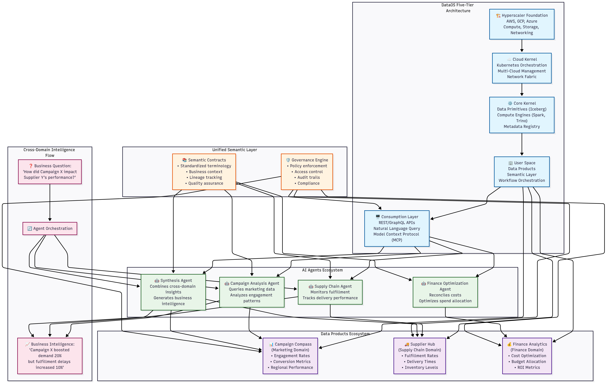

# DataOS Architecture: Highlights

## Executive Memo

Modern enterprises face a familiar paradox: the more data tools they adopt to solve complexity, the more complex their infrastructure becomes. Data teams find themselves trapped in endless integration cycles, while business leaders wait months for insights that should take weeks.

DataOS approaches this challenge differently. Instead of adding another tool to the stack, it reimagines data infrastructure as a unified operating system—much like how cloud platforms transformed server management or how Kubernetes revolutionized container orchestration.

This document explores DataOS's architecture, from its five-tier foundation through its approach to data products and AI-native capabilities. You'll discover how organizations are rethinking data infrastructure for the AI era, and why industry leaders are contributing to the open specifications that DataOS helps define.

---

## Table of Contents

- [Introducing DataOS](#introducing-dataos)
- [Architecture Deep Dive](#architecture-deep-dive)
  - [DataOS Five-Tier Architecture](#dataos-five-tier-architecture)
  - [Core Architectural Principles](#core-architectural-principles)
- [What Makes DataOS Different](#what-makes-dataos-different)
  - [The Modern Data Stack Challenge](#the-modern-data-stack-challenge)
  - [The DataOS Solution](#the-dataos-solution)
  - [Strategic Value Drivers](#strategic-value-drivers)
- [The Bottom Line](#the-bottom-line)
- [Data Products: From Data to Strategic Business Assets](#data-products-from-data-to-strategic-business-assets)
  - [The Transformation Challenge](#the-transformation-challenge)
  - [Architectural Integration](#architectural-integration)
  - [Enterprise Integration Standards](#enterprise-integration-standards)
  - [AI-First Architecture](#ai-first-architecture)
  - [Development Velocity](#development-velocity)
  - [Enterprise Value Realization](#enterprise-value-realization)
- [Where DataOS is Headed: A Foundation for AI-Native Systems](#where-dataos-is-headed-a-foundation-for-ai-native-systems)
  - [Governed AI Access via Model Context Protocol (MCP)](#governed-ai-access-via-model-context-protocol-mcp)
  - [Semantic Memory for Enterprise Agents](#semantic-memory-for-enterprise-agents)
  - [How DataOS Enables AI Agent Success](#how-dataos-enables-ai-agent-success)
  - [Closed-Loop Intelligence with Intent Feedback](#closed-loop-intelligence-with-intent-feedback)
  - [Composable Agents Across Business Domains](#composable-agents-across-business-domains)
  - [Long-Term Vision: The Operating System for Autonomous Enterprises](#long-term-vision-the-operating-system-for-autonomous-enterprises)
- [Strategic Competitive Advantages](#strategic-competitive-advantages)
  - [Unique Technology Stack](#unique-technology-stack)
  - [Moats & Barriers to Entry](#moats--barriers-to-entry)
  - [Innovation Velocity Advantage](#innovation-velocity-advantage)
  - [Strategic Decentralization Through Data Products](#strategic-decentralization-through-data-products)
  - [Integration Economics](#integration-economics)
- [Open Specification Leadership](#open-specification-leadership)
- [References](#references)

---

## **Introducing DataOS**

**What DataOS Is:**
DataOS is a **unified data operating system** that transforms complex multi-cloud infrastructure into a single, manageable platform through five architectural tiers. At its core sits the **DataOS Lakehouse**—native Iceberg storage with ACID transactions, intelligent data policies (masking, row filtering), and automated table lifecycle management driven by usage analytics and cost optimization.

**How It Works:**
The platform operates through **declarative management** where infrastructure and data products are defined via GitOps workflows. A **semantic compiler** translates business intent into optimized execution plans across any compute engine (Spark, Trino, BigQuery, Snowflake, Databricks, StarRocks, etc.), while the **multi-tenant scheduler** dynamically places workloads based on cost and performance requirements. The underlying **metadata graph** maintains complete lineage, schema evolution, and dependency resolution across all data assets.

**What It Delivers:**
- **Operational simplicity**: Replace 10+ fragmented tools with unified declarative infrastructure
- **Built-in reliability**: Horizontal scaling and 99.9% system availability through distributed architecture and automated failover
- **Intelligent data movement**: Automated identification and movement of only required datasets for productization, eliminating unnecessary ETL overhead
- **Standards-based freedom**: Open data formats ensure interoperability without vendor lock-in
- **Production-ready DevOps**: Versioned data products with automated testing and rollback capabilities

## **Architecture Deep Dive**

DataOS solves the fundamental challenge of modern data infrastructure: **architectural complexity**. While traditional approaches require integrating 10+ specialized tools, each with unique APIs, security models, and operational overhead, DataOS delivers equivalent capabilities through a **unified five-tier architecture** that abstracts complexity without sacrificing functionality.

**DataOS Five-Tier Architecture:**

**Tier 1: Hyperscaler Foundation**
The infrastructure layer abstracts cloud provider specifics (AWS, GCP, Azure) through standardized compute, storage, and networking primitives. DataOS dynamically provisions resources across regions and providers based on workload requirements, cost optimization, and data locality constraints.

**Tier 2: Cloud Kernel**
A Kubernetes-native abstraction layer that provides multi-cloud orchestration, persistent storage management, and network fabric unification. This tier handles cross-cloud resource scheduling, disaster recovery, and ensures consistent networking policies across heterogeneous environments.

**Tier 3: Core Kernel** 
The unified data operations engine containing three critical subsystems: **Data Primitives** (Iceberg lakehouse, streaming, batch processing), **Compute Engines** (Spark, Trino, BigQuery, Snowflake, Databricks, StarRocks, etc.), and **Metadata Registry** (schema evolution, lineage tracking, governance policies). [DataOS provides strategic lineage capabilities that go beyond traditional observability [1]](https://moderndata101.substack.com/p/data-lineage-is-strategy-beyond-observability), enabling proactive data product development through context-aware lineage that captures business intent and impact analysis across the entire data ecosystem. This tier ensures ACID compliance and maintains data consistency across all operations.

**Tier 4: User Space**
Business-focused abstraction layer where **Data Products** are defined declaratively, the **Semantic Layer** maps business concepts to physical data structures, and **Workflow Orchestration** manages complex data pipelines. This tier translates business intent into technical execution while maintaining governance and observability.

*The Semantic Layer in Tier 4 serves as the foundational component that enables DataOS's platform-wide semantic capabilities across all consumption patterns and interfaces.* 

DataOS enables [metrics-focused data strategy through model-first data products [3]](https://moderndata101.substack.com/p/model-first-data-products), allowing domain teams to start with business outcomes and metric dependency trees rather than technical implementation details. This approach shifts control of data initiatives closer to business users, enabling sales managers, marketing analysts, and other domain experts to define logical models that directly serve their decision-making needs while analytics engineers focus on materializing these business-driven prototypes.

DataOS addresses the evolution of [the semantic layer movement [4]](https://moderndata101.substack.com/p/the-semantic-movement-the-story-of), moving beyond the limitations of data cubes and BI-locked semantics. The Tier 4 Semantic Layer component provides a truly universal semantic foundation that serves multiple consumption patterns—from natural language queries to API-driven applications—while maintaining consistency and avoiding semantic mistrust through integrated data quality and governance.

**Tier 5: Consumption Layer**
Multi-modal access interfaces including **REST/GraphQL APIs** for programmatic access, **Natural Language Query Engine** for business users, and **Model Context Protocol (MCP)** for AI/ML integration. This tier provides consistent authentication, authorization, and audit trails across all access patterns. The platform ensures [LLM accuracy through governed data access [5]](https://moderndata101.substack.com/p/does-your-llms-speak-the-truth-ensure), preventing AI hallucinations by maintaining data quality and context throughout the AI integration pipeline.

The key architectural insight is **progressive abstraction**: each tier provides higher-level primitives while maintaining full control over lower-level optimizations. This enables DataOS to eliminate tool sprawl and data movement overhead while preserving the performance characteristics and specialized capabilities that drive enterprise adoption of best-of-breed solutions.

**Core Architectural Principles:**
- **Separation of Concerns**: Each tier has distinct responsibilities with clean interfaces
- **Composable Design**: Components can be extended or replaced without affecting other tiers  
- **Declarative Management**: Infrastructure and data products defined as code with GitOps workflows
- **Multi-Cloud Native**: Portable abstractions that leverage cloud-specific optimizations

> **Technical Deep Dive**: For detailed technical specifications, microservices architecture, and implementation details of each tier, see the [DataOS Official Architecture Documentation [2]](https://dataos.info/architecture/).

## **What Makes DataOS Different**

**The Modern Data Stack Challenge**

Enterprise organizations typically manage 8-12 data tools across their infrastructure—each requiring specialized teams, separate security models, and custom integrations. While Modern Data Stacks solved the monolithic data warehouse problem, they've created a new challenge: operational complexity that scales exponentially with each tool added.

The fundamental challenge extends beyond operational complexity to user experience itself. [Modern data systems must support evolving data models that adapt to changing business requirements [6]](https://moderndata101.substack.com/p/evolving-data-models-backbone-of) while maintaining rich user experiences across all data consumers—from technical teams to business stakeholders.

Recent industry research validates this challenge: [**over 70% of data leaders and practitioners agree that the current data stack is too complex [7]**](https://moderndata101.substack.com/p/the-current-data-stack-is-too-complex), with survey respondents from 230+ organizations across 48 countries reporting they use 5-7+ different tools for basic data operations. About 10% use more than 10 tools, and **40% of teams spend more than 30% of their time just jumping between tools** to ensure they work together.

The business impact is measurable: engineering teams spend 60-70% of their time on integration work rather than building data products that drive revenue. Top data engineering talent becomes focused on integration specialization instead of product innovation, while time-to-insight suffers as data moves through multiple systems with different SLAs and failure modes.

This tool proliferation creates cascading operational costs: licensing fees for multiple vendors, specialized training for each platform, dedicated platform teams for infrastructure maintenance, and continuous integration overhead whenever new tools join the ecosystem. The hidden costs of maintaining 5+ tools often exceed the original licensing investment by 15-18% annually, not including the opportunity cost of engineering talent focused on operational overhead instead of business value creation.

**Executive Impact**: Data infrastructure complexity creates cascading organizational challenges—increased vendor dependency, extended procurement cycles, complicated compliance auditing, and technical debt that accumulates faster than business value. This constrains innovation velocity and competitive positioning while creating strategic liability across business operations.

**The DataOS Solution**

DataOS addresses these executive-level challenges through architectural consolidation without sacrificing capabilities. Rather than managing multiple vendor relationships, SLAs, and integration points, organizations get enterprise-grade data infrastructure through a single platform with unified governance, security, and operational models.

The key insight: instead of integrating 10+ fragmented data integration and orchestration tools, we rebuilt the data operations layer as one cohesive system that connects to your existing compute investments (BigQuery, Snowflake, Databricks, etc.). This eliminates integration complexity while preserving the specialized performance characteristics that drove your original tool selection decisions. DataOS represents [what's truly "modern" in the modern data stack [8]](https://moderndata101.substack.com/p/whats-modern-in-the-modern-data-stack)—the evolution from fragmented tool ecosystems to unified platform engineering that enables rather than replaces existing investments, shifting organizations from maintenance-first to data-first operations through standardized interfaces and declarative management.

DataOS avoids [the common mistakes organizations make when building data platforms [9]](https://moderndata101.substack.com/p/building-data-platforms-the-mistake) by focusing on user experience and business outcomes rather than technical features, ensuring platform adoption drives measurable business value rather than becoming another underutilized infrastructure investment.

**What DataOS Replaces vs. What It Integrates:**

**Replaces**: The fragmented ecosystem of data integration tools, orchestration platforms, governance systems, and custom middleware that create operational complexity

**Integrates With**: Your existing compute and storage investments—BigQuery, Snowflake, Databricks, cloud data lakes—leveraging them through standardized interfaces while eliminating the integration overhead

This approach maximizes your existing technology investments while eliminating the operational complexity of managing multiple integration points, security models, and vendor relationships.

**Strategic Value Drivers:**

**Unified Operations and Governance**
DataOS eliminates operational silos through enterprise-wide consolidation. All components share the same authentication, governance, and monitoring systems. Security policies defined once apply across all data operations automatically. Compliance requirements are enforced consistently without per-tool configuration. This eliminates custom integrations, API compatibility issues, and data copying between systems that creates security gaps.

**Accelerated Time-to-Market**
Traditional data delivery follows a predictable pattern: business requirements get translated into weeks of technical implementation across multiple systems. DataOS inverts this model through declarative development—teams define business outcomes, and the platform handles technical execution automatically.

**Organizational Impact**: Reduces data product delivery cycles from months to weeks, enabling faster response to market opportunities and competitive threats. Organizations can pivot data strategies without infrastructure constraints, supporting agile business model evolution.

The semantic compiler translates business logic into optimized execution plans across any compute engine—Spark, Trino, BigQuery, Snowflake, Databricks, and others. The multi-tenant scheduler automatically selects the most cost-effective cloud provider for each workload. This reduces time-to-insight from weeks to days while improving cost optimization through intelligent resource allocation.

**Engineering-Grade Data Operations**
DataOS applies proven software engineering practices to data infrastructure. Every data asset—schemas, transformations, governance policies—is versioned and deployed through GitOps workflows, providing the same reliability and rollback capabilities expected from application deployments.

This architectural approach enables A/B testing of data products, collaborative development through pull requests, and automated testing pipelines. Data teams can operate with the same velocity and reliability standards as software engineering teams, reducing operational risk while accelerating innovation.

**Risk Management**: Eliminates manual deployment processes that create operational vulnerabilities. Provides audit trails for regulatory compliance, automated disaster recovery, and zero-downtime updates that protect business continuity.

**Business Context Built Into the Platform**
Most data platforms bolt business logic on top of technical infrastructure as an afterthought. DataOS embeds business understanding directly into the platform architecture through its semantic compiler.

This architectural difference enables automatic query optimization across different compute engines, maintains consistency even when data moves between systems, and allows business users to ask questions in natural language. [As data practitioners recognize, data without context becomes meaningless [10]](https://moderndata101.substack.com/p/lost-in-translation-data-without-context)—DataOS solves this by embedding semantic linking directly into the platform architecture, ensuring that shape and meaning remain connected throughout the data lifecycle, all without the performance penalties you'd expect from layered-on business logic.

**Strategic Multi-Cloud Optimization**
DataOS provides true multi-cloud portability beyond vendor marketing promises. The platform continuously analyzes workload characteristics, cost predictions, performance requirements, and compliance rules to automatically place each task where it delivers the best business outcome.

This enables strategic flexibility: finance queries automatically route to the lowest-cost cloud, real-time analytics leverage GCP's specialized performance, and European customer data stays compliant on Azure. Organizations gain negotiating leverage with cloud providers while optimizing for cost, performance, and compliance simultaneously—without operational overhead.

**Financial Impact**: Industry case studies demonstrate 20-40% cloud infrastructure cost reduction through intelligent workload placement and automated resource optimization. Eliminates vendor lock-in risks that constrain future strategic options and negotiating positions.

**Single Platform, Specialized Performance**
Organizations get native capabilities across the entire data lifecycle while maintaining the specialized performance characteristics required for different workload types. The unified platform eliminates integration overhead while preserving the technical advantages that drove original tool selection decisions.

---

## **The Bottom Line**

DataOS delivers what traditional data platforms cannot: **architectural consolidation without capability compromise**. Organizations reduce operational complexity, accelerate time-to-market, and improve cost efficiency while maintaining the specialized performance characteristics their business requires.

DataOS functions as the **unified control plane for enterprise data ecosystems**—making existing investments more valuable while positioning organizations for emerging technologies and changing business requirements. It's data infrastructure that scales with business strategy, not against it.

The platform's architectural consolidation manifests most clearly in how it transforms raw data into strategic business assets. While traditional approaches treat data as static warehouse tables, DataOS elevates data into **Data Products**—intelligent, self-managing assets that combine technical execution with business context to drive measurable organizational outcomes.

---

## **Data Products: From Data to Strategic Business Assets**

**The Transformation Challenge**

Enterprise data typically exists as disconnected warehouse tables—technical artifacts that hold information but lack business meaning, operational intelligence, or strategic context. This disconnect creates the fundamental gap between data availability and business value realization. Organizations invest heavily in data infrastructure but struggle to translate that investment into competitive advantage.

DataOS Data Products bridge this gap by transforming traditional tables into **enterprise-grade, versioned ontologies** that unify code, quality signals, business semantics, and operational telemetry. Each Data Product becomes a domain-specific execution kernel that provides deterministic, auditable context—eliminating the ambiguity that constrains AI applications and business decision-making.

**Architectural Integration**

Data Products represent the convergence of three traditionally separate organizational capabilities:

**Code Management**: Transformation logic, ingestion workflows, and processing pipelines managed through enterprise GitOps standards
**Business Intelligence**: Semantic definitions, ontological frameworks, and governance policies that embed institutional knowledge
**Infrastructure Operations**: Cloud resources, compute engines, and orchestration systems that ensure reliable execution

This architectural integration creates self-managing assets that continuously optimize for cost, performance, and business relevance without manual intervention—addressing the operational complexity that constrains traditional data initiatives.

**Enterprise Integration Standards**

Data Products provide consistent enterprise APIs that eliminate integration overhead:

- **RESTful/GraphQL Data APIs**: Standardized programmatic access across all organizational systems
- **Metadata APIs**: [ODPS-compliant [19]](https://opendataproducts.org/) governance with DataOS extensions for enterprise requirements
- **BI-Compatible Interfaces**: Native Postgres/MySQL connectivity for existing analytical tools
- **Operational APIs**: Real-time usage analytics, change tracking, and performance monitoring

DataOS Data Products are fully compatible with the [Open Data Product Specification (ODPS) [19]](https://opendataproducts.org/), the Linux Foundation-hosted standard for computational data product metadata. The DataOS team actively contributes to ODPS development as members of the Technical Steering Committee, ensuring DataOS remains aligned with evolving industry standards while offering additional enterprise-grade extensions for advanced governance, AI integration, and multi-cloud operations.

**AI-First Architecture**

Data Products address the critical challenge of AI reliability in enterprise environments. Traditional data structures lack the semantic boundaries necessary for trustworthy AI applications, leading to hallucinations and unreliable business outcomes. Data Products provide:

- **Semantic Constraints**: Well-defined business context that guides AI interpretation and prevents drift
- **Audit Trails**: Complete lineage tracking that enables AI decision validation and regulatory compliance
- **Quality Assurance**: Built-in validation frameworks that prevent AI systems from operating on compromised data
- **Operational Intelligence**: Continuous monitoring that informs AI systems about data freshness and business relevance

**Development Velocity**

The platform enables rapid enterprise application development through integrated tooling:

- **Python SDK**: Production-ready data applications deployed in hours rather than development cycles
- **Modern Web Framework**: NextJS-based interfaces with native data connectivity and enterprise authentication
- **Cross-Product Communication**: MCP Gateway enabling sophisticated multi-domain workflows and agentic operations

**Enterprise Value Realization**

DataOS transforms organizational data capabilities across four critical dimensions:

**Operational Excellence**: Self-healing architecture significantly reduces data management overhead (industry benchmarks show 60-80% reduction in maintenance tasks), redirecting technical resources toward innovation rather than maintenance.

**Strategic Agility**: Organizations deploy reliable AI applications without traditional 6-12 month data preparation cycles (compared to industry standard implementation timelines), enabling rapid response to competitive pressures and market opportunities.

**Development Velocity**: Application development cycles compress from quarters to weeks through standardized APIs and pre-built enterprise integrations.

**Governance at Scale**: Unified metadata management scales governance policies across organizational boundaries while preserving domain autonomy and operational flexibility.

The capabilities described above—particularly the AI-First Architecture of Data Products, semantic constraints, and operational intelligence—create the foundational requirements for enterprise AI systems. However, the full potential of these capabilities emerges when extended across the entire DataOS platform to support autonomous, intelligent operations at enterprise scale.

---

## **Where DataOS is Headed: A Foundation for AI-Native Systems**

**The modern data stack wasn't built for AI. DataOS is.**

Building on the semantic constraints, governance frameworks, and operational intelligence established through Data Products, DataOS extends these capabilities platform-wide to support AI-native enterprise systems. As generative AI and agent-based systems become embedded in enterprise workflows, they introduce entirely new demands on data infrastructure that traditional platforms cannot meet. [Research shows that over 60% of CIOs are integrating AI into their innovation strategies [16]](https://moderndata101.substack.com/p/the-power-combo-of-ai-agents), yet most organizations struggle with fundamental limitations:

- **The Agency Gap**: Standalone LLMs lack the ability to take action or make autonomous decisions, providing generic responses rather than strategic insights
- **Cross-Domain Context Loss**: AI systems require semantic clarity and business context that spans multiple domains, not just raw data access from isolated silos  
- **Complex Problem-Solving Requirements**: Enterprise AI needs to break down complex problems into manageable components, just as humans apply deductive reasoning to solve challenging tasks

[AI agents represent the evolution beyond standalone LLMs [16]](https://moderndata101.substack.com/p/the-power-combo-of-ai-agents), functioning as collections of AI solutions connected through workflows to solve larger, more complex purposes. This mirrors the fundamental approach to problem-solving that DataOS applies to data architecture—breaking down complex systems into smaller, independent units that work together intelligently.

DataOS enables AI-native systems by extending each architectural tier with AI-specific capabilities while maintaining the same unified governance, security, and operational models:

*The diagram above illustrates how DataOS enables AI-native systems through its five-tier architecture, showing how AI agents collaborate across domain-specific data products while maintaining unified governance and semantic consistency.*

**AI Integration Across the Five-Tier Architecture:**

**Tier 5 (Consumption Layer) - AI Access Interfaces:**
- **Model Context Protocol (MCP)**: Standardized AI agent interface with built-in governance
- **Natural Language Query Engine**: Enhanced with context-aware AI interpretation
- **AI Agent APIs**: Secure, policy-enforced interfaces for autonomous systems

**Tier 4 (User Space) - AI-Enhanced Orchestration:**
- **Intent Feedback Loops**: AI agents propose data product improvements through GitOps workflows
- **AI-Driven Data Products**: Self-optimizing products that adapt based on usage patterns
- **Cross-Domain Agent Coordination**: Multi-agent workflows orchestrated through existing pipeline infrastructure

**Tier 3 (Core Kernel) - AI-Ready Metadata & Semantics:**
- **Semantic Memory**: Enhanced metadata registry with institutional knowledge encoding
- **Lineage-Aware AI Context**: Complete audit trails that enable explainable AI decisions
- **AI-Safe Data Validation**: Built-in quality frameworks preventing AI hallucinations

**Tier 2 (Cloud Kernel) - AI Workload Management:**
- **AI-Optimized Scheduling**: Multi-cloud placement for AI/ML workloads based on compute requirements
- **Resource Auto-Scaling**: Dynamic provisioning for variable AI agent compute demands

**Tier 1 (Hyperscaler Foundation) - AI Infrastructure:**
- **GPU/TPU Integration**: Seamless access to specialized AI compute across cloud providers
- **AI-Specific Storage**: Optimized data locality for training and inference workloads

**Governed AI Access via Model Context Protocol (MCP)**
*Extending Tier 5 (Consumption Layer) with AI-native interfaces*

Building on DataOS's existing REST/GraphQL APIs and Natural Language Query Engine, the Model Context Protocol provides a standardized interface for AI agents to query and reason over data products with built-in safeguards. Unlike typical APIs that simply return data, MCP includes:

- **Semantic Contracts**: AI agents understand not just what data they're accessing, but what it means in business context
- **Lineage-Aware Responses**: Agents receive complete context about data origins, transformations, and dependencies
- **Policy Enforcement**: Governance rules are automatically applied at query time, ensuring compliance across all AI interactions
- **Grounding Context**: Built-in semantic understanding prevents hallucinations by providing verified business logic

This architecture enables safe, explainable, and traceable AI behavior while eliminating the data quality issues that plague current AI implementations.

**Semantic Memory for Enterprise Agents**
*Enhanced Tier 3 (Core Kernel) Metadata Registry for AI applications*

The existing metadata graph and schema evolution capabilities in DataOS's Core Kernel are extended to support AI agents. Because all data products in DataOS are semantically versioned with complete lineage tracking, AI agents can maintain institutional memory that includes:

- **Historical Understanding**: How metrics and business definitions have evolved over time
- **Schema Evolution Awareness**: Automatic adaptation to data structure changes without breaking agent workflows  
- **Business Logic Reasoning**: Decisions grounded in validated business rules rather than statistical patterns alone

DataOS functions as a semantic memory layer for AI—enabling agents that can reason, plan, and act based on institutional knowledge encoded directly in data products.

**How DataOS Enables AI Agent Success**

DataOS addresses the core challenges that limit AI agent effectiveness through its integrated data product platform:

- **AI-Ready Data**: [Data products provide purpose-driven, quality-approved data with governance built-in [16]](https://moderndata101.substack.com/p/the-power-combo-of-ai-agents), eliminating the data quality issues that cause AI hallucinations and unreliable outcomes
- **Context Cushioning**: DataOS's semantic layer foundation provides rich context around data that enables AI agents to achieve higher levels of reasoning—addressing the fundamental deficiency where most LLMs lack reliable reasoning due to insufficient contextual understanding
- **Complexity Abstraction**: Self-service infrastructure enables rapid development and deployment of AI agents without requiring teams to manage complex database integrations, API creation, and infrastructure provisioning
- **Standardized Interoperability**: OpenAPI standards ensure seamless interaction between AI agents and various data sources, promoting compatibility across diverse enterprise systems while enabling enhanced scalability through template-driven approaches

**Closed-Loop Intelligence with Intent Feedback**
*AI-enhanced Tier 4 (User Space) workflow orchestration*

Leveraging DataOS's existing GitOps workflows and Data Product management, DataOS roadmap includes "intent feedback" capabilities—allowing AI agents to propose improvements to data products based on usage patterns and business outcomes. These proposals flow through the same GitOps validation and testing processes as human-generated changes, creating a closed loop between:

**AI Discovery** → **Domain Intent** → **Governed Productization** → **Downstream Activation**

This transforms AI from passive consumer to active contributor in the data ecosystem, enabling continuous optimization based on actual business performance.

**Composable Agents Across Business Domains**

The modular, versioned architecture of data products enables sophisticated multi-domain AI orchestration that addresses the critical challenge of [cross-functional context and decision-making [17]](https://moderndata101.substack.com/p/how-ai-agents-and-data-products-work). Traditional AI systems struggle with siloed context—where different applications maintain separate vector databases and knowledge graphs, creating "domain-induced knowledge gaps" that prevent effective cross-domain insights.

DataOS solves this through multi-agent workflows where specialized agents collaborate across domains:

**Real-World Example: Marketing Impact on Supply Chain**
- **Campaign Analysis Agent**: Queries the "Campaign Compass" data product to identify engagement rates, regional performance, and demand patterns from a marketing campaign
- **Supply Chain Agent**: Accesses the "Supplier Hub" data product to evaluate fulfillment rates, delivery times, and inventory levels affected by increased demand
- **Synthesis Agent**: Combines insights to answer complex questions like "_How did Campaign X impact Supplier Y's fulfillment rates and delivery times?_"

This enables business intelligence such as: "_Campaign X boosted demand for Supplier Z's products by 20%, but fulfillment delays increased by 10%, likely impacting customer satisfaction._"

**Cross-Domain Orchestration:**
- **Marketing agents** optimize attribution models while informing supply chain planning
- **Sales agents** leverage forecast models that incorporate marketing campaign impacts and supplier capacity constraints  
- **Finance agents** reconcile cost optimization across both marketing spend and supply chain efficiency
- **Operations agents** coordinate inventory based on marketing-driven demand predictions

All agents operate through DataOS's [unified semantic layer that standardizes terminology [17]](https://moderndata101.substack.com/p/how-ai-agents-and-data-products-work) across domains—ensuring "target_region" from marketing data and "geo_state" from sales assets are understood as the same information, eliminating the context fragmentation that limits traditional AI implementations.

**Architectural Integration Summary**

Unlike platforms that bolt AI capabilities on top of existing infrastructure, DataOS integrates AI-native features directly into its five-tier architecture:

- **Unified Governance**: AI agents operate under the same security, compliance, and audit frameworks as human users
- **Seamless Resource Management**: AI workloads leverage the same multi-cloud optimization and cost management
- **Consistent Interfaces**: AI agents access data through the same APIs and semantic layer foundation as business applications
- **Integrated Monitoring**: AI operations appear in the same observability and lineage tracking as traditional data workflows

This architectural integration ensures AI capabilities scale with business requirements while maintaining enterprise reliability and governance standards.

**Long-Term Vision: The Operating System for Autonomous Enterprises**

DataOS is positioned to become the foundational layer for AI-native enterprises through its unique combination of:

- **Unified metadata fabric** that provides semantic understanding across all business domains
- **Declarative infrastructure** that can be programmatically modified by intelligent agents
- **Built-in governance** that ensures AI actions remain compliant and auditable
- **Composable architecture** that enables rapid deployment of domain-specific AI capabilities

This foundation enables the next generation of autonomous business systems: intelligent agents that can reason about business context, automated decision systems that operate within governance constraints, contextual copilots that understand institutional knowledge, and self-updating metric stores that adapt to changing business requirements—all while maintaining the reliability and security standards required for enterprise operations.

---

## **Strategic Competitive Advantages**

### **Unique Technology Stack**

- **Unified Metadata Fabric**: Single source of truth across all tools and clouds
- **Intent Engine**: Translates business requirements to technical execution automatically
- **Semantic Compiler**: Converts business logic to optimized queries across any engine
- **Product Mesh**: Treats datasets as versioned, governed products with built-in SLAs
- **Standards Leadership**: Active contribution to [ODPS [19]](https://opendataproducts.org/) Technical Steering Committee ensures compatibility with emerging industry standards while extending capabilities for enterprise requirements

### **Moats & Barriers to Entry**

**Hard to Replicate Because:**
- **Network Effects**: More integrations = better semantic understanding
- **Data Gravity**: Once metadata is centralized, switching costs are prohibitive  
- **Technical Complexity**: Building unified abstractions across clouds/engines requires years of R&D
- **Ecosystem Lock-in**: API-first approach becomes integral to organizational workflows

**Current Landscape Gaps:**
- Snowflake/Databricks: Cloud-locked, compute-centric
- Traditional stacks: Require 5-10 tools integration
- Modern stacks: Still fragmented, no unified governance

### **Innovation Velocity Advantage**

**Faster Innovation Through:**
- **Composable Architecture**: Add capabilities without breaking existing workflows
- **Unified Testing**: Single platform = faster iteration cycles
- **Shared Context**: The platform's semantic layer accelerates feature development
- **API-First**: External developers extend platform capabilities

**Strategic Decentralization Through Data Products**
DataOS enables [smart decentralization that balances domain autonomy with centralized governance [11]](https://moderndata101.substack.com/p/dont-trust-decentralisation-yet-game). Rather than forcing every department to wait for a centralized data team (which creates bottlenecks) or requiring each domain to build its own complete data infrastructure (which is expensive and duplicative), DataOS allows each domain to create and control their own data products while sharing common infrastructure, governance, and standards. This means marketing can optimize their customer attribution data product for their specific needs, while sales can build forecast models—and both can easily share insights because they're built on the same underlying platform.

The platform addresses the fundamental challenge of [where exactly data becomes product [12]](https://moderndata101.substack.com/p/where-exactly-data-becomes-product), providing clear boundaries and operational frameworks that enable domain teams to create valuable data products without losing organizational coherence. DataOS implements [proven metrics-first data product strategies [13]](https://moderndata101.substack.com/p/the-data-product-strategy-becoming) that treat data like electricity—a regulated, scalable commodity that flows through parallel circuits to power business metrics without disrupting other operations.

This approach enables [CDO-level strategic initiatives [14]](https://moderndata101.substack.com/p/cdo-guide-upscaling-marketing-analytics) by providing the infrastructure foundation needed to scale data-driven operations across marketing, sales, and other business domains. The platform's metric enablement model ensures that every data product output port directly maps to business metrics, creating transparent feedback loops between data initiatives and measurable business outcomes while enabling non-disruptive extensibility as new use cases emerge.

### **Integration Economics**

**Cost-Effective Integration:**
- **No Rip-and-Replace**: Overlay existing compute investments (BigQuery, Snowflake, etc.), don't replace them
- **API Governance**: Maintain control without tool migration
- **Gradual Adoption**: Start with governance, expand to full platform
- **Shared Infrastructure**: Amortize costs across all data operations

---

## **Open Specification Leadership**

The DataOS team actively contributes to industry standards through leadership roles in two critical open specifications:

**Data Developer Platform (DDP) Specification**: DataOS development has led to the creation of the [Data Developer Platform (DDP) specification [15]](https://datadeveloperplatform.org/), an open specification that codifies how modern data platforms should be built to enable data-first organizations. Drawing from lessons learned building DataOS and inspired by the proven [Internal Developer Platform (IDP) standard [18]](https://internaldeveloperplatform.org/) from software engineering, the DDP specification provides a framework that other organizations can adopt and adapt.

The DDP specification addresses the core challenge facing data teams: being "drained from continuously plumbing integrations and fragile pipelines, which leaves little to no time to focus on the real deal - data and data applications." Unlike custom-built solutions that took companies like Uber, Google, and Airbnb years to develop for their specific internal architectures, DataOS represents a battle-tested implementation of these principles that organizations can adopt without the multi-year development investment.

**Open Data Product Specification (ODPS) Leadership**: The DataOS team serves as active members of the [Open Data Product Specification (ODPS) [19]](https://opendataproducts.org/) Technical Steering Committee. This Linux Foundation-hosted initiative defines the computational data product metadata model used by organizations like NATO, BASF, and Alation. DataOS Data Products maintain ODPS compatibility while extending the specification with enterprise-grade capabilities for AI integration, multi-cloud governance, and advanced semantic modeling.

This dual standards leadership ensures DataOS remains at the forefront of industry evolution while providing organizations with proven, interoperable solutions that reduce vendor lock-in and accelerate adoption.

---

## **References**

**[1]** Data Lineage is Strategy: Beyond Observability and Debugging  
https://moderndata101.substack.com/p/data-lineage-is-strategy-beyond-observability

**[2]** DataOS Official Architecture Documentation  
https://dataos.info/architecture/

**[3]** Metrics-Focused Data Strategy with Model-First Data Products  
https://moderndata101.substack.com/p/model-first-data-products

**[4]** The Semantic Layer Movement: The Rise & Current State  
https://moderndata101.substack.com/p/the-semantic-movement-the-story-of

**[5]** Does Your LLMs Speak the Truth? Ensure Accuracy with Governed Data  
https://moderndata101.substack.com/p/does-your-llms-speak-the-truth-ensure

**[6]** Evolving Data Models: Backbone of Rich User Experiences (UX) for Data Citizens  
https://moderndata101.substack.com/p/evolving-data-models-backbone-of

**[7]** The Current Data Stack is Too Complex: 70% Data Leaders & Practitioners Agree  
https://moderndata101.substack.com/p/the-current-data-stack-is-too-complex

**[8]** What's "Modern" in the Modern Data Stack | Issue #44  
https://moderndata101.substack.com/p/whats-modern-in-the-modern-data-stack

**[9]** Building Data Platforms: The Mistake Organizations Make  
https://moderndata101.substack.com/p/building-data-platforms-the-mistake

**[10]** Lost in Translation: Data without Context is a Body Without a Brain  
https://moderndata101.substack.com/p/lost-in-translation-data-without-context

**[11]** Don't Trust Decentralisation Yet? Game Theory Might Change Your Stance  
https://moderndata101.substack.com/p/dont-trust-decentralisation-yet-game

**[12]** Where Exactly Data Becomes Product: Illustrated Guide to Data Products in Action  
https://moderndata101.substack.com/p/where-exactly-data-becomes-product

**[13]** The Data Product Strategy - Becoming Metrics-First | Issue: #21  
https://moderndata101.substack.com/p/the-data-product-strategy-becoming

**[14]** CDO Guide to Upscaling Marketing Analytics: Building Data-Driven Domains  
https://moderndata101.substack.com/p/cdo-guide-upscaling-marketing-analytics

**[15]** Data Developer Platform Specification  
https://datadeveloperplatform.org/

**[16]** The Power Combo of AI Agents: Building Intelligent Systems that Get Things Done  
https://moderndata101.substack.com/p/the-power-combo-of-ai-agents

**[17]** How AI Agents and Data Products Work Together: The Ultimate Enterprise Data Strategy  
https://moderndata101.substack.com/p/how-ai-agents-and-data-products-work

**[18]** Internal Developer Platform  
https://internaldeveloperplatform.org/

**[19]** Open Data Product Specification  
https://opendataproducts.org/
