# Argus: The Knowledge System (SKOS Layer in Depth)

> Internal codenames: **Vulcan** (a per-product project, also called a **data product**, containing physical models, a semantic *model*, metrics, and perspectives), **Argus** (the cross-product knowledge system that harvests the data products and acts as an org-wide semantic *layer*, built bottom-up). "Data product" and "Vulcan project" are the same thing. External brand: DataOS.
>
> Argus is a two-layer knowledge system fed by a sensory subsystem. The inner layer is a SKOS knowledge model (**meaning**); the outer layer grounds that meaning in real data: asset attachment, term mapping, and governance workflow (the **grounding layer**). Beneath both sits **Harvest**, the subsystem that automatically pulls metadata from every data product and makes the organization's data searchable and lineage-connected; it feeds the knowledge layers but is not itself a curated layer. All of it is Argus, built in-house, not outsourced to a third-party store. This document specifies the **two knowledge layers and the Harvest subsystem**. Sections 1 and 2 cover SKOS as the W3C standard defines it, with enough detail that you should not need to consult the spec separately. Sections 3 and 4 are where Argus shapes SKOS to its needs: term-to-concept resolution, and the mapping of concept schemes onto business domains. Section 5 specifies the grounding layer: bindings, binding kinds, the resolver, and governance workflow. Section 6 specifies Harvest. The architecture overview below frames how the pieces relate before the detail begins.

---

## Contents

- [Argus System Architecture](#argus-system-architecture)
- [1. History and Brief](#1-history-and-brief)
- [2. SKOS in Depth](#2-skos-in-depth)
  - [2.1 The data model at a glance](#21-the-data-model-at-a-glance)
  - [2.2 Concepts](#22-concepts)
  - [2.3 Concept schemes](#23-concept-schemes)
  - [2.4 Lexical labels](#24-lexical-labels)
  - [2.5 Notations](#25-notations)
  - [2.6 Documentation properties](#26-documentation-properties)
  - [2.7 Semantic relations: the core idea](#27-semantic-relations-the-core-idea)
  - [2.8 Cycles, reflexivity, and polyhierarchy](#28-cycles-reflexivity-and-polyhierarchy)
  - [2.9 Extending semantic relations](#29-extending-semantic-relations)
  - [2.10 The Argus custom relations](#210-the-argus-custom-relations)
  - [2.11 Concept collections](#211-concept-collections)
  - [2.12 Mapping properties](#212-mapping-properties)
  - [2.13 Integrity conditions: consolidated checklist](#213-integrity-conditions-consolidated-checklist)
- [3. Labels as Glossary Terms, and Term Resolution](#3-labels-as-glossary-terms-and-term-resolution)
- [4. Concept Schemes as Business Domains](#4-concept-schemes-as-business-domains)
- [5. The Grounding Layer](#5-the-grounding-layer)
  - [5.1 Asset attachment (bindings)](#51-asset-attachment-bindings)
  - [5.2 Binding kinds](#52-binding-kinds)
  - [5.3 dependsOn vs derivedFrom: the endpoint-type rule](#53-dependson-vs-derivedfrom-the-endpoint-type-rule)
  - [5.4 Term mapping and the resolver](#54-term-mapping-and-the-resolver)
  - [5.5 Workflow and governance](#55-workflow-and-governance)
- [6. The Harvest Subsystem](#6-the-harvest-subsystem)
  - [6.1 What Harvest is](#61-what-harvest-is)
  - [6.2 The harvested picture](#62-the-harvested-picture)
  - [6.3 Two kinds of lineage](#63-two-kinds-of-lineage)
  - [6.4 Discovery](#64-discovery)
  - [6.5 Seams to the knowledge layers](#65-seams-to-the-knowledge-layers)

---

## Argus System Architecture

Argus is the whole system: two curated knowledge layers fed by an automated sensory subsystem. All three parts are owned and implemented by Argus.

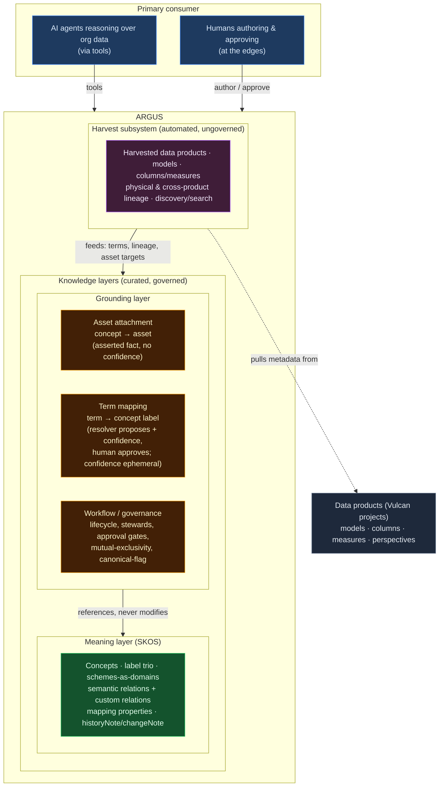

**Layer 1, Meaning layer (SKOS).** The knowledge-organization core specified in this document: concepts with stable opaque identity, the label trio, concept schemes as business domains, the semantic-relation tree with the Argus custom relations (`extendsFrom`, `hasMany`/`hasOne`/`belongsTo`, `dependsOn`/`feedsInto`), mapping properties for cross-scheme alignment, and `historyNote`/`changeNote` for the change record. This layer is *about concepts relating to concepts*. It never references a physical table. Argus implements it natively rather than stretching it to do things it was not designed for.

**Layer 2, Grounding layer.** Where meaning is grounded in real data. Three concerns live here, and none of them are SKOS vocabulary; they reference SKOS concepts but never add to the SKOS model:

- **Asset attachment**: binding a concept to a physical asset (a model, column, or measure in a data product). A plain asserted fact relating the concept to where it lives in data, qualified by a binding *kind* (`implements`, `derivedFrom`, `tagged`; see section 5.2). No confidence score; it is either bound or not.
- **Term mapping**: resolving a free-style term to a concept label. The resolver computes a confidence score shown *to a human to decide* whether to attach the label. The confidence is ephemeral decision-scaffolding for curation; once the human approves, the label is just a label and the score is gone. AI proposes, human approves.
- **Workflow / governance**: lifecycle (Draft / Active / Deprecated), stewards, approval gates, mutual-exclusivity, canonical-flag: the machinery governing how concepts and bindings move through their lives.

**The Harvest subsystem.** Beneath the two knowledge layers, Harvest automatically pulls structural metadata from every registered data product (Vulcan project) and stitches it into one searchable, lineage-connected picture (section 6). It is the *sensory apparatus*, the hundred eyes, and it differs from the knowledge layers in kind: it is automated, ungoverned, and reflects whatever the data products emit, where the knowledge layers are curated and human-approved. Harvest is not a curated layer; it *feeds* the knowledge layers, supplying the raw terms the resolver maps, the physical lineage that corroborates conceptual dependency, and the assets that bindings point at.

**The dividing principle.** Facts about *meaning* live in the meaning layer (Layer 1). Facts about *meaning grounded in data*, and the *process of curating and governing it*, live in the grounding layer (Layer 2). Observed structural facts about what physically exists across data products live in Harvest, ungoverned. Binding is grounding, so it is Layer 2. Lifecycle is process, so it is Layer 2. Confidence is curation-scaffolding, so it is Layer 2 and ephemeral. Concepts, labels, and relations are meaning, so they are Layer 1, untouched. What a data product actually contains is observation, so it is Harvest.

**Operating model and consumer.** The primary consumer is AI agents reasoning about the organization's data through tools; humans author and approve at the edges. The flow is decentralized generation, centralized convergence: each product team builds its own Vulcan semantic *model* locally, where the domain expertise lives; Argus collects those models and converges them (AI inferring and proposing alignments and mappings, humans approving) into a single org-wide semantic *layer* across the organization, built bottom-up. The semantic-model-versus-semantic-layer distinction is deliberate and load-bearing: a Vulcan model is local and per-product; the Argus semantic layer is the cross-product integration tier above the collection of them. The result is a reasoning surface no single-product model could offer.

The remainder of this document specifies all three parts: the meaning layer in sections 1–4, the grounding layer in section 5, and the Harvest subsystem in section 6.

---

## 1. History and Brief

SKOS (Simple Knowledge Organization System) became a W3C Recommendation on 18 August 2009, produced by the Semantic Web Deployment Working Group. It did not appear from nothing. It is the formalization of decades of prior work in the library and information sciences on representing thesauri, taxonomies, classification schemes, and subject heading systems. The direct lineage runs through the ISO thesaurus standards (ISO 2788 for monolingual thesauri, ISO 5964 for multilingual) and their British equivalents (BS 8723), through the SWAD-Europe project and the early SKOS Core work in the first half of the 2000s.

The motivation was specific. Many knowledge organization systems share a common shape: a set of concepts, labeled in natural language, arranged into broader/narrower hierarchies and association networks, and grouped into schemes. Before SKOS there was no widely deployed standard for exchanging these structures between systems as data. Each thesaurus or taxonomy lived in its own format, in its own tool, behind its own export quirks.

The design decision that matters most for us is what SKOS deliberately is *not*. It is not a formal knowledge representation language. A formal ontology (OWL) asserts axioms and facts about the world: a logical model from which a reasoner derives new truths and detects contradictions. A thesaurus asserts nothing of the kind. It identifies and informally describes a set of meanings, and arranges them into a convenient map of a subject domain. SKOS models that map as-is, without forcing the costly re-engineering into formal axioms that OWL would demand.

Technically, SKOS is defined as an OWL Full ontology, and SKOS data are RDF triples. But the concepts in a SKOS vocabulary are modeled as *individuals*, not as classes. This is the crux of why SKOS is lightweight where OWL is heavy: SKOS records facts about the vocabulary itself ("concept X has preferred label Y and lives in scheme Z"), never facts about how the world is arranged. That distinction is what makes it the right reference model for Argus. We want stable concept identity, hierarchical and associative links, and clean cross-scheme mapping. We do not want the cost and rigidity of a full logical ontology. SKOS gives the former without imposing the latter.

A consequence worth internalizing early: SKOS inherits RDF's **open-world assumption**. Missing data is never a contradiction. Removing a statement never makes the remaining data inconsistent. Almost nothing in SKOS is an integrity violation. The handful of genuine integrity conditions are enumerated in section 2.13. Everything else the spec defines is a license to *infer*, not a constraint to *enforce*. Where we want stricter behavior (no cycles, irreflexive hierarchy), that is our application convention to impose, not something SKOS gives us for free.

---

## 2. SKOS in Depth

### 2.1 The data model at a glance

SKOS is four classes and twenty-five properties. The namespace is `http://www.w3.org/2004/02/skos/core#`, conventionally abbreviated `skos:`.

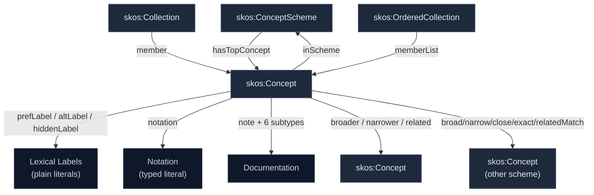

The full vocabulary:

| Group | URIs |
|---|---|
| Classes | `skos:Concept`, `skos:ConceptScheme`, `skos:Collection`, `skos:OrderedCollection` |
| Scheme membership | `skos:inScheme`, `skos:hasTopConcept`, `skos:topConceptOf` |
| Lexical labels | `skos:prefLabel`, `skos:altLabel`, `skos:hiddenLabel` |
| Notation | `skos:notation` |
| Documentation | `skos:note`, `skos:definition`, `skos:scopeNote`, `skos:example`, `skos:historyNote`, `skos:editorialNote`, `skos:changeNote` |
| Semantic relations | `skos:semanticRelation`, `skos:broader`, `skos:narrower`, `skos:related`, `skos:broaderTransitive`, `skos:narrowerTransitive` |
| Collections | `skos:member`, `skos:memberList` |
| Mapping | `skos:mappingRelation`, `skos:closeMatch`, `skos:exactMatch`, `skos:broadMatch`, `skos:narrowMatch`, `skos:relatedMatch` |

All Turtle examples below assume these prefixes:

```turtle
@prefix skos: <http://www.w3.org/2004/02/skos/core#> .
@prefix rdf:  <http://www.w3.org/1999/02/22-rdf-syntax-ns#> .
@prefix rdfs: <http://www.w3.org/2000/01/rdf-schema#> .
@prefix owl:  <http://www.w3.org/2002/07/owl#> .
@prefix ex:   <http://example.org/ns/> .
```

### 2.2 Concepts

`skos:Concept` is the class of concepts. A concept is a unit of thought, a meaning, an idea, deliberately suggestive rather than restrictive. The single most important property of a concept is its **identity**: a concept is identified by a URI, and that URI is the stable anchor. Everything else about a concept (its labels, its notes, its place in the hierarchy) is mutable metadata hung off that stable identity.

```turtle
ex:c-arr rdf:type skos:Concept ;
    skos:prefLabel "Annual Recurring Revenue"@en .
```

Three things follow, and they are the foundation of the whole model:

**A concept is not its label.** The string "Annual Recurring Revenue" is metadata. If the business renames it to "Annualized Recurring Revenue," you change the `prefLabel` and nothing else breaks, because every link, every binding, every reference points at `ex:c-arr`, not at the string. This is the failure mode SKOS exists to prevent: treating the term as the concept, so that renaming shatters every reference.

**A concept is an individual, not a class.** `skos:Concept` is itself an `owl:Class`, but `ex:c-arr` is an instance of it, an individual. SKOS asserts facts *about* `ex:c-arr` (it has this label, it lives in that scheme), never axioms about the world. This is why a SKOS hierarchy carries no logical entailments about membership or subsumption the way an OWL class hierarchy would.

**URIs should be opaque.** This is convention, not a spec rule, but it is non-negotiable for us. Never encode the human label into the URI. `ex:c-arr` or `ex:C4092`, never `ex:AnnualRecurringRevenue`. The label is allowed to change; the identifier must not. Let `prefLabel` hold the words and let the URI be a silent, permanent anchor.

### 2.3 Concept schemes

A `skos:ConceptScheme` is an aggregation of concepts: the SKOS modeling of "a thesaurus" or "a taxonomy" or, for us, "a business domain." Concepts declare membership with `skos:inScheme`. A scheme can name its entry points with `skos:hasTopConcept`, and the concept can point back with `skos:topConceptOf` (the two are inverses; assert either).

```turtle
ex:revenue-domain rdf:type skos:ConceptScheme ;
    skos:prefLabel "Revenue"@en ;
    skos:hasTopConcept ex:c-arr .

ex:c-arr skos:topConceptOf ex:revenue-domain ;
    skos:inScheme ex:revenue-domain .
```

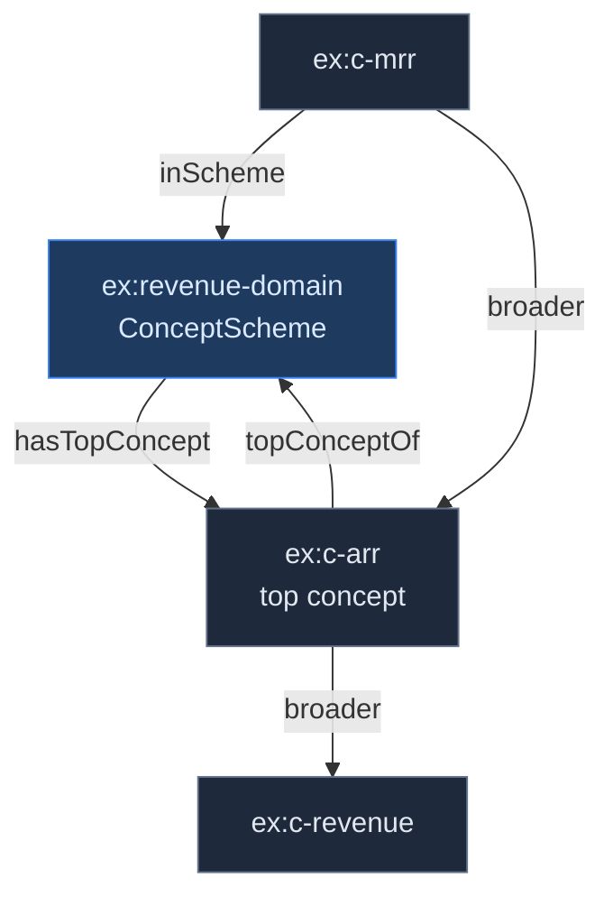

Two properties of schemes shape how we use them:

**Schemes are open, not closed.** You can say concepts X, Y, Z are `inScheme` A. You cannot say *only* X, Y, Z are in A. SKOS gives no way to seal a scheme's boundary. So SKOS lets you *describe* a scheme but never fully *define* one. For Argus this is liberating rather than limiting: domains accrete concepts over time, and we never want to declare a domain "complete."

**A concept can live in more than one scheme.** Membership is many-to-many. A concept can belong to zero, one, or several schemes. This is consistent with the data model and is exactly what we need when a concept is genuinely shared across domains rather than owned by one. (`skos:ConceptScheme` is disjoint from `skos:Concept`; one resource cannot be both. That is integrity condition S9.)

**A semantic link does not drag concepts into the same scheme.** If `A inScheme MyScheme` and `A narrower B`, that does *not* entail `B inScheme MyScheme`. Links cross scheme boundaries freely. Membership is asserted explicitly, never inferred from relationships.

### 2.4 Lexical labels

Every concept can carry labels in three registers, in any number of languages:

- **`skos:prefLabel`**: the one preferred label per language. At most one per language tag (integrity condition S14).
- **`skos:altLabel`**: synonyms, acronyms, alternative forms. Any number.
- **`skos:hiddenLabel`**: labels that should match in text search but never display. The canonical use is misspellings and deprecated terms: a user who types "anual recuring revenue" still finds the concept, but the typo is never shown back and so is not reinforced.

```turtle
ex:c-arr
    skos:prefLabel   "Annual Recurring Revenue"@en ;
    skos:altLabel    "ARR"@en , "Annualized Recurring Revenue"@en ;
    skos:hiddenLabel "anual recurring revenue"@en .
```

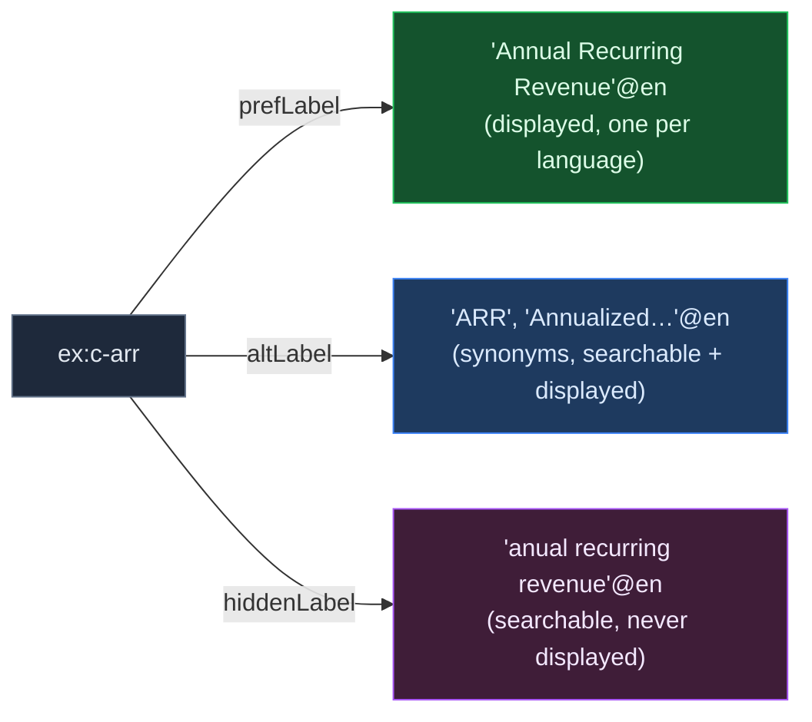

The three are **pairwise disjoint** (integrity condition S13): the same string cannot be both a pref and an alt label on one concept, nor alt and hidden, nor pref and hidden. The labeling properties are sub-properties of `rdfs:label` and their values are plain literals (a string plus an optional language tag, never a datatype).

A detail that becomes the hook for section 3: **no domain is stated** for the label properties. You can attach `prefLabel`/`altLabel`/`hiddenLabel` to any resource at all, not just a `skos:Concept`. SKOS leaves this open deliberately, and it is the clean extension point for using labels as free-floating glossary terms that resolve to concepts.

### 2.5 Notations

A `skos:notation` is a code ("303.4833", "T58.5", "K" for potassium) used to identify a concept within a scheme. It differs from a label in kind, not just in use: a notation is a **typed literal** (it carries a datatype URI naming the notation system, and no language tag), whereas a label is a **plain literal** (language tag, no datatype). The two never overlap as literal types.

```turtle
ex:c-arr skos:notation "REV-001"^^ex:MetricCode .
```

By convention no two concepts in a scheme share a notation (otherwise it could not identify uniquely), and a concept may carry several notations from different systems. For Argus, notation is where a stable internal metric code lives, distinct from the human label and distinct again from the opaque URI. Three identifiers, three jobs: URI for machine identity, notation for the catalog code, prefLabel for the human word.

### 2.6 Documentation properties

Seven note properties, all sub-properties of `skos:note`:

| Property | Purpose |
|---|---|
| `skos:definition` | The formal meaning of the concept |
| `skos:scopeNote` | What the concept does and does not cover; boundary clarification |
| `skos:example` | An illustrative instance |
| `skos:historyNote` | How the concept's meaning has changed over time |
| `skos:changeNote` | A specific edit, with provenance |
| `skos:editorialNote` | A note to stewards/maintainers, not end users |
| `skos:note` | The generic catch-all parent |

```turtle
ex:c-arr
    skos:definition "Annualized value of recurring subscription revenue
                     under contract as of a point in time."@en ;
    skos:scopeNote  "Excludes one-time fees and usage overages."@en ;
    skos:historyNote "Redefined 2025-Q3 to include multi-year prepay."@en ;
    skos:changeNote  "2026-01-14: scope narrowed to contracted ARR (steward: Devendra)."@en .
```

These are not decoration. `historyNote` and `changeNote` together are the audit trail that supports the deprecation-path requirement: when a concept's meaning shifts, the record of what changed and when lives here. Like the labels, the documentation properties have no stated domain (they can annotate any resource), and the set is explicitly meant to be *extended* by third parties where a more specific note type is needed.

### 2.7 Semantic relations: the core idea

This is the heart of SKOS, and the place where the design is most easily misread. SKOS distinguishes two basic kinds of link between concepts: **hierarchical** (one concept is more general than another) and **associative** (two concepts are connected, but neither is more general). And within the hierarchical kind, it makes a second distinction that is the key to the whole model: between the *fact you assert* and the *inference you draw*.

The property hierarchy:

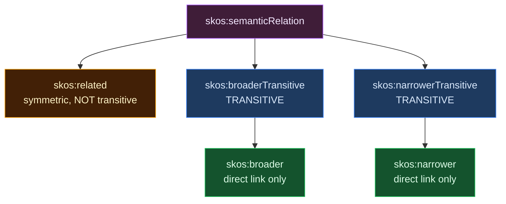

**`broader` and `narrower` are direct links.** `A skos:broader B` means B is the *immediate* parent of A: one step up, nothing skipped. Read the direction carefully: in `A broader B`, the object B is the broader (more general) concept. "A has-broader-concept B." So `ex:c-mrr broader ex:c-arr` reads "MRR's immediate parent is ARR." The two are inverses (S25): assert `A narrower B` and `B broader A` follows automatically, so you only ever state one direction.

**`broader` is deliberately NOT transitive.** This is the part that surprises people. If `ex:cat broader ex:mammal` and `ex:mammal broader ex:animal`, SKOS does *not* let you infer `ex:cat broader ex:animal`. That is intentional. SKOS wants `broader` to mean *exactly* "direct parent," with no ambiguity, so that an application asking "what are the immediate children of mammal?" gets back exactly one level, not the entire subtree at every depth. If `broader` were transitive you could no longer reconstruct the actual tree shape, which you need for rendering, navigation, and "show me one level down."

**`broaderTransitive` and `narrowerTransitive` are the ancestor/descendant relations**, and these *are* transitive (S24). `A broaderTransitive B` means B is an ancestor of A at *any* depth. The elegant part: `broader` is a sub-property of `broaderTransitive` (S22). So every direct link you assert is automatically also a transitive link, and the transitive closure then fills in all the indirect ancestors for free.

From two asserted facts:

```turtle
ex:cat    skos:broader ex:mammal .
ex:mammal skos:broader ex:animal .
```

a reasoner infers:

```turtle
ex:cat    skos:broaderTransitive ex:mammal .   # from sub-property (S22)
ex:mammal skos:broaderTransitive ex:animal .   # from sub-property (S22)
ex:cat    skos:broaderTransitive ex:animal .   # from transitivity (S24)
```

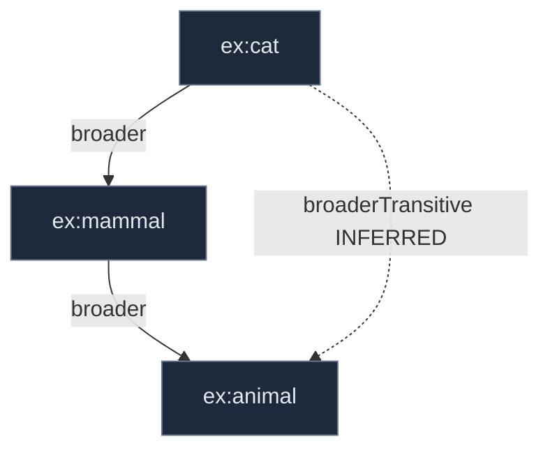

Solid arrows are asserted; the dashed arrow is inferred.

**The convention that makes this work: you only ever *assert* `broader`/`narrower`, and you only ever *query* `broaderTransitive`/`narrowerTransitive`.** The transitive properties are an inference surface, not an authoring surface. Authors write the direct skeleton; the system computes the ancestry. The intuition the spec uses: *father* (and *adoptive father*) are direct and non-transitive; *ancestor* is the transitive closure over them.

Why this matters in practice is query expansion. A user searches "animal" and you want to return everything filed under cat, dog, sparrow, and so on, then walk `narrowerTransitive` from animal and pull the whole subtree in one step. But when you *render* the taxonomy tree, walk `narrower` (direct only) so each node shows exactly its immediate children. Same asserted data, two relations, two jobs.

**`related` is the associative link**: "these two concepts are connected, but neither is more general." It is symmetric (S23): `A related B` entails `B related A`. It is **not** transitive (S32): `A related B` and `B related C` do *not* give `A related C`; relatedness does not chain. And it is **not** asserted reflexive or irreflexive: `A related A` is consistent with the model, though most applications will want to screen it out.

**The integrity condition that keeps the two kinds clean (S27):** `related` is disjoint from `broaderTransitive`. Two concepts cannot be both hierarchically connected (even indirectly, even through the transitive closure) and associatively linked. The model treats "is an ancestor of" and "is merely related to" as mutually exclusive. That disjointness is what stops the two link types from collapsing into a vague "connected somehow."

```turtle
# Consistent: a hierarchical link and an associative link to different concepts
ex:a skos:broader ex:b ;
     skos:related ex:c .

# NOT consistent: b is both broader-than and related-to a
ex:a skos:broader ex:b ;
     skos:related ex:b .
```

### 2.8 Cycles, reflexivity, and polyhierarchy

These three behaviors are where SKOS's open-world stance shows, and where we must decide our own conventions because SKOS will not decide for us.

**Cycles are consistent.** `ex:a broader ex:b` and `ex:b broader ex:a` together are valid SKOS: there is no condition requiring `broaderTransitive` to be irreflexive. SKOS will not reject a cycle. If we want to forbid cycles (we do), the strategy is to compute the transitive closure and look for any `X broaderTransitive X`; finding one means a cycle exists. Detecting and rejecting it is *our* job, an application convention, not a spec violation.

**Reflexivity is unspecified.** `ex:a broader ex:a` is neither required nor forbidden. Same screening approach applies if we want to treat it as an error.

**Polyhierarchy is native.** A concept having two broader parents is explicitly consistent: there is no condition requiring a single path between two nodes. This arises naturally and SKOS supports it directly. We do not need any junction-table workaround at the model level; multiple `broader` edges on one concept simply *are* polyhierarchy.

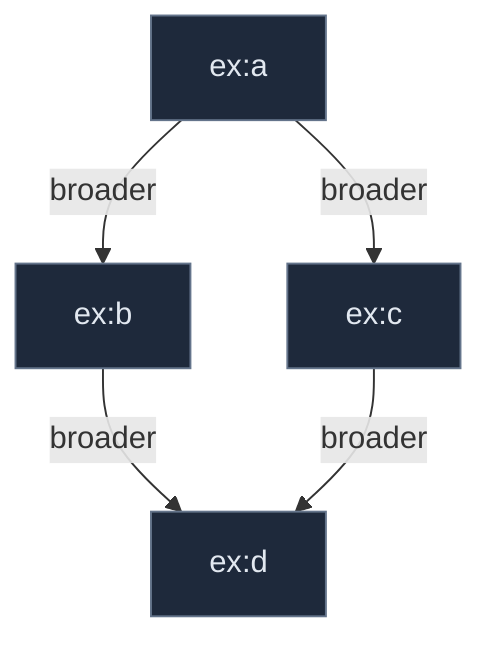

Two valid paths from `a` to `d`: consistent SKOS, native polyhierarchy.

### 2.9 Extending semantic relations

SKOS sanctions exactly one extension mechanism, and it is clean: **declare a custom property as an `rdfs:subPropertyOf` an existing SKOS property.** The spec proves this works (Example 31): custom `cause`/`effect` properties declared as sub-properties of `skos:related`, where the sub-properties may be symmetric, asymmetric, or antisymmetric independently of the parent.

The reason this is the *right* extension path, and not inventing parallel vocabulary, is the **dumb-down guarantee**. A downstream consumer that understands only core SKOS still reads your custom edge correctly through its parent: an `extendsFrom` edge reads as `broader`, a `belongsTo` edge reads as `related`. A richer consumer reads the specific predicate. The specificity is purely additive; nothing breaks for the simple reader. That dual-read property is the entire argument for extending by sub-property.

The choice of parent is not cosmetic; it determines which inferences and integrity conditions your relation inherits:

- Parent under **`broader`** → inherits transitive-closure behavior (your chains become queryable ancestry) *and* the disjointness-with-`related` constraint. Use only for genuinely hierarchical, is-a relations.
- Parent under **`related`** → associative, symmetric parent (though the child need not be symmetric), inherits the disjointness-from-hierarchy. Use for same-level structural associations.
- Parent under **`semanticRelation`** directly → a free-standing typed concept-to-concept edge with `Concept` domain/range, but *outside* both the hierarchical inference and the hierarchical/associative disjointness. Use when you need behavior (like transitivity) that the `related` branch forbids.

### 2.10 The Argus custom relations

Argus extends SKOS with five custom relations. Three parenting strategies, each chosen for the reasons above.

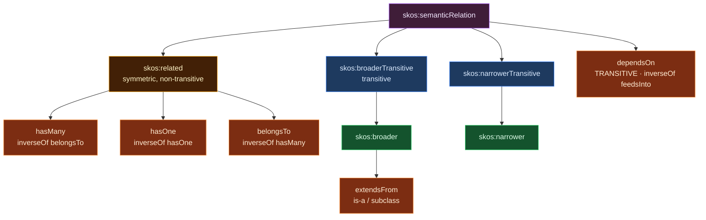

**`extendsFrom` → sub-property of `skos:broader`.** Genuinely hierarchical and is-a. `ex:b2b-customer extendsFrom ex:customer` is exactly a narrower/broader relationship. Parenting under `broader` means the subclass chains become queryable ancestry via `broaderTransitive`, and inherits the disjointness-with-`related`. This is the only one of the five that belongs in the hierarchy.

**The three structural relations → sub-properties of `skos:related`.** These are associative, not hierarchical. They are kept as three distinct properties rather than one relation with a cardinality flag, because their inverse structures differ:

| Relation | Cardinality | Inverse |
|---|---|---|
| `hasMany` | one-to-many | `belongsTo` |
| `hasOne` | one-to-one | `hasOne` (its own inverse class) |
| `belongsTo` | many-to-one | `hasMany` |

`hasOne` is its own inverse (if `ex:user hasOne ex:profile` then `ex:profile hasOne ex:user`, same cardinality both directions). `hasMany` and `belongsTo` are inverses of each other (cardinality flips: each item on the "many" side `belongsTo` exactly one). `belongsTo` is specifically the inverse of `hasMany`, not a generic inverse of all three, which is precisely why folding them into a single `has` predicate would lose information: a lone `has` could not tell a reasoner whether the back-link is `belongsTo` or another `hasOne`.

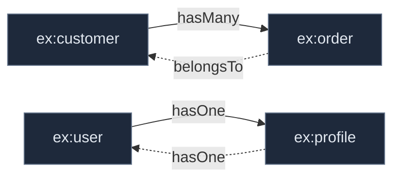

Because `related` is symmetric, the dumbed-down view still entails a symmetric, undirected `related` link; a core-SKOS consumer just sees "order and customer are related." The direction and cardinality live entirely in the sub-properties. The symmetry of the parent does not force symmetry on the children (spec §8.6.3). All three inherit the S27 disjointness, which is correct: an `order belongsTo customer` association must never also be a hierarchical ancestry claim.

```turtle
ex:hasMany   rdf:type owl:ObjectProperty ;
    rdfs:subPropertyOf skos:related ;
    owl:inverseOf ex:belongsTo .

ex:hasOne    rdf:type owl:ObjectProperty ;
    rdfs:subPropertyOf skos:related ;
    owl:inverseOf ex:hasOne .

ex:belongsTo rdf:type owl:ObjectProperty ;
    rdfs:subPropertyOf skos:related ;
    owl:inverseOf ex:hasMany .

ex:extendsFrom rdf:type owl:ObjectProperty ;
    rdfs:subPropertyOf skos:broader .
```

**`dependsOn` → direct sub-property of `skos:semanticRelation`, declared transitive, inverse `feedsInto`.** This is the deliberate departure. `dependsOn` is a provenance/lineage relation (`ex:cac-payback dependsOn ex:marketing-spend`), and lineage needs to *chain*: if a metric depends on another that depends on a third, the dependency carries through. But you cannot make a sub-property of `related` transitive, because `related` is non-transitive and the resulting closure would collide with the S27 disjointness. So `dependsOn` sits *beside* the hierarchical and associative branches, parented directly on `semanticRelation`. That placement frees it from both the non-transitivity and the disjointness, while keeping the `Concept` domain/range and a clean dumb-down to a generic semantic edge.

```turtle
ex:dependsOn rdf:type owl:ObjectProperty , owl:TransitiveProperty ;
    rdfs:subPropertyOf skos:semanticRelation ;
    owl:inverseOf ex:feedsInto .
```

Being disjointness-exempt is the point: a derived metric can legitimately both `dependsOn` and be `related` to its source, which the disjointness would otherwise forbid. The transitive closure answers the two questions that justify the relation's existence: *upstream* ("what breaks if this source changes?", walk `dependsOn`) and *downstream* ("what is affected by this?", walk `feedsInto`).

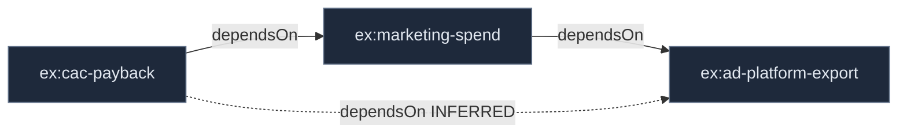

Every one of the five dumbs down losslessly: a core-SKOS consumer reads `extendsFrom` as `broader`, the three structural relations as `related`, and `dependsOn` as a bare `semanticRelation` edge.

### 2.11 Concept collections

A `skos:Collection` is a labeled, unordered group of concepts; a `skos:OrderedCollection` adds meaningful sequence. Members are stated with `skos:member` (range is the union of `Concept` and `Collection`, so collections nest) and, for ordered collections, `skos:memberList` pointing at an RDF list.

```turtle
ex:eco-vehicles rdf:type skos:Collection ;
    skos:prefLabel "Eco-Friendly Vehicles"@en ;
    skos:member ex:electric-sedan , ex:hybrid-suv .

ex:job-levels rdf:type skos:OrderedCollection ;
    skos:memberList ( ex:junior ex:mid ex:senior ) .
```

The critical rule: **a Collection is not a Concept**: they are disjoint classes (integrity condition S37). You therefore *cannot* use `broader`/`narrower`/`related` to link to or from a collection; the domain and range of the semantic relations is `skos:Concept`, so such a link is inconsistent. Collections are for grouping concepts under a shared label *without* creating a hierarchical relationship, the "eco-friendly" facet that crosses the real hierarchy without becoming part of it. Use a collection for faceting and node labels; never reach for it as a substitute for hierarchy.

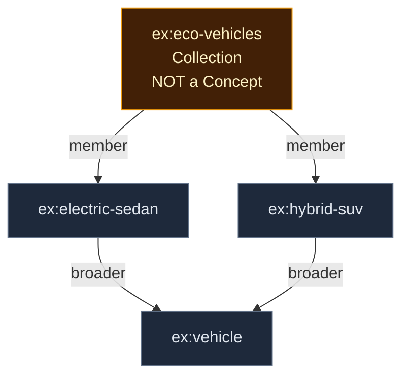

The sedan and SUV sit under `vehicle` in the real hierarchy (via `broader`); the collection groups them by a cross-cutting characteristic (via `member`) without touching that hierarchy.

### 2.12 Mapping properties

Mapping properties link concepts across *different* schemes: the alignment layer. There are five, plus their parent `skos:mappingRelation`:

| Property | Meaning | Formal character |
|---|---|---|
| `skos:exactMatch` | interchangeable across a wide range of applications | symmetric **and transitive** (S44, S45); sub-property of `closeMatch` |
| `skos:closeMatch` | interchangeable in *some* applications | symmetric, **not transitive** (deliberately) |
| `skos:broadMatch` | target is broader (cross-scheme) | sub-property of `broader` |
| `skos:narrowMatch` | target is narrower (cross-scheme) | sub-property of `narrower`; inverse of `broadMatch` |
| `skos:relatedMatch` | associative (cross-scheme) | sub-property of `related`; symmetric |

The full extended tree, mapping properties slotted under their semantic-relation parents:

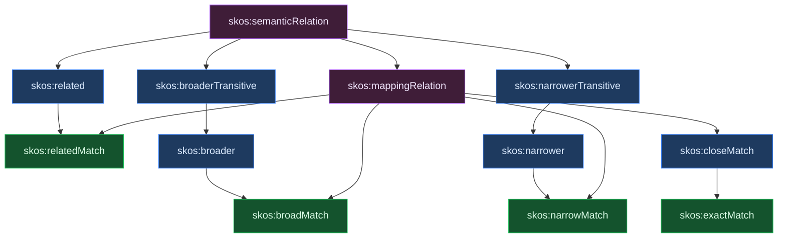

The distinction to hold onto, and the one most often gotten wrong: **`exactMatch` is transitive; `closeMatch` is not.** The spec asserts `exactMatch` as an `owl:TransitiveProperty` (S45). `closeMatch` is deliberately *not* transitive, specifically to avoid "compound errors" when chaining mappings across three or more schemes. So the discipline is this: the spec gives you a transitive `exactMatch`, and that very transitivity is why you chain it carefully: three `exactMatch` links across four schemes will be inferred into a complete equivalence web, and one sloppy assertion propagates everywhere. Use `exactMatch` only for genuine, confident interchangeability; reach for `closeMatch` the moment there is doubt, precisely because it does not propagate.

Integrity condition S46: `exactMatch` is disjoint from `broadMatch` and `relatedMatch` (and, by inference, `narrowMatch`). A pair of concepts cannot be both exactly equivalent and hierarchically or associatively mapped.

One more note that matters for Argus: SKOS deliberately does **not** equate `exactMatch` with `owl:sameAs`. `exactMatch` says "interchangeable for retrieval purposes," not "the same individual." We keep that separation: two concepts can be `exactMatch` without being asserted identical, which is exactly the looseness we want for cross-domain alignment that stops short of merging identities.

By convention, mapping properties link concepts in *different* schemes; using the plain semantic relations across schemes is also consistent. The mapping properties are a convenience that lets you tell at a glance which links are internal to a scheme and which are cross-scheme alignments.

### 2.13 Integrity conditions: consolidated checklist

The complete set of genuine integrity conditions: the only things that make SKOS data *inconsistent*. Everything else in the model licenses inference rather than enforcing a constraint. This is the validation checklist.

| ID | Condition |
|---|---|
| S9 | `skos:ConceptScheme` is disjoint with `skos:Concept`. |
| S13 | `prefLabel`, `altLabel`, `hiddenLabel` are pairwise disjoint. |
| S14 | A resource has at most one `prefLabel` per language tag. |
| S27 | `skos:related` is disjoint with `skos:broaderTransitive` (and therefore with `narrowerTransitive`). |
| S37 | `skos:Collection` is disjoint with each of `skos:Concept` and `skos:ConceptScheme`. |
| S46 | `skos:exactMatch` is disjoint with `broadMatch` and `relatedMatch` (and therefore `narrowMatch`). |

Things that are **consistent** and therefore *not* caught by SKOS validation, must be screened by application convention if you want them rejected: cycles in the hierarchy; reflexive links (`A broader A`, `A related A`); a concept in zero or many schemes; alternate paths / polyhierarchy (these we *keep*); a scheme with no top concept.

---

## 3. Labels as Glossary Terms, and Term Resolution

This is where Argus applies SKOS rather than restates it. SKOS supplies the target; Argus supplies the resolver.

> **Layer note.** This section sits at the boundary between the two knowledge layers. The *target* of resolution (concepts and their labels) is the meaning layer (Layer 1) and is what this section explains. The *resolver* itself, and the confidence score it produces, belong to the grounding layer (Layer 2): the score is ephemeral decision-scaffolding shown to a human to approve a term-to-label match, not a durable property of any SKOS edge. This section introduces resolution because its target is SKOS; the resolver's full mechanics, the three proposal jobs, and the term-acceptance-to-binding flow are specified in section 5.4, which is authoritative.

The model from section 2.4 does the structural work: a concept holds its `prefLabel`, its `altLabel` synonyms, and its `hiddenLabel` misspellings/deprecated forms, while the concept's *identity* is the opaque URI. A glossary term, in this framing, is just a label, and because the SKOS labeling properties have no stated domain, a free-floating term can exist as a label before it is ever attached to a settled concept.

The resolution problem is: given a free-style string a user or an agent typed (`"arr_total"`, `"annualised rec rev"`, `"net new ARR"`), find the concept it means, and attach a confidence to that judgment. The string will not, in general, be an exact label match. SKOS gives the resolution *target* (a concept URI). Argus computes the resolution.

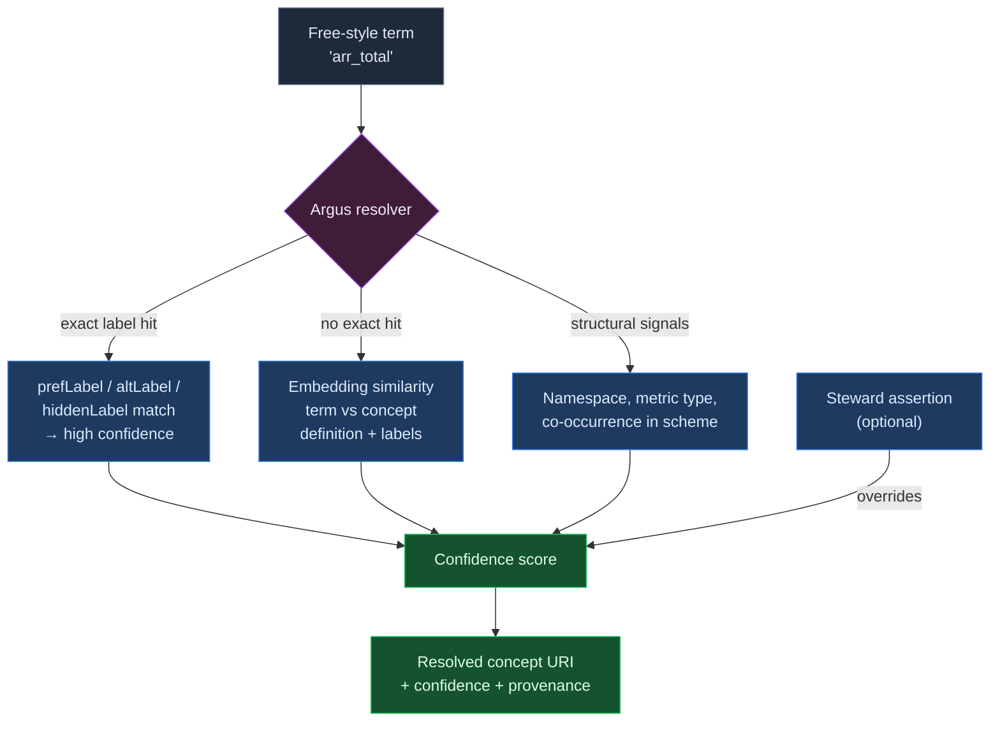

The confidence score is a **computed** property, never a declared one. Three input signals, combined:

1. **Lexical match.** Does the term match a `prefLabel`, `altLabel`, or `hiddenLabel` exactly or near-exactly (after normalization)? An exact `prefLabel` hit is the strongest lexical signal; an `altLabel` hit slightly less; a `hiddenLabel` hit (it matched a known misspelling) lower still but still positive. This is the cheapest check and resolves the majority of well-behaved terms outright.

2. **Semantic similarity.** Embed the free-style term (and any surrounding context) and compare against the embedding of each candidate concept's definition plus labels. The embedding distance is the signal that catches paraphrase and novel phrasing: `"annualised rec rev"` never appears as a label but sits close to the ARR concept's definition vector. This is what lets the resolver handle terms it has never literally seen.

3. **Structural alignment.** Does the term's namespace, its declared metric type, or its co-occurrence with other already-resolved terms in the same scheme point toward a particular concept? A term appearing in a revenue-domain context resolves toward revenue-domain concepts. Structural context disambiguates between two concepts that are lexically and semantically close.

These combine into a single confidence. Above a high threshold, the resolver binds automatically and records the binding with its provenance. In a middle band, it proposes the binding and surfaces it for steward review. Below a floor, it declines to bind and flags the term as unresolved: a candidate for a *new* concept that does not yet exist.

A **steward assertion overrides everything.** When a human confirms "this term means this concept," that assertion outweighs the computed signals and the confidence is pinned. But (and this is the governance principle that makes the model tractable) human assertion is never *required*. The system computes confidence continuously and cheaply; humans intervene only at the margins and only when they choose to. This keeps the governance burden where it belongs: humans *approve concepts* (high-cost, low-frequency), humans *optionally assert bindings* (medium-cost, medium-frequency), and the system *computes confidence* (low-cost, high-frequency).

The same machinery handles drift. When a resolved term's underlying implementation changes, its structural and semantic signals shift, the computed confidence drops, and the resolver surfaces the decay rather than silently tolerating a now-wrong binding or silently breaking it. The bottom-up emergence path follows from the unresolved-term case: terms that repeatedly fail to resolve, but cluster together semantically, are the signal that a new concept wants to exist, and that proposal goes to a steward to approve, never to author from scratch.

---

## 4. Concept Schemes as Business Domains

The cleanest mapping in the whole exercise, and the one that resolves a standing design question: **each business domain is a `skos:ConceptScheme`.**

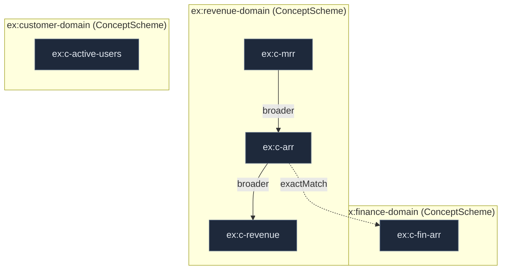

The standing question was whether the `glossary.*` namespace and the domain namespaces (`revenue.*`, `finance.*`, `customer.*`) represented an intentional dual registry or accumulated inconsistency. SKOS answers it directly: they are not two registries. `revenue.*` and `finance.*` are concepts `inScheme` two different domain ConceptSchemes. There is no separate "glossary namespace"; the glossary is the *human-readable projection across all the domain schemes*, not a registry of its own. The appearance of a distinct `glossary.*` namespace is the symptom of having treated the glossary as a flat global registry instead of as the union of per-domain schemes.

So the resolution is: **accumulated inconsistency, and here is the model that removes it.** A concept's home is its scheme. There is exactly one place a concept lives, and the glossary is a view over all of them, not a parallel store.

This buys three things directly from the SKOS model:

**Domain ownership maps to scheme membership.** The revenue team owns `ex:revenue-domain`; concepts in that scheme are theirs to steward. `inScheme` *is* the ownership boundary. And because schemes are open (section 2.3), a domain is never "finished"; it accretes concepts over time without anyone having to declare it complete.

**Shared concepts are handled honestly.** A concept genuinely used by two domains can be `inScheme` both: membership is many-to-many. No duplication, no forced single owner. When two domains have *similar but distinct* concepts (revenue's ARR and finance's ARR, defined slightly differently), they stay as separate concepts in their respective schemes, linked by `exactMatch` or `closeMatch` rather than collapsed into one. The cross-domain alignment is explicit and auditable, and per section 2.12 `closeMatch` is the safe default the moment the two definitions are not provably interchangeable, because it does not propagate the way `exactMatch` does.

**Cross-domain links use mapping properties.** Within a domain scheme, concepts link with the plain semantic relations (`broader`, `related`, and the Argus extensions). Across domain schemes, they link with the mapping properties (`exactMatch`, `closeMatch`, `relatedMatch`). The choice of property tells you at a glance whether a link is internal to a domain or a cross-domain alignment, which is exactly the provenance distinction Argus needs when it converges the per-product Vulcan semantic models into a single org-wide semantic layer.

Within the meaning layer, then, each domain scheme tends its own concepts, and the mapping properties are what cross between them, so no single scheme is asked to hold everything.

---

## 5. The Grounding Layer

The meaning layer (sections 1–4) organizes meaning: concepts relating to concepts. This layer grounds that meaning in real data. It references SKOS concepts by their opaque URIs and never adds to the SKOS vocabulary. Three concerns live here: asset attachment, term mapping, and workflow.

### 5.1 Asset attachment (bindings)

A **binding** is an asserted edge from a SKOS concept to a physical asset in a data product: a model, column, or measure. It states a fact: *this physical thing realizes this concept*.

A binding is **not** a SKOS construct. SKOS concepts bind only to other concepts; a concept-to-table edge has no home in the SKOS vocabulary by design, because SKOS is about meaning, not about where meaning is realized. So bindings live in Layer 2, referencing the concept but never modifying it.

A binding carries **no confidence score**. It is an assertion, not an inference: either someone (or a deploy-time process) declared that this asset realizes this concept, or they did not. This is the clean separation from term mapping (section 5.4), where confidence does appear. Binding is a fact about reality; term mapping is an inference proposed for human approval.

Bindings are many-to-many: one concept can be realized by several assets across products (the same metric built in three data products), and one asset can realize several concepts. A concept's bindings *are* the set of places it is realized across the organization: this is what makes Argus a cross-product semantic layer rather than a single-product model.

Each binding stores a structural fingerprint of its asset at bind time, so that later divergence can be detected as drift (section 5.5).

### 5.2 Binding kinds

The binding kind describes the nature of the concept-to-asset edge. It is a **closed, system-defined enum**, owned by Argus and not user-extensible. Ship set:

| Kind | Meaning | Agent reasoning it enables |
|---|---|---|
| `implements` | The asset *is* the computation/realization of the concept (the authoritative "ARR is this measure"). | "To get ARR, query this." The primary executable edge; the one an agent trusts to run. |
| `derivedFrom` | The asset is an *input* to the concept's computation, not the concept itself. | Physical lineage: "this concept's realization reads from that asset." |
| `tagged` | The asset is topically *about* the concept but does not realize it. | Discovery and recall, without claiming the asset computes the concept. |

The strength gradient is the point: `tagged` is the loose, high-recall edge anyone may assert; `implements` is the authoritative edge an agent relies on to actually run. Candidate kinds (`constrains`/`validates`, `sampleOf`) are held back until a concrete agent question demands them.

> **PS: why binding kinds are an enum, not concepts.** A tempting refactor is to model each binding kind as a SKOS concept in a meta-scheme, so that "everything is a concept." We deliberately rejected this. Binding kinds are a small, closed, slow-moving set with *fixed operational semantics that an agent must understand natively*: an agent has to already know what `implements` means to reason correctly; it cannot derive that behaviour from a definition string at runtime. Making kinds into concepts adds indirection that buys nothing, invites teams to mint new kinds (which would break the guarantee that an agent can rely on what a kind means), and blurs the Layer-1/Layer-2 boundary by putting an operational Layer-2 vocabulary into the SKOS meaning graph. The kind vocabulary is owned by Argus and changes only by deliberate engineering decision. If you are reading this because you want to add a kind: add it to the enum and document its operational semantics here. Do not turn kinds into concepts.

### 5.3 dependsOn vs derivedFrom: the endpoint-type rule

`dependsOn` (Layer 1) and `derivedFrom` (Layer 2) look like the same idea and are routinely confused. They are not the same edge. The difference is **what sits at the other end**:

- **concept → concept** is `dependsOn` (Layer 1, a semantic relation): *what meaning does this meaning rest on?* "ARR depends on Revenue" is true at the level of definitions, survives even with zero implementations built, and is cross-product and stable.
- **concept → asset** is a `derivedFrom` binding (Layer 2): *what physical asset feeds this concept's computation?* "ARR is derived from `warehouse.fct_revenue`" exists only once something is built, points at a specific table in a specific Vulcan model, and churns as implementations change.

The rule removes the judgment call entirely:

> **If the other end is a concept, it is a Layer-1 `dependsOn`. If the other end is an asset, it is a Layer-2 `derivedFrom` binding. The endpoint type is the layer.** You never choose between them; the thing you point at decides.

Why keep them separate: ARR `dependsOn` Revenue is **one** edge (concept to concept), but ARR may be `derivedFrom` **three** different tables that each realize Revenue differently. The conceptual dependency is single and stable; the physical derivations are many and volatile. Collapsing them loses the ability to say "the *meaning* is stable but the *plumbing* moved", which is exactly the drift signal of section 5.5 (the binding fingerprint changes; the `dependsOn` does not).

The two layers can corroborate each other: when ARR is `derivedFrom` table T and T `implements` Revenue, ARR's conceptual `dependsOn` Revenue is *confirmed by physical evidence*. Argus can flag stated conceptual dependencies that are **not** backed by actual lineage, and lineage that implies an **unstated** conceptual dependency. That cross-layer check is a capability, not a reason to merge the edges.

### 5.4 Term mapping and the resolver

Term mapping resolves a free-style string (`arr_total`, a column name, a query fragment) to a concept and proposes attaching it as a **label** (`altLabel`, `hiddenLabel`, or candidate `prefLabel`). The resolver computes a **confidence score** shown *to a human to decide*.

Confidence is **ephemeral and Layer-2**: it is a property of the *proposal event*, not of any durable edge. Once a human approves, the label is attached as a plain SKOS label and the score is gone. An agent never thresholds on a stored label-confidence, because none exists; approved labels are simply true.

The resolver combines three signals, **lexical** (match against existing labels), **semantic** (embedding distance to candidate concepts' definitions and labels), and **structural** (namespace, metric type, co-occurrence with already-resolved terms). It runs three named proposal jobs, all feeding a steward approval queue, never writing to the graph directly:

1. **Map to existing concept**: "this term maps to concept X, confidence 0.88." High-frequency, low-ceremony. Most terms map to something that already exists.
2. **Suggest a new concept**: when a term, or better a *cluster* of terms across products, resolves to nothing with confidence, propose a draft concept (prefLabel, definition, scheme) for the steward to create. One unresolved term is noise; five across three products that cluster semantically are a concept the org has been using without naming. This is bottom-up emergence.
3. **Suggest alignment**: notice two existing concepts in different schemes that look like the same or related meaning, and propose a mapping property (`closeMatch`/`exactMatch`) plus optionally a canonical flag. This is cross-product convergence proper.

The unifying principle: **AI proposes, with confidence and supporting evidence; the steward gives a yes / no / edit on a well-formed proposal, never authoring from a blank page.** The same three-signal machinery serves all three jobs; only the target differs.

**Term acceptance triggers a binding proposal, not an automatic binding.** When an accepted term originates from an asset (a column or measure name), confirming the term-to-concept resolution is strong evidence the asset realizes the concept, but not proof of *which kind* (`implements` vs `tagged`), nor that this asset is the authoritative one. So acceptance feeds a binding *proposal* with a suggested kind and confidence; a human or threshold approves; the resulting binding is then an asserted, confidence-free fact (section 5.1). Term acceptance is evidence feeding a proposal, never a binding in itself.

### 5.5 Workflow and governance

Workflow governs how concepts and bindings move through their lives. It operates *on* the SKOS layer and records change using SKOS's native `historyNote`/`changeNote`, but the machinery itself is Layer 2.

**Concept lifecycle:** `proposed → active → deprecated → superseded`. Proposed concepts are visible but agents exclude them from authoritative reasoning. Deprecation never deletes: a deprecated concept points via `supersedes` to its replacement, so bindings degrade gracefully and an agent following a dead concept is routed to the live one.

**Governance is approving, not authoring.** Stewards do not write concepts top-down; they approve what emerges bottom-up (section 5.4). The cost gradient: creating a *concept* is high-cost, low-frequency, gated; asserting a *binding* is medium-cost, medium-frequency, optionally reviewed; computing *confidence* is zero-cost, high-frequency, automated. The burden sits where it is cheap. AI never writes to the graph directly; it only populates the proposal queue.

**Approval gates** apply to a small number of transitions: promoting a proposed concept to active, deprecating or superseding a concept, and optionally (per scheme) confirming a binding. Everything else flows ungated.

**Mutual exclusivity:** a `ConceptScheme` may be flagged mutually exclusive, meaning an asset may bind to at most one concept from that scheme (an asset is `PII-Sensitive` *or* `PII-NonSensitive`, never both). The validator enforces this at bind time. No SKOS construct covers this; it is a Layer-2 constraint on bindings.

**Canonical flag:** when two domains hold legitimately-distinct-but-aligned concepts (revenue's ARR and finance's ARR, linked by `closeMatch`), one may be flagged enterprise-canonical. The variants coexist in their schemes, the mapping property records their relationship, and the flag tells an agent which to prefer when several aligned concepts match. A Layer-2 annotation, not a SKOS property.

**Drift detection:** each binding's stored fingerprint (section 5.1) is compared against the asset over time. On divergence, the workflow surfaces one of three cases for human judgement: the implementation drifted (re-confirm or demote the binding), the concept's meaning changed (propose a new version), or the asset now realizes a *different* concept (propose a new binding). The system detects and surfaces; humans judge. "AI proposes, human approves" applied to evolution, not just creation.

---

## 6. The Harvest Subsystem

Argus Panoptes was the hundred-eyed giant, Hera's all-seeing guardian, whose eyes never all slept at once, so nothing across his domain escaped notice. Harvest is those eyes. Where the knowledge layers *curate* meaning, Harvest *observes* reality: it automatically pulls structural metadata from every registered data product and stitches it into one searchable, lineage-connected picture that no single data product can see on its own.

### 6.1 What Harvest is

Individual data products (Vulcan projects) run in isolation. Each knows only its own models, its own lineage, its own runs. Harvest sits above all of them and asks the question no single product can: *what does all our data look like, and how does it connect?* It pulls each product's metadata on a schedule, detects what has changed, and maintains a unified view across the whole estate.

Harvest differs from the knowledge layers in kind, and the difference is the reason it is a subsystem rather than a third curated layer:

- It is **automated**: metadata is pulled and processed without human involvement.
- It is **ungoverned**: it reflects whatever the data products emit. There are no stewards, no approval gates, no lifecycle. If a product publishes a model, Harvest records it; if the product removes it, Harvest drops it. Truth here is "what the products say," not "what has been approved."
- It is **structural, not semantic**: it captures the shape of data (models, columns, measures, physical tables, lineage, run health), not the meaning of it. Meaning is the knowledge layers' job, curated from what Harvest observes.

This separation is deliberate. Folding Harvest into the grounding layer would hide that the harvester has no governance while everything beside it does. Keeping it a distinct subsystem keeps that boundary honest: Harvest is the raw, high-volume, always-current sensory feed; the knowledge layers are the considered, low-volume, human-approved understanding built on top of it.

### 6.2 The harvested picture

Harvest models the estate at three conceptual levels, each named here without committing to storage (the implementation is specified separately):

- **Data product**: a registered Vulcan project, identified by its tenant, name, and environment. It carries product-level descriptors: domain, alignment (source- or consumer-aligned), version, discoverability, and a health/active status. A product can be marked inactive, in which case it is excluded from discovery and lineage results by default.
- **Model**: a unit within a data product: a physical SQL or seed table, an external reference to another product's table, a semantic model, a metric, or a perspective (a published consumption artifact). The *kind* and *source type* of a model are what let Harvest tell a physical table apart from a semantic definition apart from a published output.
- **Column / measure / dimension / segment**: the fields within a model. Measures carry a measure type (sum, count, ratio, and so on); dimensions and segments describe the analytical structure; physical columns describe the raw shape.

Every level carries free-form **tags** and **terms**, and those term streams are the seam to the knowledge layers (section 6.5).

### 6.3 Two kinds of lineage

Harvest tracks lineage at the model and column level, and it is essential not to confuse this with the meaning layer's `dependsOn`. They are different in nature:

- **Intra-product lineage** is *declared*: a model states what it depends on, and Harvest records those edges directly.
- **Cross-product lineage** is *resolved, not declared*. When a model in product B references the same physical table (same gateway, same table name) as a model in product A, B depends on A, and Harvest discovers this by matching physical table references, with no annotation required. The dependency falls out of the shared physical location. This is the connection no single product can see: product B only knows it reads "some external table"; only Harvest, seeing both products, knows that table is produced by product A.

This is **data-flow lineage**, which physical output feeds which physical input. It is distinct from the meaning layer's `dependsOn`, which is **semantic dependency**, which concept's meaning rests on which. The endpoint-type rule of section 5.3 is the bridge: a concept-to-concept dependency is `dependsOn` (meaning layer); a concept-to-asset derivation is a `derivedFrom` binding (grounding layer); and the asset-to-asset flow Harvest computes is what lets Argus check whether the two agree (section 6.5).

### 6.4 Discovery

Because Harvest holds the whole estate in one place, it can answer questions no single product can: find a measure by tag across every product, search models and columns by name or description, surface similar entities by meaning, and browse the estate by facet (kind, source type, tag, term, domain). Discovery spans structured filtering, full-text search, and similarity search, always scoped to active products by default. This is the capability that turns a scattered set of isolated products into a single searchable body of organizational data knowledge.

### 6.5 Seams to the knowledge layers

Harvest is the sensory feed; the knowledge layers reason over it. Four seams connect them, and together they are what make Argus one system rather than two.

1. **Terms → resolver queue.** Every tag and term Harvest pulls from a data product is a free-style string. As products are synced, newly discovered terms enter the resolver queue (section 5.4): the resolver proposes a mapping to an existing concept, a brand-new concept, or an alignment between concepts, and a steward approves. This is the discover-then-converge loop in motion: *term appears in sync → enters resolver queue → proposal → steward*. Harvest supplies the raw vocabulary; the grounding layer converges it onto meaning.

2. **Cross-product lineage → `dependsOn` corroboration.** The asset-to-asset data-flow lineage Harvest resolves is the physical evidence that confirms or contradicts the meaning layer's conceptual `dependsOn`. When a concept is `derivedFrom` an asset and that asset feeds another via Harvest lineage, a stated conceptual dependency is corroborated; when the lineage and the concept graph disagree, Argus can surface the discrepancy (a claimed dependency with no physical basis, or physical flow implying an unstated dependency).

3. **Harvested assets → binding targets.** The models, columns, and measures Harvest catalogs are the very things the grounding layer's bindings point at (section 5.1). Without Harvest, a binding would have nothing concrete to attach to; Harvest is what makes the binding target real and current.

4. **Discovery → workflow triggers.** Beyond terms, structural changes Harvest detects can trigger knowledge-layer workflows: a new measure appearing across several products may signal an emerging concept; a model going stale or failing may flag bindings that now rest on unhealthy data; a removed model may orphan a binding and prompt review. Harvest observes the change; the workflow decides what it means.

The throughline: Harvest is automated breadth, the knowledge layers are curated depth, and the seams are where breadth becomes depth: observed reality flowing upward into approved meaning, one proposal at a time.