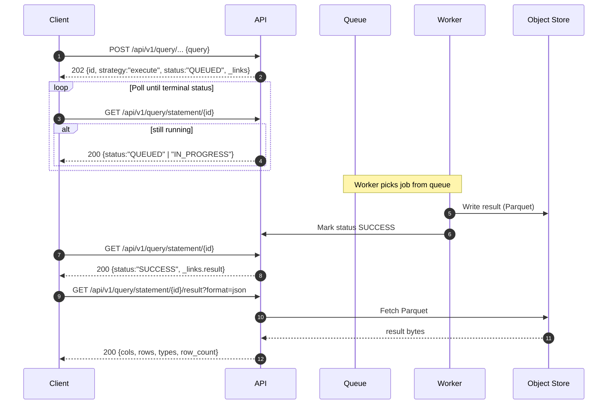
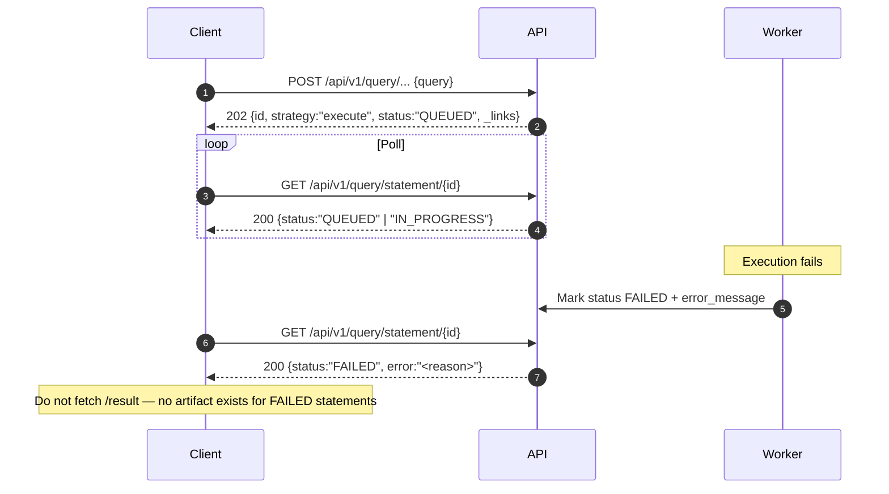
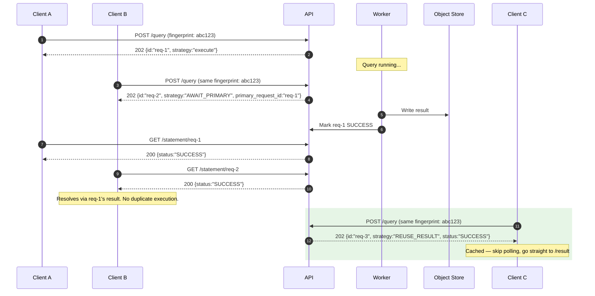
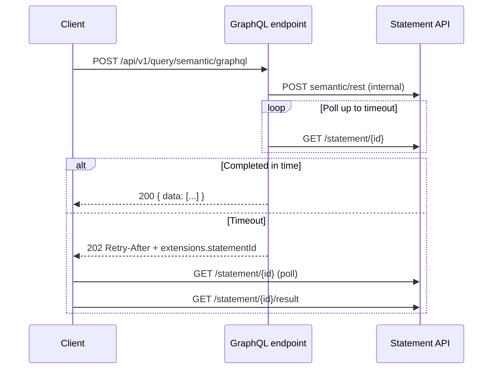

# Querying data products

Vulcan exposes two ways to read data.

**Semantic models** are the governed layer — measures, dimensions, segments, and joins defined in your project. You query them by member name (`users.plan_type`, `store_revenue.measure`), not by warehouse column names. REST ([§1](#1-rest)), Semantic SQL ([§2](#2-semantic-sql)), GraphQL ([§3](#3-graphql)), and the Metric API ([§4](#4-metrics)) all target this layer. Your request is transpiled into warehouse SQL, executed on the gateway, and returned as a statement result.

**Physical models** are the underlying warehouse tables. **Source SQL** ([§5](#5-source-sql)) runs a `SELECT` you write directly against those tables — no transpiler, no semantic member names. Use it for ad-hoc access or columns the semantic layer does not expose.

Most interfaces return `202 Accepted` and a statement id; you poll until the query finishes, then fetch rows. GraphQL usually returns data in one response; long queries fall back to the same poll-and-fetch flow ([§6 Statement lifecycle](#6-statement-lifecycle)).

| Path | You send | What runs |
|------|----------|-----------|
| Semantic | REST, GraphQL, Semantic SQL, or Metric API | Transpiler → warehouse SQL → gateway |
| Physical | Source SQL | Your `SELECT` → gateway |

Member names use `model.column`. Time buckets add a granularity suffix (`users.signup_date.month`). Pick an interface in the table of contents below.

---

## Table of contents

**Query interfaces**

1. [REST](#1-rest)
2. [Semantic SQL](#2-semantic-sql)
3. [GraphQL](#3-graphql)
4. [Metrics](#4-metrics)
5. [Source SQL](#5-source-sql)

**Reference**

- [Statement lifecycle](#6-statement-lifecycle)
- [Measure and dimension behavior](#7-measure-and-dimension-behavior)
- [Cross-model queries](#8-cross-model-queries)
- [GraphQL vs REST](#9-graphql-vs-rest)

---

## 1. REST

REST is the canonical query shape. Semantic SQL transpiles to it; GraphQL compiles to it internally; the Metric API expands into it.

**Endpoint:** `POST /api/v1/query/semantic/rest`

**Body:** `{"query": { ... }}`

### Response lifecycle

`POST` returns `202 Accepted` with a statement `id`. Poll `GET /api/v1/query/statement/{id}` until `status` is `SUCCESS` or `FAILED`. Fetch rows from `GET /api/v1/query/statement/{id}/result?format=json` only after `SUCCESS`.

```bash
ID=$(curl -s -X POST https://<host>/api/v1/query/semantic/rest \
  -H "Authorization: Bearer $TOKEN" \
  -H "Content-Type: application/json" \
  -d '{"query":{"measures":["users.total_users"],"dimensions":["users.plan_type"]}}' \
  | jq -r '.id')

until [ "$(curl -s -H "Authorization: Bearer $TOKEN" \
  "https://<host>/api/v1/query/statement/$ID" | jq -r '.status')" = "SUCCESS" ]; do
  sleep 2
done

curl -s -H "Authorization: Bearer $TOKEN" \
  "https://<host>/api/v1/query/statement/$ID/result?format=json" | jq .
```

Status codes, deduplication, and export formats: [§6 Statement lifecycle](#6-statement-lifecycle).

At least one of `measures`, `dimensions`, or `timeDimensions` is required.

### Top-level fields

| Field | Description |
|-------|-------------|
| `measures` | Metrics to compute (`model.measure`) |
| `dimensions` | Group-by attributes; time fields may use `model.date.granularity` |
| `segments` | Pre-defined boolean filters from the model (ANDed) |
| `filters` | Ad-hoc filter trees (see [Filters](#filters)) |
| `timeDimensions` | Time grouping and range filtering |
| `order` | Sort — object or array of `[member, direction]` pairs |
| `limit` | Max rows (default 10,000; max 50,000) |
| `offset` | Pagination offset |
| `timezone` | IANA timezone (default `UTC`) |
| `total` | When `true`, also return full row count before limit/offset |
| `ungrouped` | Row-level results without `GROUP BY` |
| `joinHints` | Explicit join path sequences (see [§8](#8-cross-model-queries)) |

Default order when omitted: first `timeDimensions` entry with granularity (asc) → first measure (desc) → first dimension (asc). Pass `"order": []` to disable ordering.

### Filters {#filters}

The `filters` array holds leaf filters and logical groups. Each top-level entry is ANDed with the others.

**Leaf filter:** `{ "member": "model.field", "operator": "...", "values": [...] }`

**Logical filter:** exactly one of `{ "and": [...] }` or `{ "or": [...] }`. Children nest recursively.

Dimension filters restrict rows before aggregation (SQL `WHERE`). Measure filters restrict aggregated results (SQL `HAVING`). Do not mix dimension and measure filters inside the same `and`/`or` group — use separate top-level entries.

**Segments** (`segments[]`) are pre-authored boolean filters, ANDed together. In Semantic SQL they appear as `WHERE segment_name IS TRUE`.

#### REST ↔ SQL mapping

| REST | SQL | Notes |
|------|-----|-------|
| Top-level `filters` entries | AND between clauses | Each array element is one tree |
| `{ "and": [...] }` | `( … AND … )` | Recursive |
| `{ "or": [...] }` | `( … OR … )` | Recursive |
| Dimension leaf filter | `WHERE` | Before aggregation |
| Measure leaf filter | `HAVING` | After aggregation |
| `equals` + multiple values | `= v1 OR = v2` | Same as `in` for strings/numbers |
| `in` / `notIn` | `IN (...)` / `NOT IN (...)` | |
| `contains` | `ILIKE '%v%'` | Case-insensitive |
| `notContains` | `NOT ILIKE …` | Includes NULL rows unless `null` in values |
| `startsWith` / `endsWith` | `ILIKE 'v%'` / `ILIKE '%v'` | |
| `gt` / `gte` / `lt` / `lte` | comparisons | On dimensions or measures |
| `set` / `notSet` | `IS NOT NULL` / `IS NULL` | Omit `values` |
| `inDateRange` | typed range / `BETWEEN` | Prefer `timeDimensions[].dateRange` when bucketing |
| `measureFilter` | measure's built-in predicate | Omit `values` |

#### Simple filters

REST:

```json
{
  "filters": [
    {
      "member": "users.plan_type",
      "operator": "notEquals",
      "values": [
        "free"
      ]
    },
    {
      "member": "users.email",
      "operator": "set"
    }
  ]
}
```

Semantic SQL ([§2](#2-semantic-sql)):

```sql
WHERE users.plan_type <> 'free'
  AND users.email IS NOT NULL
```

#### Nested OR with inner AND

Equivalent to `(country ∈ {US, CA, GB}) OR (country = DE AND status = completed AND plan ≠ free)`.

REST:

```json
{
  "filters": [
    {
      "or": [
        {
          "member": "users.country",
          "operator": "equals",
          "values": [
            "US",
            "CA",
            "GB"
          ]
        },
        {
          "and": [
            {
              "member": "users.country",
              "operator": "equals",
              "values": [
                "DE"
              ]
            },
            {
              "member": "subscriptions.status",
              "operator": "equals",
              "values": [
                "completed"
              ]
            },
            {
              "member": "users.plan_type",
              "operator": "notEquals",
              "values": [
                "free"
              ]
            }
          ]
        }
      ]
    }
  ]
}
```

Semantic SQL:

```sql
WHERE (
  users.country IN ('US', 'CA', 'GB')
  OR (
    users.country = 'DE'
    AND subscriptions.status = 'completed'
    AND users.plan_type <> 'free'
  )
)
```

#### Dimension filters + separate measure filter

REST:

```json
{
  "filters": [
    {
      "and": [
        {
          "member": "subscriptions.plan_type",
          "operator": "equals",
          "values": [
            "enterprise",
            "business"
          ]
        },
        {
          "member": "users.industry",
          "operator": "set"
        }
      ]
    },
    {
      "member": "subscriptions.mrr",
      "operator": "gte",
      "values": [
        "10000"
      ]
    }
  ]
}
```

Semantic SQL:

```sql
SELECT users.industry, MEASURE(subscriptions.mrr)
FROM users
CROSS JOIN subscriptions
WHERE subscriptions.plan_type IN ('enterprise', 'business')
  AND users.industry IS NOT NULL
GROUP BY 1
HAVING MEASURE(subscriptions.mrr) >= 10000
```

#### Filter operators {#filter-operators}

| Operator | `ltype` | Needs `values` | Description |
|----------|---------|----------------|-------------|
| `equals` | string, number, boolean, time | yes | Exact match; multiple values = OR |
| `notEquals` | string, number, boolean, time | yes | Inverse of equals |
| `in` | string, number | yes | Value in list |
| `notIn` | string, number | yes | Value not in list |
| `contains` | string | yes | Case-insensitive substring |
| `notContains` | string | yes | Inverse; includes NULL unless `null` in values |
| `startsWith` | string | yes | Case-insensitive prefix |
| `notStartsWith` | string | yes | Inverse |
| `endsWith` | string | yes | Case-insensitive suffix |
| `notEndsWith` | string | yes | Inverse |
| `gt` | number, measure | yes | Greater than |
| `gte` | number, measure | yes | Greater than or equal |
| `lt` | number, measure | yes | Less than |
| `lte` | number, measure | yes | Less than or equal |
| `set` | any | no | Not NULL |
| `notSet` | any | no | Is NULL |
| `inDateRange` | time | yes | Inclusive range `["start", "end"]` |
| `notInDateRange` | time | yes | Outside range |
| `onTheDate` | time | yes | Exact date |
| `beforeDate` | time | yes | Strictly before |
| `beforeOrOnDate` | time | yes | On or before |
| `afterDate` | time | yes | Strictly after |
| `afterOrOnDate` | time | yes | On or after |
| `measureFilter` | measure | no | Measure's built-in filter predicate |

Notes:

- `equals` with multiple values is equivalent to `in`.
- Dates: `"YYYY-MM-DD"` or `"YYYY-MM-DDTHH:mm:ss.SSS"`. Date-only values pad to day boundaries.
- `onTheDate` matches one calendar day on a time member. The same filter is `inDateRange` with the same start and end date.

### Time dimensions

```json
{
  "timeDimensions": [
    {
      "dimension": "users.signup_date",
      "granularity": "week",
      "dateRange": "last 90 days"
    }
  ]
}
```

| Field | Description |
|-------|-------------|
| `dimension` | Qualified time field (required) |
| `granularity` | Bucket: `second`, `minute`, `hour`, `day`, `week`, `month`, `quarter`, `year`, or custom |
| `dateRange` | Preset string or `["YYYY-MM-DD", "YYYY-MM-DD"]` |
| `compareDateRange` | Period-over-period — array of date ranges; mutually exclusive with `dateRange` |

#### Date range presets {#date-range-presets}

Accepted as `dateRange` strings in `timeDimensions[]`. Evaluated in the query `timezone`.

| Category | Presets |
|----------|---------|
| Single day | `today`, `yesterday`, `tomorrow` |
| Rolling window | `last 7 days`, `last 14 days`, `last 30 days`, `last 60 days`, `last 90 days`, `last 180 days`, `last 365 days`, `last 6 months`, `last 3 months` |
| Calendar — past | `last week`, `last month`, `last quarter`, `last year` |
| Calendar — current | `this week`, `this month`, `this quarter`, `this year` |
| Calendar — future | `next week`, `next month`, `next quarter`, `next year` |
| Extended | `from 7 days ago to now`, `from now to 2 weeks from now`, `last 360 days` |

For anything not listed, use an explicit array:

```json
{
  "dateRange": [
    "2025-01-01",
    "2025-03-31"
  ]
}
```

For `flow` and `stock` measures, pair time filters with guidance in [§7](#7-measure-and-dimension-behavior).

Metric example:

```json
{
  "timeDimensions": [
    {
      "dimension": "store_revenue.ts",
      "granularity": "day",
      "dateRange": [
        "2025-01-01",
        "2025-03-31"
      ]
    }
  ]
}
```

### Complete examples

Semantic:

```json
{
  "query": {
    "measures": [
      "users.active_users"
    ],
    "dimensions": [
      "users.plan_type",
      "users.signup_channel"
    ],
    "segments": [
      "users.recent_signups"
    ],
    "timeDimensions": [
      {
        "dimension": "users.signup_date",
        "granularity": "week",
        "dateRange": "last 90 days"
      }
    ],
    "filters": [
      {
        "member": "users.plan_type",
        "operator": "notEquals",
        "values": [
          "free"
        ]
      }
    ],
    "order": [
      [
        "users.signup_date",
        "desc"
      ]
    ],
    "limit": 500,
    "timezone": "UTC"
  }
}
```

Metric (full REST — see [§4](#4-metrics) for the shortcut API):

```json
{
  "query": {
    "measures": [
      "store_revenue.measure"
    ],
    "dimensions": [
      "store_revenue.product_category",
      "store_revenue.ts.day"
    ],
    "segments": [
      "store_revenue.orders_completed_orders"
    ],
    "timeDimensions": [
      {
        "dimension": "store_revenue.ts",
        "granularity": "day",
        "dateRange": "last 90 days"
      }
    ],
    "limit": 1000
  }
}
```

---

## 2. Semantic SQL

Semantic SQL queries semantic and metric models using SQL syntax. The public REST SQL endpoint and the MySQL wire interface accept the same language.

**Endpoint:** `POST /api/v1/query/semantic/sql`

```json
{
  "sql": "SELECT MEASURE(users.total_users), users.plan_type FROM users GROUP BY users.plan_type"
}
```

### Response lifecycle

`POST /api/v1/query/semantic/sql` with `{ "sql": "..." }` returns `202 Accepted` and a statement `id`. Poll `GET /api/v1/query/statement/{id}` until `status` is `SUCCESS` or `FAILED`. Fetch rows from `GET /api/v1/query/statement/{id}/result?format=json` only after `SUCCESS`. Do not call `/result` when `FAILED`.

Status codes, deduplication, and export formats: [§6 Statement lifecycle](#6-statement-lifecycle).

Public endpoints compile to **regular queries** only. Each statement must transpile to the REST shape in [§1](#1-rest). Outer queries that wrap an inner semantic SELECT (post-processing), and arbitrary warehouse SQL against semantic tables (pushdown), are not supported. If the transpiler can't rewrite your SQL, the request fails.

### Model mapping

| Concept | SQL |
|---------|-----|
| Semantic or metric model | Table name in `FROM` |
| Dimension | Column in `SELECT` / `GROUP BY` |
| Measure | `MEASURE(model.column)` |
| Segment | Boolean column: `WHERE seg IS TRUE` |

### Basic queries

```sql
SELECT users.plan_type, MEASURE(users.total_users)
FROM users
GROUP BY users.plan_type;
```

Segment:

```sql
SELECT MEASURE(subscriptions.total_arr)
FROM subscriptions
WHERE active_subscriptions IS TRUE;
```

Time filter:

```sql
SELECT DATE_TRUNC('month', users.signup_date) AS month, MEASURE(users.total_users)
FROM users
WHERE users.signup_date >= '2025-01-01'
GROUP BY 1
ORDER BY 1;
```

Metric model:

```sql
SELECT product_category, DATE_TRUNC('day', ts) AS day, MEASURE(measure)
FROM store_revenue
WHERE orders_completed_orders IS TRUE
GROUP BY 1, 2;
```

### WHERE and HAVING

Dimension filters → `WHERE`. Measure filters → `HAVING`. Logical structure matches [§1 Filters](#filters).

### Joins

**`CROSS JOIN`** declares a semantic join. Do not write an `ON` clause; the transpiler resolves the condition from model metadata.

```sql
SELECT users.plan_type, MEASURE(usage_events.total_events)
FROM users
CROSS JOIN usage_events
GROUP BY users.plan_type;
```

**`__joinField`** is a virtual column for BI tools that require explicit join keys:

```sql
SELECT p.name, MEASURE(o.count)
FROM orders o
LEFT JOIN products p ON o.__joinField = p.__joinField
GROUP BY 1;
```

Same semantic resolution as `CROSS JOIN`. Appears in MySQL schema discovery (`DESCRIBE users` lists `__joinField`).

For ambiguous graphs, set `"joinHints"` in REST ([§1](#1-rest)) or order `CROSS JOIN` carefully. Directionality, fan-out, and path rules: [§8](#8-cross-model-queries).

### Aggregated vs ungrouped

With `GROUP BY`, every measure must be aggregated (`MEASURE(...)` or a matching aggregate) and every non-aggregated column must appear in `GROUP BY`.

Without `GROUP BY`, the query runs in ungrouped mode (row-level). REST equivalent: `"ungrouped": true`. Primary keys of involved models may be required.

### Supported SQL

Semantic SQL accepts a subset of SQL oriented toward regular semantic queries:

- **Comparison:** `=`, `<>`, `<`, `>`, `<=`, `>=`, `IN`, `NOT IN`, `IS NULL`, `IS NOT NULL`, `LIKE` / `ILIKE`
- **String:** `LOWER`, `UPPER`, `CONCAT`, `SUBSTRING`, `TRIM`, `STARTS_WITH`, `||`
- **Date/time:** `DATE_TRUNC`, `EXTRACT`, date literals in `WHERE`
- **Aggregates:** `MEASURE(col)` for any measure type; `SUM`, `COUNT`, `AVG`, `MIN`, `MAX` when they match the measure's aggregation type
- **Conditional:** `CASE`, `COALESCE` where the transpiler accepts them in filter or projection context

Window functions, nested outer queries over semantic tables, and expressions that don't transpile to the REST query shape will fail at submit time.

### REST vs Semantic SQL

| Use Semantic SQL when | Use REST when |
|-----------------------|---------------|
| You prefer SQL syntax | Structured programmatic building |
| Custom `HAVING` or filter logic | `compareDateRange` |
| Familiar SQL tooling | `total` row count, `joinHints` |
| MySQL/BI client | Default time-dimension helpers |

### MySQL interface

Connect any MySQL client to port `3307` (dev) or `3306` (prod). SSL required. Password is your DataOS API key or JWT.

```bash
mysql -h 127.0.0.1 -P 3307 -u <username> -p'<api-key>' \
  --ssl-mode=REQUIRED --enable-cleartext-plugin public
```

`SHOW TABLES` and `DESCRIBE` list semantic and metric models. Queries run through the MySQL wire interface use the same statement API: submit, poll until `SUCCESS`, then fetch `/result`. Schema comes from `/api/v1/metadata/semantic` and refreshes when the fingerprint changes.

---

## 3. GraphQL

**Endpoint:** `POST /api/v1/query/semantic/graphql`

**Headers:** `Authorization: Bearer $TOKEN`, `X-User: <user-id>`

### Response lifecycle

GraphQL returns rows in the same response when the query finishes within ~55 seconds (`200` with `data`). If it is still running, you get `202` with `Retry-After` and `extensions.statementId` — retry the GraphQL request or poll the statement API ([§6](#6-statement-lifecycle)).

| Outcome | HTTP | What you do |
|---------|------|-------------|
| Query finishes in time | `200` with `data` | Use `data` — no polling |
| Query still running at timeout | `202` with `Retry-After` and `extensions.statementId` | Retry after the wait, or poll `GET /api/v1/query/statement/{id}` |
| Identical query retried | `202` (may reuse result) | Same deduplication as async submits — see [§6](#6-statement-lifecycle) |

For queries that routinely run longer than ~55 seconds, use REST or Semantic SQL ([§1](#1-rest), [§2](#2-semantic-sql)).

On timeout the response is `HTTP 202` with `Retry-After: 30` and a body like:

```json
{
  "data": null,
  "extensions": {
    "status": "IN_PROGRESS",
    "statementId": "a3f8c1d2-...",
    "_links": {
      "self": {
        "href": "/api/v1/query/statement/a3f8c1d2-..."
      },
      "result": {
        "href": "/api/v1/query/statement/a3f8c1d2-.../result"
      }
    }
  }
}
```

### Basic query

GraphQL:

```graphql
query {
  table(limit: 10) {
    users {
      plan_type
      active_users
    }
  }
}
```

REST equivalent:

```json
{
  "measures": [
    "users.active_users"
  ],
  "dimensions": [
    "users.plan_type"
  ],
  "limit": 10
}
```

### Time granularity

```graphql
query {
  table {
    store_revenue {
      product_category
      measure
      ts {
        day
      }
    }
  }
}
```

REST equivalent:

```json
{
  "dimensions": [
    "store_revenue.product_category",
    "store_revenue.ts.day"
  ],
  "measures": [
    "store_revenue.measure"
  ]
}
```

### Filters and ordering

```graphql
query {
  table(
    limit: 100
    timezone: "America/Los_Angeles"
  ) {
    subscriptions(
      orderBy: {
        plan_type: asc
        total_arr: desc
      }
      where: {
        status: {
          equals: "active"
        }
      }
    ) {
      plan_type
      total_arr
    }
  }
}
```

GraphQL filter differences from REST JSON:

- Numbers are JSON numbers, not strings.
- Null checks use `{ set: false }` instead of `notSet`.
- `in` and `notIn` are supported on string, number, and time fields.
- Time fields have no `onTheDate`. Filter one calendar day with `inDateRange` and the same start and end date, or use `beforeDate`, `afterDate`, `beforeOrOnDate`, or `afterOrOnDate`.
- `@include(if: $var)` and `@skip(if: $var)` work on fields.

Single-day time filter:

```graphql
users(
  where: {
    signup_date: {
      inDateRange: ["2025-01-15", "2025-01-15"]
    }
  }
) {
  total_users
}
```

GraphQL has no `segments[]`. Express segment logic in `where`:

```graphql
query {
  table {
    users(
      where: {
        status: {
          equals: "active"
        }
        plan_type: {
          equals: "free"
        }
      }
    ) {
      total_users
    }
  }
}
```

### Multiple models

```graphql
query {
  table(limit: 5) {
    users {
      plan_type
    }
    usage_events {
      total_events
    }
  }
}
```

Cross-model rules: [§8](#8-cross-model-queries). No `joinHints` in GraphQL.

### Introspection

```graphql
{
  __schema {
    types {
      name
      kind
      fields {
        name
        type {
          name
        }
      }
    }
  }
}
```

Capability gaps vs REST: [§9](#9-graphql-vs-rest).

---

## 4. Metrics

The Metric API is a shortcut for METRIC models. The server builds the full REST query ([§1](#1-rest)) for you — `measure`, `ts`, and any declared segments are always included.

**Mount:** `/api/v1/query/metric/{metric_name}`

### Response lifecycle

`GET` or `POST /api/v1/query/metric/{metric_name}` returns `202 Accepted` and a statement `id`. Poll `GET /api/v1/query/statement/{id}` until `status` is `SUCCESS` or `FAILED`. Fetch rows from `GET /api/v1/query/statement/{id}/result?format=json` only after `SUCCESS`.

Status codes, deduplication, and export formats: [§6 Statement lifecycle](#6-statement-lifecycle).

### METRIC model layout

Every metric shares the same column structure:

| Column | `kind` | Purpose |
|--------|--------|---------|
| `measure` | measure | Headline KPI — always this name |
| `ts` | dimension (time) | Time axis — always this name |
| others | dimension | Slice dimensions (names vary) |
| `*_segment` | segment | Optional pre-defined row filters |

`default_granularity` sets the time bucket when you omit granularity (for example `day`).

```json
{
  "name": "store_revenue",
  "kind": "METRIC",
  "default_granularity": "day",
  "columns": [
    {
      "name": "measure",
      "kind": "measure",
      "ltype": "number"
    },
    {
      "name": "ts",
      "kind": "dimension",
      "ltype": "time"
    },
    {
      "name": "product_category",
      "kind": "dimension",
      "ltype": "string"
    },
    {
      "name": "sales_channel",
      "kind": "dimension",
      "ltype": "string"
    },
    {
      "name": "orders_completed_orders",
      "kind": "segment",
      "ltype": "boolean"
    }
  ]
}
```

Slice dimensions use plain names in the Metric API (`product_category`) but qualified names in REST and SQL (`store_revenue.product_category`).

You cannot turn off auto-included `measure`, `ts`, or metric segments. For period-over-period comparison, cross-model mixing, or queries without time bucketing, use REST directly.

### GET — no filters

```bash
GET /api/v1/query/metric/store_revenue?dimensions=product_category,sales_channel&granularity=day&timezone=UTC&limit=1000
```

| Param | Default | Description |
|-------|---------|-------------|
| `dimensions` | — | Comma-separated **alias** names (not qualified) |
| `granularity` | model's `default_granularity` | Time bucket |
| `timezone` | UTC | IANA timezone |
| `limit` | 10,000 | Max 50,000 |
| `offset` | 0 | Rows to skip |

### POST — with filters

```bash
POST /api/v1/query/metric/store_revenue
```

```json
{
  "dimensions": [
    "product_category",
    "sales_channel"
  ],
  "granularity": "day",
  "timezone": "UTC",
  "filters": [
    {
      "member": "store_revenue.sales_channel",
      "operator": "equals",
      "values": [
        "web"
      ]
    }
  ],
  "limit": 1000
}
```

Dimensions use alias names (`product_category`). Filter `member` fields always use qualified names (`store_revenue.sales_channel`). Filter syntax: [§1 Filters](#filters).

### What GET expands to

`GET …/metric/store_revenue?dimensions=product_category&granularity=day` is equivalent to:

```json
{
  "measures": [
    "store_revenue.measure"
  ],
  "dimensions": [
    "store_revenue.product_category",
    "store_revenue.ts.day"
  ],
  "segments": [
    "<any segments declared on the metric>"
  ],
  "timeDimensions": [
    {
      "dimension": "store_revenue.ts",
      "granularity": "day"
    }
  ]
}
```

### Metric API vs REST

| Need | Metric API | REST |
|------|------------|------|
| Simple KPI query, minimal setup | Best fit | Works |
| Plain dimension aliases | Yes | Qualified names only |
| `compareDateRange` | No | Yes |
| Mix metric with semantic members | No | Yes |
| Suppress auto-included `ts` / `measure` | No | Yes |
| Default granularity applied automatically | Yes | No |

---

## 5. Source SQL

Source SQL runs warehouse `SELECT` statements against Physical Tables. No member naming, no transpiler.

**Endpoint:** `POST /api/v1/query/statement`

```json
{
  "sql": "SELECT plan_type, COUNT(*) FROM b2b_saas.users WHERE status = 'active' GROUP BY 1 LIMIT 100",
  "params": {},
  "meta": {}
}
```

Rules:

- **`SELECT` only.** No INSERT, UPDATE, DELETE, or DDL.
- Tables must exist in the active environment. Use Physical Table names from metadata (`model.table.physical.name`).
- Write SQL in the gateway warehouse dialect (`metadata.gateway.dialect`, for example `postgres`). The API does not translate dialects for Source SQL.
- Optional `?gateway=` query parameter when multiple gateways are configured.

### Response lifecycle

`POST /api/v1/query/statement` with `{ "sql": "...", "params": {}, "meta": {} }` returns `202 Accepted` and a statement `id`. Poll `GET /api/v1/query/statement/{id}` until `status` is `SUCCESS` or `FAILED`. Fetch rows from `GET /api/v1/query/statement/{id}/result?format=json` only after `SUCCESS`.

Status codes, deduplication, and export formats: [§6 Statement lifecycle](#6-statement-lifecycle).

Use Source SQL for ad-hoc access to Physical Tables, columns not exposed on the semantic layer, or expressions the semantic transpiler won't accept. Use the semantic layer when you need governed measures, segments, or cross-model joins.

---

# Reference

## 6. Statement lifecycle

REST ([§1](#1-rest)), Semantic SQL ([§2](#2-semantic-sql)), Metric API ([§4](#4-metrics)), and Source SQL ([§5](#5-source-sql)) share one async pipeline. GraphQL ([§3](#3-graphql)) usually inlines the result; on timeout it falls back to the same statement API.

Every async submit returns `202 Accepted` immediately. Poll for status, then fetch the result.

### Standard flow



### Error path



### Deduplication



| `strategy` | Meaning | What to do |
|------------|---------|------------|
| `EXECUTE` | Fresh execution queued | Poll until `SUCCESS` or `FAILED` |
| `REUSE_RESULT` | Identical cached result | `status` is already `SUCCESS` — fetch now |
| `AWAIT_PRIMARY` | Identical query already running | Poll normally; shares primary result |

| Status | Meaning |
|--------|---------|
| `ACCEPTED` | Received, not yet queued |
| `QUEUED` | In the execution queue |
| `IN_PROGRESS` | Worker executing |
| `SUCCESS` | Complete — result available |
| `FAILED` | Failed — see `error` field |

### GraphQL timeout path



### Fetching results

```bash
GET /api/v1/query/statement/{id}/result?format=json   # default
GET /api/v1/query/statement/{id}/result?format=csv
GET /api/v1/query/statement/{id}/result?format=yaml
GET /api/v1/query/statement/{id}/result?format=parquet  # 307 redirect to presigned URL
```

JSON responses include `{cols, rows, types, row_count, size_bytes, _links}`. JSON, CSV, and YAML support `limit`, `offset`, and `columns` on the result fetch. Parquet returns the full file.

The `Is-Stale: true` response header means the result computed successfully but one or more upstream models changed since execution. Re-run if you need fresh data.

### Submit paths

| Submit | Path |
|--------|------|
| Source SQL | `POST /api/v1/query/statement` |
| Semantic REST | `POST /api/v1/query/semantic/rest` |
| Semantic SQL | `POST /api/v1/query/semantic/sql` |
| Metric API | `GET` or `POST /api/v1/query/metric/{name}` |
| GraphQL | `POST /api/v1/query/semantic/graphql` |

Poll: `GET /api/v1/query/statement/{id}`. Fetch: `GET /api/v1/query/statement/{id}/result`.

---

## 7. Measure and dimension behavior

Each column in metadata carries a `behavior` field. It tells you what the value *means* in analysis — separate from `ltype` (string, number, time) and `details.agg_type` (count, sum, avg). Read `behavior.type` before you pick a measure or interpret a result.

If you sum net revenue across thirty daily snapshots without deduplicating orders, you inflate totals. No error is thrown. The query succeeds. `behavior.type: stock` is what warns you this can happen.

### Measure types

**`simple`** — Plain count, sum, avg, min, max. Safe to group by any dimension and sum across any time range. Examples: `users.total_users`, `usage_events.total_events`.

**`flow`** — Amount accumulated during a time window. January plus February equals Jan–Feb. Meaningless without a bounded window. Examples: `subscriptions.churn_count`, `usage_events.api_usage_count`. Always set `timeDimensions` with a `dateRange` ([§1](#1-rest)).

**`stock`** — Level at a point in time. Sum across entities (plan types, regions) is fine. Sum across time is not — each snapshot row counts again. Examples: `subscriptions.total_arr`, `usage_events.daily_active_users`. Pin time to a single point or narrow boundary. Metadata exposes `time_dimension`, `period_treatment` (`last`, `avg`, `first`), and `period_grain` on the behavior object.

**`ratio`** — Numerator ÷ denominator at the query grain. Do not average a pre-computed ratio column; the API recomputes from parts. Example: `subscriptions.churn_rate`. Check `behavior.numerator` and `behavior.denominator`.

**`derived`** — Built from other measures (growth rates, shifted comparisons). Check `behavior.measure_refs` for dependencies.

### Dimension types

**`categorical`** — Safe in `dimensions[]`. Examples: `users.plan_type`, `users.signup_channel`.

**`identifier`** — Filter and join only, not for grouping. Most are `public: false` and cannot appear in queries at all.

**`bucketing`** — Numeric range bands (MRR tiers). Group like categorical.

**`ordinal`** — Ordered categories (tier levels, NPS bands). Group like categorical; alphabetic sort may not match semantic order.

### Reading behavior from metadata

```python
behavior = col.get("behavior", {})
behavior_type = behavior.get("type")
# measures: simple | flow | stock | ratio | derived
# dimensions: categorical | identifier | bucketing | ordinal
```

### Author warnings

Columns and models can carry `ai_context.caveats[]` — short notes from the model author. Read them before using a measure.

```json
{
  "ai_context": {
    "caveats": [
      "Net revenue is per order day; use the completed_orders segment before comparing totals."
    ]
  }
}
```

---

## 8. Cross-model queries

Mixing measures and dimensions from different models requires a join path in the transpiler. Three rules decide what works.

### Rule 1 — Directionality

A join is only traversable from the model that declares it. Joins live in `model.joins[]`.

In the b2b_saas catalog:

- `users.joins` → `subscriptions` (one_to_many), `usage_events` (one_to_many)
- `usage_events.joins` is empty

Valid: `subscriptions.plan_type` as a dimension while measuring `users.total_users` (users declares the join).

Invalid: `users.plan_type` as a dimension while measuring `usage_events.total_events` (usage_events declares no path to users).

Check `joins[]` on the model that owns your measure. Only declared targets are reachable.

### Rule 2 — Fan-out

Crossing a `one_to_many` edge from the measure's model and grouping by a dimension on the many side inflates the measure. A user with three subscriptions appears three times when you group by `subscriptions.plan_type`, so `users.total_users` counts each user three times.

Safe patterns:

- Filter across the join without grouping by the many-side dimension (filter `subscriptions.status = active` while counting users).
- Put the measure on the many-side model (`subscriptions.total_arr` by `subscriptions.plan_type`).

When in doubt, measure from the model that owns what you're counting. Use joins to filter, not to group.

### Rule 3 — Ambiguous paths and joinHints

When multiple paths connect two models, the transpiler picks the shortest by hop count — which may not match business intent.

```
A → B → C → X
A → D → E → X   ← correct business path
A → F → X       ← shortest, picked by default
```

Set an explicit path in REST ([§1](#1-rest)) or Semantic SQL ([§2](#2-semantic-sql)):

```json
{
  "joinHints": [
    [
      "A",
      "D",
      "E",
      "X"
    ]
  ]
}
```

Or encode the path in a member name:

```json
{
  "dimensions": [
    "users.subscriptions.subscription_plans.tier"
  ]
}
```

`joinHints` is supported in REST and Semantic SQL, not GraphQL ([§3](#3-graphql)).

### Safe patterns

```json
{
  "measures": [
    "users.total_users"
  ],
  "dimensions": [
    "users.plan_type"
  ]
}
```

```json
{
  "measures": [
    "users.active_users"
  ],
  "filters": [
    {
      "member": "subscriptions.status",
      "operator": "equals",
      "values": [
        "active"
      ]
    }
  ]
}
```

```json
{
  "measures": [
    "subscriptions.total_arr"
  ],
  "dimensions": [
    "subscriptions.plan_type"
  ]
}
```

Semantic SQL equivalent for the filter-across-join case:

```sql
SELECT users.industry, MEASURE(users.enterprise_users)
FROM users
CROSS JOIN subscriptions
WHERE subscriptions.status = 'active'
GROUP BY 1;
```

### Patterns to avoid

```json
{
  "measures": [
    "usage_events.total_events"
  ],
  "dimensions": [
    "users.plan_type"
  ]
}
```

Transpiler error: no join path.

```json
{
  "measures": [
    "users.total_users"
  ],
  "dimensions": [
    "subscriptions.plan_type"
  ]
}
```

No error. Silent count inflation.

---

## 9. GraphQL vs REST

| Feature | REST | GraphQL |
|---------|------|---------|
| `segments[]` | yes | no — use `where` |
| `timeDimensions[]` | yes | no — use field granularity |
| `compareDateRange` | yes | no |
| `total` | yes | no |
| `ungrouped` | yes | no |
| `joinHints` | yes | no |
| Parquet export | yes | no |
| Schema introspection | no | yes |
| Long queries | native poll | `202` + retry |

GraphQL inherits table-level `limit`, `offset`, and `timezone` on the root `table(...)` field.
