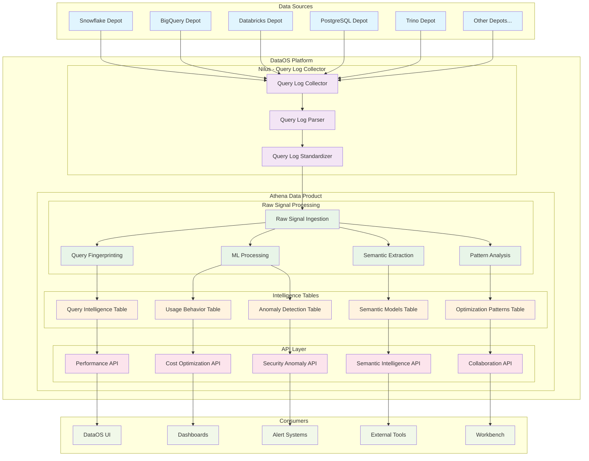

# DataOS Athena

## EXECUTIVE SUMMARY

Modern data platforms have conquered connectivity, processing, and storage, yet remain fundamentally static—executing queries without learning, optimizing nothing automatically, and treating every interaction as isolated from the last. Organizations waste millions annually on this hidden crisis, where the same inefficient patterns repeat endlessly because platforms lack organizational memory. DataOS Athena transforms this reality by making DataOS the first truly AI-native data platform that learns from every interaction to continuously optimize your entire data landscape through universal query intelligence APIs.

While competitors offer fragmented point solutions or single-cloud intelligence that creates vendor lock-in, Athena delivers the only platform that learns from your entire heterogeneous data ecosystem—Snowflake, BigQuery, Databricks, and beyond. This creates compound intelligence that grows more valuable with each interaction, automatically detecting expensive query patterns, identifying cold data refreshed unnecessarily, and discovering optimization opportunities across all connected sources. As enterprises move to operationalize AI, DataOS Athena represents the strategic evolution that transforms static data infrastructure into intelligent, self-optimizing systems that define the next generation of data operations.

---

## TABLE OF CONTENTS

1. [**THE INTELLIGENCE GAP: Setting the Stage**](#1-the-intelligence-gap-setting-the-stage)
   - 1.1 The Current Data Platform Reality
   - 1.2 The Business Impact: A Perfect Storm of Inefficiency
   - 1.3 The Organizational Memory Problem

2. [**WHY DATAOS IS UNIQUELY POSITIONED TO SOLVE THIS**](#2-why-dataos-is-uniquely-positioned-to-solve-this)

3. [**ATHENA VISION: The What & Why**](#3-athena-vision-the-what--why)
   - 3.1 Vision Statement
   - 3.2 Core Hypothesis
   - 3.3 What is DataOS Athena?
   - 3.4 Why "Athena"?
   - 3.5 The Athena Advantage

4. [**STRATEGIC POSITIONING: Where We Play**](#4-strategic-positioning-where-we-play)
   - 4.1 Platform Evolution Story
   - 4.2 Primary Positioning
   - 4.3 Key Differentiators

5. [**COMPETITIVE LANDSCAPE: How We Win**](#5-competitive-landscape-how-we-win)
   - 5.1 Competitive Landscape Matrix
   - 5.2 Competitor Categories & Counter-Positioning
   - 5.3 Messaging Framework

6. [**FEATURES: The Wild Possibilities Unleashed**](#6-features-the-wild-possibilities-unleashed)
   - 6.1 Predictive Query Optimization
   - 6.2 Universal Query Intelligence
   - 6.3 Intelligent Cost Optimization
   - 6.4 Intelligent Performance Recommendations
   - 6.5 Natural Language Query Optimization
   - 6.6 Anomaly Detection and Root Cause Analysis
   - 6.7 Intelligent Data Movement Optimization
   - 6.8 Cold Data & Unused Asset Detection
   - 6.9 Semantic Modeling Intelligence
   - 6.10 Collaborative Intelligence and Knowledge Sharing

7. [**TECHNICAL INTELLIGENCE CATEGORIES**](#7-technical-intelligence-categories)
   - 7.1 The Breadth of Intelligence
   - 7.2 Intelligence Categories Overview

8. [**TECHNICAL ARCHITECTURE**](#8-technical-architecture)
   - 8.1 Architecture Overview
   - 8.2 Data Product Architecture Pattern
   - 8.3 Architecture Layers
   - 8.4 Technical Foundation
   - 8.5 Key Architectural Benefits

9. [**GO-TO-MARKET STRATEGY**](#9-go-to-market-strategy)
   - 9.1 Platform Enhancement Story
   - 9.2 Competitive Differentiation
   - 9.3 Customer Success Metrics

---

> **"Transform DataOS from a data platform into the first truly intelligent data platform - one that learns from every interaction to continuously optimize your entire data landscape."**

---

## 1. THE INTELLIGENCE GAP: Setting the Stage

Data platforms have evolved into sophisticated orchestration engines, successfully conquering the foundational challenges of modern data infrastructure. We've achieved seamless connectivity across any source, powerful processing capabilities that transform petabytes with ease, and cost-effective storage that scales infinitely. Yet despite these remarkable achievements, there's a profound gap that's costing organizations millions and constraining innovation potential.

### 1.1 The Current Data Platform Reality

Modern data platforms excel at execution but fail at intelligence. They're powerful yet fundamentally static systems that execute queries without learning, optimize nothing automatically, and treat every interaction as completely isolated from the last. Recent research from [Fivetran reveals the true cost of this intelligence gap](https://www.fivetran.com/blog/new-ai-survey-poor-data-quality-leads-to-406-million-in-losses) _(March 20, 2024)_: organizations lose an average of **$406 million annually**—roughly 6% of their total revenue—due to poor data quality and suboptimal data operations.

This isn't just a technical problem; it's a business crisis hiding in plain sight. [Monte Carlo's 2024 State of Reliable AI Survey](https://www.montecarlodata.com/blog-2024-state-of-reliable-ai-survey/) _(June 4, 2024)_ found that while 100% of data professionals feel pressure to implement GenAI strategies, 68% aren't completely confident in the quality of data powering these initiatives. The situation has only intensified in late 2024, with [Pacific AI's 2025 AI Governance Survey](https://pacific.ai/2025-ai-governance-survey/) _(conducted through May 2025)_ revealing that only 30% of organizations have successfully deployed GenAI to production, with 45% citing "speed-to-market pressure" as the top governance barrier—a clear indication that the rush to AI is outpacing intelligent data infrastructure development.

### 1.2 The Business Impact: A Perfect Storm of Inefficiency

The intelligence gap creates a cascade of organizational inefficiencies that compound over time. Data scientists—the architects of your AI future—spend [80% of their time on data preparation](https://www.pragmaticinstitute.com/resources/articles/data/overcoming-the-80-20-rule-in-data-science/) _(date not available)_ rather than building and refining models. This means your highest-value technical talent is trapped in manual optimization tasks instead of driving innovation.

The financial impact is staggering when you examine real-world examples. [Instacart faced a $28 million annual Snowflake bill](https://medium.com/@sahil_singla/how-top-companies-save-millions-in-snowflake-costs-6b4d9cda1964) _(December 26, 2023)_ that they ultimately reduced by 56% through intelligent optimization. [One engineer saved $70,000 monthly in BigQuery costs](https://www.junaideffendi.com/p/how-i-saved-70k-a-month-in-bigquery) _(March 9, 2024)_ simply by implementing basic intelligence practices. The problem persists into 2025, with [WinPure's 2024 Customer Insight Report](https://www.eckerson.com/articles/poor-data-quality-is-a-full-blown-crisis-a-2024-customer-insight-report) _(March 21, 2025)_ revealing that 65% of companies still rely on manual Excel methods for data cleaning, while duplicate records in CRM systems reach up to 20%, creating massive inefficiencies and inflated processing costs.

[Boston Consulting Group's recent research](https://www.starburst.io/info/a-new-architecture-to-manage-data-costs-and-complexity/) _(February 8, 2023)_ confirms that organizations face an unprecedented perfect storm: data volume growing at 21% annually while platform complexity and costs spiral upward. Without intelligent optimization, [cloud data warehouses routinely generate surprise bills](https://www.acceldata.io/guide/optimize-costs-data-stack-cost-optimization) _(December 13, 2023)_ that catch organizations off-guard, sometimes reaching hundreds of thousands of dollars monthly.

### 1.3 The Organizational Memory Problem

Perhaps most critically, every query in your organization starts from zero. There's no learning, no accumulated wisdom, no pattern recognition. Your platform doesn't know that marketing always runs the same dashboard queries every Monday morning, that finance's month-end reports could be pre-computed and cached, or that certain query patterns consistently perform poorly across different data sources. 

This organizational amnesia means the same inefficient queries run thousands of times across your enterprise, each execution as wasteful as the first. Teams spend months optimizing individual queries instead of building new capabilities, while 80% of your queries are likely variations of the same 20 patterns that could be intelligently optimized once and applied universally.

The infrastructure crisis becomes even more acute when organizations attempt to deploy AI initiatives. [NTT DATA's comprehensive GenAI survey](https://us.nttdata.com/en/news/press-release/2024/november/playtime-is-over-for-genai) _(November 14, 2024)_ of 2,300+ IT leaders across 34 countries found that **90% say legacy infrastructure hinders effective GenAI use**, while 67% report their employees lack the necessary skills to work with GenAI. Meanwhile, [K2view's enterprise survey](https://dev.to/iriszarecki/enterprise-data-is-at-the-crux-of-the-biggest-challenges-for-genai-deployment-2dkf) _(November 11, 2024)_ reveals that 48% of respondents cite data security and privacy concerns as deployment roadblocks, with 33% citing enterprise data readiness challenges—highlighting how the absence of intelligent data infrastructure is actively blocking AI transformation.

**Hidden Intelligence Waste Examples:**
The intelligence gap manifests in countless wasteful patterns hiding in plain sight. Organizations refresh tables hourly but query them weekly, wasting millions in compute costs on unnecessary data freshness. Teams repeatedly discover that SELECT * queries scanning terabytes while returning 10 rows cost $100K+ monthly, yet these same patterns recur because there's no organizational memory. Meanwhile, 80% of queries are variations of the same 20 patterns—like calculating revenue (SUM(price * quantity)) or grouping by customer segments—yet each execution starts from zero without leveraging previous optimizations.

**The Gap:**
No universal intelligence layer exists that can learn from and optimize across your entire heterogeneous data landscape. Current solutions are either:
- **Point solutions** (AI2SQL, SQLAI.ai, Workik, EverSQL) that work in isolation
- **Cloud-native tools** (Snowflake Cortex, BigQuery Vertex AI, Oracle Autonomous Database) that create vendor lock-in
- **Traditional platforms** that remain static and unintelligent
- **Academic projects** (Balsa, LearnedRewrite) that aren't production-ready

As [Snowflake's 2025 AI + Data Predictions](https://www.snowflake.com/en/blog/ai-data-predictions-2025/) _(December 4, 2024)_ emphasizes, 2025 will be the year enterprises move from experimenting with AI to operationalizing it—but this transition requires making data "AI ready" with intelligent optimization capabilities that current platforms simply don't possess.

**This intelligence gap represents the largest untapped opportunity in modern data infrastructure—and the competitive advantage that forward-thinking organizations will seize to dominate their markets.**

---

## 2. WHY DATAOS IS UNIQUELY POSITIONED TO SOLVE THIS

While the market struggles with fragmented point solutions and vendor-locked cloud services, [DataOS](https://dataos.info/) occupies a unique strategic position that makes it the ideal platform to deliver universal query intelligence. Unlike traditional data platforms that focus solely on storage and processing, DataOS is architected as a **comprehensive data product platform** that already sits at the nexus of organizational data operations.

**Universal Data Orchestration**
DataOS already connects to and orchestrates data across **all major data sources** in an organization through its Depot abstraction layer. This means DataOS has native visibility into the complete data landscape—from cloud warehouses like Snowflake and BigQuery to operational databases, data lakes, and streaming sources. This universal connectivity is the foundation that query intelligence requires but that no other platform possesses at this scale.

**Critical Path Position**
DataOS doesn't just connect to data sources—it **sits in the critical path of data production and consumption**. Through its Workflows, Services, and data processing Stacks, DataOS orchestrates the majority of data operations within organizations. This positioning means DataOS naturally observes query patterns, data access behaviors, and performance characteristics across the entire data ecosystem—the exact intelligence needed for optimization.

**Data Product-Centric Architecture**
Unlike traditional platforms that treat data as raw material, DataOS **productizes raw data and transforms it into business assets**. Through its Lens semantic modeling layer, Data Product Hub, and governance frameworks, DataOS already understands the business context of data usage. This business-aware architecture provides the contextual intelligence that pure technical optimization solutions lack.

**Comprehensive Metadata Foundation**
DataOS maintains **comprehensive metadata across all connected data sources** through its Metis catalog and governance system. This metadata foundation includes schema information, lineage tracking, usage patterns, and quality metrics—all essential components for building intelligent optimization recommendations. Most importantly, this metadata is already unified and accessible, eliminating the integration challenges that plague other solutions.

Despite these foundational advantages, DataOS currently operates as a sophisticated orchestration platform without learning from its own operations. Every query executed through DataOS Clusters, every data transformation run through Workflows, and every exploration performed through Workbench represents valuable intelligence that is currently discarded rather than leveraged.

Today's DataOS users find themselves trapped in a cycle of reactive optimization, manually tuning Cluster configurations and wrestling with query performance issues after problems arise rather than preventing them. This reactive approach means that valuable optimization insights remain isolated—when a team discovers that certain query patterns perform better with specific resource configurations, that knowledge stays with that specific team rather than benefiting the broader organization. Teams repeatedly solve the same performance challenges independently, reinventing optimization wheels that could be shared and automated.

The platform itself remains fundamentally static, executing the same inefficient query patterns repeatedly without adapting or improving based on accumulated experience. Data teams spend countless hours engaged in manual pattern recognition, hunting for optimization opportunities that could be automatically discovered and resolved if the platform possessed the intelligence to learn from its own operations. This represents a massive missed opportunity, as DataOS processes millions of queries and transformations that could inform a continuously improving intelligence layer, yet this invaluable learning potential is completely unrealized.

---

## 3. ATHENA VISION: The What & Why

### 3.1 Vision Statement

**"Transform DataOS from a data platform into the first truly intelligent data platform - one that learns from every interaction to continuously optimize your entire data landscape."**

### 3.2 Core Hypothesis

**"Query intelligence should be native to the platform, not bolted on."**

Just as modern applications are built with security-by-design, next-generation data platforms must be built with intelligence-by-design. The era of dumb data platforms is ending.

### 3.3 What is DataOS Athena?

DataOS Athena represents three interconnected dimensions of intelligence that together transform how organizations interact with data. From a technical perspective, Athena is an intelligent analytics service that sits alongside DataOS, leveraging Nilus for universal query log access and machine learning algorithms to generate optimization insights delivered via APIs that other services and users can leverage.

The business reality is even more compelling: Athena becomes your data platform's brain, learning from every query executed across every data source to provide increasingly intelligent recommendations and optimizations. Rather than treating each interaction as isolated, Athena builds organizational memory that compounds over time, turning accumulated experience into competitive advantage.

For users, Athena transforms DataOS from a static tool into a learning assistant that makes every resource smarter with each interaction. Teams no longer need to repeatedly solve the same optimization challenges—instead, they benefit from an intelligent system that remembers what works and automatically applies those insights across similar scenarios throughout the organization.

**Concrete Business Value Examples:**
Athena's intelligence APIs deliver immediate, measurable business value through specific optimization insights. The system identifies tables refreshed hourly but queried weekly, immediately flagging millions in wasted compute costs. Athena detects $100K+ queries that scan terabytes but return 10 rows, providing API-delivered recommendations for index creation or query rewriting. Most powerfully, Athena discovers semantic models from repeated query patterns—when teams repeatedly calculate the same business metrics like customer lifetime value or inventory turnover, Athena's APIs suggest creating reusable data products that eliminate redundant computation across the organization.

### 3.4 Why "Athena"?

We chose the name Athena to reflect the strategic intelligence and wisdom this system brings to DataOS. In Greek mythology, Athena was the goddess of wisdom, strategic warfare, and intelligent action—she was known for her ability to see patterns others missed and make optimal decisions in complex situations.

Just as the mythological Athena provided strategic counsel to heroes and leaders, DataOS Athena provides strategic intelligence to data teams and business users. Like her namesake, Athena embodies wisdom by learning from every interaction to become increasingly intelligent, while providing strategic intelligence that considers the bigger picture across your entire data landscape rather than optimizing in isolation.

Athena enables optimal decision-making by helping users make the best choices for query optimization and data access patterns, drawing from accumulated organizational experience rather than starting from scratch each time. Most importantly, Athena sees hidden patterns and discovers optimization opportunities that would be invisible to human analysts, just as the mythological goddess could perceive strategic opportunities others missed.

The name also reinforces our positioning as "The First AI-Native Data Platform." Athena represents the marriage of ancient wisdom with cutting-edge AI technology, making DataOS the most intelligent data platform available and embodying the principle that true intelligence comes from both learning and strategic thinking.

### 3.5 The Athena Advantage

#### **Universal Learning**
Unlike point solutions that optimize individual data sources in isolation, Athena learns from your entire data ecosystem through Nilus integration. This comprehensive approach means Athena recognizes query patterns and resource utilization trends across all connected sources, understanding how workload characteristics and optimal scaling strategies apply to similar analytical tasks regardless of the underlying technology. The system builds organizational usage patterns that compound learning over time, creating intelligence that grows more valuable with each interaction.

#### **Network Effects**
Intelligence improves with scale and diversity in ways that create exponential value rather than linear improvements. More data sources provide better pattern recognition capabilities, allowing Athena to identify optimization opportunities that would be impossible to detect with limited visibility. More queries create more optimization opportunities, while more users contribute broader optimization insights that benefit the entire organization. This creates a virtuous cycle where platform intelligence accelerates as adoption increases.

#### **Platform Native**
Zero-friction optimization across all DataOS resources eliminates the integration complexity that plagues bolt-on solutions. Users experience seamless optimization recommendations through native DataOS interfaces without needing to learn additional tools or manage separate integrations. Intelligent optimization insights are delivered through APIs that integrate naturally with existing workflows, ensuring that intelligence enhances rather than complicates existing data operations. This native approach means optimization intelligence becomes invisible infrastructure rather than visible overhead.

---

## 4. STRATEGIC POSITIONING: Where We Play

### 4.1 Platform Evolution Story

DataOS Athena represents the natural evolution of data platforms from infrastructure utilities to intelligent assistants. Where DataOS 1.0 focused on the foundational capabilities of connecting, processing, and storing data, DataOS 2.0 adds the transformative fourth dimension: learning. This evolution mirrors the broader transformation happening across enterprise software, where static tools are giving way to intelligent systems that improve through experience.

The transition from DataOS 1.0 to DataOS 2.0 isn't just about adding features—it's about fundamentally changing the relationship between users and their data infrastructure. Instead of managing a collection of tools and processes, users interact with an intelligent platform that understands their patterns, anticipates their needs, and continuously optimizes their operations. This represents the most significant advancement in data platform architecture since the introduction of cloud-native data warehouses.

### 4.2 Primary Positioning

**"The First AI-Native Data Platform"**

Our primary positioning centers on a simple but powerful truth: while other platforms move and store data, DataOS thinks about data. Athena makes DataOS the first data platform with built-in query intelligence, learning from every interaction to continuously optimize your entire data landscape.

This positioning differentiates us from both traditional data platforms that remain fundamentally static and cloud-native solutions that bolt intelligence onto existing architectures. We're not adding AI capabilities to a data platform—we're creating the first data platform designed from the ground up with intelligence as a core architectural principle. This represents a fundamental shift in how data platforms are conceived, built, and operated.

### 4.3 Key Differentiators

#### **Platform-Native Intelligence**
The most significant differentiator lies in how intelligence is integrated into the platform architecture. Other solutions offer bolt-on AI tools that require separate integration, procurement processes, and additional learning curves for users. These solutions create tool sprawl and complexity, forcing organizations to manage multiple vendors, multiple interfaces, and multiple optimization strategies.

DataOS with Athena weaves intelligence directly into the platform fabric, creating a single unified experience where optimization insights are delivered seamlessly across all resources through native APIs. This native approach delivers zero-friction optimization recommendations across all DataOS resources, eliminating the complexity and overhead that plague bolt-on solutions. Users don't need to learn new tools or manage separate integrations—intelligence becomes invisible infrastructure delivered through APIs that enhance rather than complicate their workflows.

#### **Universal Query Intelligence**
Traditional optimization solutions focus on database-specific optimizations, creating vendor lock-in and siloed learning that traps insights within individual platforms. Each database or cloud service maintains its own optimization intelligence, preventing organizations from applying lessons learned across their entire data ecosystem.

DataOS with Athena delivers organization-wide learning through Nilus integration, providing cloud-agnostic intelligence that works across all connected data sources. This universal approach means optimization insights gained from one platform can benefit the entire data ecosystem, creating compound value that's impossible with single-platform solutions. Organizations can apply optimization insights across their entire data landscape rather than being limited to individual platforms or cloud providers.

#### **Data Product Lifecycle Optimization**
Most optimization solutions focus narrowly on query-level improvements, providing tactical benefits without addressing the broader strategic intelligence needs of modern data organizations. These solutions optimize individual queries but miss the bigger picture of how data products perform across their entire lifecycle.

DataOS with Athena provides end-to-end data product performance optimization, delivering strategic intelligence that considers the complete data pipeline from ingestion to consumption. Rather than optimizing individual queries in isolation, Athena optimizes entire data pipelines, understanding how upstream changes affect downstream performance and how data product usage patterns evolve over time. This comprehensive approach delivers strategic value that extends far beyond individual query performance improvements.

---

## 5. COMPETITIVE LANDSCAPE: How We Win

### 5.1 Competitive Landscape Matrix

| **Platform Feature** | **Traditional Data Platforms** | **DataOS + Athena** |
|---------------------|-------------------------------|---------------------|
| Data Connectivity | ✅ | ✅ |
| Data Processing | ✅ | ✅ |
| Data Storage | ✅ | ✅ |
| Query Intelligence | ❌ | ✅ **Unique** |
| Universal Query Log Access | ❌ | ✅ **Unique** |
| AI-Native Architecture | ❌ | ✅ **Unique** |
| Organizational Memory | ❌ | ✅ **Unique** |
| Platform-Wide Learning | ❌ | ✅ **Unique** |

### 5.2 Competitor Categories & Counter-Positioning

#### **Standalone Query Optimization Tools**

The standalone optimization tools market consists of players like [AI2SQL](https://www.ai2sql.io/) ($17/mo), [SQLAI.ai](https://www.sqlai.ai/) ($5/mo), [Workik](https://workik.com/) ($10/mo), [EverSQL](https://www.eversql.com/), [PawSQL](https://www.pawsql.com/), and [Tosska DB Ace Enterprise](https://tosska.com/). These solutions operate as point tools requiring separate integration and are fundamentally limited to single-database optimization approaches. Their business models rely on subscription-based pricing with separate tools needed for each database type, creating an immediate scalability challenge for organizations with diverse data ecosystems.

The fundamental weakness of standalone tools lies in their fragmented approach to optimization. Tool sprawl increases complexity and costs as organizations need multiple tools for different databases, with each requiring separate procurement processes, security reviews, and user training. This fragmentation means that optimization insights remain trapped within individual tools and don't benefit the broader data ecosystem. Without organizational memory or continuous learning capabilities, these tools repeatedly solve the same problems without building cumulative intelligence.

Our counter-positioning emphasizes the simplicity and power of unified intelligence: "Why use 5 different tools when DataOS Athena optimizes everything? Manage 10 data sources with one intelligence layer, not 10 tools." This message resonates particularly strongly with organizations struggling to manage multiple optimization solutions across their data infrastructure.

#### **Platform-Native Intelligence**

The platform-native intelligence category includes major cloud providers like [Snowflake Cortex](https://www.snowflake.com/en/data-cloud/cortex/), [BigQuery Vertex AI](https://cloud.google.com/vertex-ai), [Databricks Predictive Optimization](https://docs.databricks.com/en/optimizations/predictive-optimization.html), and [Oracle Autonomous Database](https://www.oracle.com/autonomous-database/). These solutions represent sophisticated approaches to cloud-native intelligence but remain fundamentally tied to specific platform ecosystems.

[Snowflake Cortex](https://www.snowflake.com/en/data-cloud/cortex/) offers comprehensive AI services including LLM functions for completion, summarization, and translation, along with Cortex Search for RAG applications, Cortex Analyst for natural language queries, and Cortex Agents for task orchestration. However, these capabilities remain limited to the Snowflake ecosystem. [BigQuery Vertex AI](https://cloud.google.com/vertex-ai) delivers history-based optimizations including join pushdown and parallelism adjustment, with automatic query tuning and Gemini integration that can deliver up to 100x performance improvements—but only within the Google Cloud ecosystem.

[Databricks](https://docs.databricks.com/en/optimizations/predictive-optimization.html) provides Predictive Optimization using AI to automatically optimize table layouts, compaction, and clustering, combined with their Photon engine for 2x performance improvements and AI/BI capabilities with compound AI systems. [Oracle Autonomous Database](https://www.oracle.com/autonomous-database/) offers self-driving capabilities including automatic tuning and patching, self-securing features with threat protection, and self-repairing functionality with failure recovery, plus AI Vector Search and Select AI capabilities. All remain locked to their respective platform ecosystems.

The critical weakness of platform-native solutions centers on vendor lock-in that limits architectural flexibility and forces technology choices. Single-cloud constraints trap intelligence within individual cloud ecosystems, meaning intelligence dies when organizations change platforms. Most importantly, optimization insights remain siloed within platform boundaries, preventing organizations from applying lessons learned across their entire data landscape.

Our counter-positioning emphasizes freedom and universal applicability: "Multi-cloud intelligence vs. single-cloud limitations. Cloud-agnostic intelligence that works everywhere, with organizational learning impossible for single-vendor solutions." This message becomes particularly powerful when organizations recognize that their data spans multiple clouds and platforms.

#### **Traditional Data Platforms**

Traditional data platforms including [Azure Data Factory](https://azure.microsoft.com/en-us/products/data-factory/), [AWS Glue](https://aws.amazon.com/glue/), and [Google Cloud Data Fusion](https://cloud.google.com/data-fusion) represent the current generation of static platforms focused on orchestration and processing. These platforms excel at moving and transforming data but lack any intelligence layer that learns from experience.

Their fundamental limitation lies in static optimization approaches that don't adapt to changing workloads. Manual performance tuning doesn't scale across enterprise data operations, leaving organizations constantly firefighting performance issues rather than preventing them. Without learning capabilities, these platforms treat every query as the first query, missing optimization opportunities that compound over time.

Our counter-positioning emphasizes the evolution from static to intelligent infrastructure: "Static platforms vs. learning platforms. AI-native vs. AI-bolted-on. Every query makes your entire platform more intelligent." This message highlights the fundamental architectural difference between platforms that execute commands and platforms that learn from experience.

#### **Academic & Open Source Projects**

The academic and open source category includes research-focused solutions like [Balsa](https://github.com/balsa-project/balsa) from Berkeley/Stanford, [LearnedRewrite](https://github.com/zhouxh19/LearnedRewrite) from Tsinghua, [SQLRay](https://github.com/JoseCarlosGarcia95/sqlray), and various index prediction tools. These projects represent cutting-edge research in query optimization using machine learning techniques.

Notable examples include [Balsa](https://github.com/balsa-project/balsa)'s deep reinforcement learning query optimizer that learns from trial-and-error without expert demonstrations, [LearnedRewrite](https://github.com/zhouxh19/LearnedRewrite)'s SQL rewrite system using Monte Carlo Tree Search for logical query optimization, and [SQLRay](https://github.com/JoseCarlosGarcia95/sqlray)'s CLI tool using OpenAI for basic query optimization. Various index prediction tools offer ML-based systems for recommending database indexes.

However, these solutions suffer from research-stage maturity that makes them unsuitable for production enterprise environments. Their limited scope focuses on specific optimization problems rather than comprehensive intelligence, and they lack essential enterprise features including governance, security, and compliance capabilities. Most maintain a single-database focus that doesn't address multi-platform optimization challenges.

Our counter-positioning emphasizes production readiness and enterprise capabilities: "Production-ready intelligence vs. research experiments. Enterprise-grade vs. proof-of-concept solutions." This message resonates with organizations that need reliable, scalable solutions rather than experimental technologies.

### 5.3 Messaging Framework

#### **Primary Messages**

1. **"DataOS Evolves: From Data Platform to Intelligence Platform"**
   - Position as natural evolution, not revolutionary change
   - Builds on existing DataOS strengths

2. **"Universal Intelligence: One Brain, All Your Data Sources"**
   - Emphasizes unique cross-platform learning capability
   - Contrasts with fragmented point solutions

3. **"Learn Once, Optimize Everywhere"**
   - Highlights network effects and compound value
   - Shows how intelligence scales with usage

4. **"The Platform That Gets Smarter While You Sleep"**
   - Emphasizes continuous learning without user intervention
   - Contrasts with static traditional platforms

#### **Competitive Messaging Framework**

Our messaging framework addresses each competitive category with specific problem-solution-proof statements that resonate with different organizational concerns and decision-making criteria.

**Against Standalone Tools:**
- **Problem**: "Tool sprawl increases complexity and costs"
- **Solution**: "One platform, universal intelligence"
- **Proof**: "Manage 10 data sources with one intelligence layer, not 10 tools"
- **Resonates with**: Operations teams and procurement departments dealing with vendor management overhead

**Against Cloud-Native Solutions:**
- **Problem**: "Vendor lock-in limits your architectural flexibility"
- **Solution**: "Cloud-agnostic intelligence that works everywhere"
- **Proof**: "One intelligence layer across all your data platforms and clouds"
- **Resonates with**: Enterprise architects and CTOs concerned about long-term strategic flexibility

**Against Traditional Platforms:**
- **Problem**: "Your data platform doesn't learn from experience"
- **Solution**: "AI-native platform that gets smarter over time"
- **Proof**: "Every query makes your entire platform more intelligent"
- **Resonates with**: Data teams frustrated by repeatedly solving optimization challenges and executives seeking competitive advantage

#### **Stakeholder-Specific Messages**

- **For Developers**: "Stop being a query janitor, become a business value creator"
- **For CTOs**: "The only platform that learns from your entire data landscape"
- **For CFOs**: "Reduce compute costs while improving performance"
- **For Data Leaders**: "The competitive advantage of intelligent infrastructure"

---

## 6. FEATURES: The Wild Possibilities Unleashed

### 6.1 Predictive Query Optimization

Athena transforms query execution from reactive to predictive by providing intelligence APIs that anticipate performance bottlenecks before they occur. By analyzing historical query patterns, resource utilization trends, and data growth trajectories, Athena delivers predictive insights about which queries will struggle tomorrow, enabling proactive optimization today. The system identifies queries that will become expensive as data volumes grow, providing API-delivered recommendations for schema modifications, index strategies, and partition approaches that prevent performance degradation before it impacts users.

This predictive capability extends beyond individual queries to entire workload patterns. Athena recognizes when Monday morning dashboard loads will overwhelm cluster resources and delivers pre-scaling recommendations via APIs that DataOS services can implement. It detects seasonal data patterns that affect query performance and provides adaptive optimization strategies through intelligence APIs that match cyclical business needs. Most remarkably, Athena learns from similar organizations' anonymized patterns to deliver predictive insights about optimization opportunities that haven't yet manifested in your specific environment.

### 6.2 Universal Query Intelligence

The true power of Athena lies in its ability to provide optimization insights via APIs that span your entire data ecosystem. When the system discovers that a specific join pattern performs 10x better with a particular configuration in Snowflake, it delivers similar optimization recommendations through APIs for equivalent patterns in BigQuery, Databricks, or any other connected data source. This cross-platform intelligence creates exponential value as insights compound across your entire data landscape through API-accessible recommendations.

Athena's universal intelligence recognizes semantic equivalencies across different SQL dialects and optimization approaches, delivering this knowledge through structured APIs. A query optimization discovered in PostgreSQL becomes an API-delivered template for similar improvements in MySQL, Oracle, or SQL Server. The system maintains a continuously growing library of optimization patterns accessible via APIs, making every data source in your organization smarter based on learnings from every other source.

### 6.3 Intelligent Cost Optimization

Beyond performance improvements, Athena delivers intelligent cost optimization insights via APIs that adapt to your organization's unique usage patterns and budget constraints. The system continuously monitors compute costs across all connected data sources, identifying opportunities to reduce expenses without sacrificing performance. Athena detects over-provisioned resources and delivers API-based recommendations for optimal scaling strategies and cost-effective alternatives for expensive query patterns.

**Freshness vs Usage Mismatch Detection:**
One of Athena's most powerful cost optimization capabilities is detecting write-read disparity across your data ecosystem. By analyzing INSERT/UPDATE patterns alongside SELECT frequencies, Athena identifies "cold freshness" scenarios where tables are refreshed frequently but rarely queried. The system provides API-delivered insights such as tables updated hourly but queried weekly, enabling immediate cost reductions through optimized refresh cadences. This intelligence extends to detecting unused tables with ongoing INSERT operations, over-freshened tables where update frequency exceeds business requirements, and scenarios where expensive batch processing continues despite dropped downstream usage.

The cost optimization capabilities extend to predictive budgeting and resource planning. Athena forecasts future compute costs based on historical trends, seasonal patterns, and planned business initiatives. The system provides early warnings when query patterns or data growth trajectories will lead to budget overruns, giving organizations time to optimize before costs spiral out of control. Most importantly, Athena continuously balances cost and performance trade-offs, ensuring optimal resource allocation that maximizes business value per dollar spent.

### 6.4 Intelligent Performance Recommendations

Athena eliminates the manual burden of performance tuning by providing intelligent optimization recommendations via APIs across all connected data sources. The system continuously monitors query performance, identifying bottlenecks, inefficient patterns, and optimization opportunities without human intervention. As queries run, Athena delivers API-based recommendations for execution plan improvements, schema modifications, and performance enhancements that compound over time.

This intelligence extends to infrastructure optimization, where Athena provides API-delivered recommendations for optimal cluster configurations, scaling policies, and resource allocation based on actual usage patterns. The system learns optimal configurations for different workload types and delivers these insights through APIs that other services can implement for similar future queries. Teams no longer need to manually research optimization strategies—Athena provides intelligent recommendations via APIs while continuously improving based on results.

### 6.5 Natural Language Query Optimization

Athena bridges the gap between business users and technical optimization through natural language interfaces that make query intelligence accessible to non-technical users. Business analysts can describe performance issues in plain English, and Athena translates these descriptions into specific optimization recommendations. The system explains complex optimization concepts in business terms, making query performance improvements understandable and actionable for all stakeholders.

**LLM-Enhanced Intelligence Applications:**
Athena employs sophisticated language models to extract nuanced insights that traditional rule-based analysis cannot detect. The system generates natural language summaries of query patterns, automatically explaining that "Most BI dashboards rely on 4 core tables" or "There is a mismatch between data refresh frequency and usage in 8 tables." Through semantic pattern extraction from SQL, Athena identifies emerging business metrics like revenue calculations and implied dimensional relationships from repeated GROUP BY patterns.

The system provides behavioral pattern mining that distinguishes between exploratory analysis (24 iterative queries adjusting filters) and production workflows (scheduled dashboard refreshes). Athena automatically tags queries and users based on behavior patterns, enabling sophisticated user segmentation and cost attribution. Most powerfully, the system offers interactive "ask-the-logs" capabilities where analysts can query their organization's data usage patterns in natural language: "Which queries caused the most cost last week?" or "Are any dbt models unused in the past 60 days?"

This natural language capability extends to proactive optimization suggestions. Athena can explain why certain queries are slow, describe the business impact of performance improvements, and recommend specific actions in terms that business users can understand and act upon. The system democratizes query optimization, making advanced database performance tuning accessible to data analysts, business intelligence developers, and other non-DBA users.

### 6.6 Anomaly Detection and Root Cause Analysis

Athena's continuous monitoring capabilities enable sophisticated anomaly detection that identifies performance issues, cost spikes, and unusual query patterns before they impact business operations. The system establishes baseline performance expectations for all queries and data operations, automatically alerting teams when performance deviates from normal patterns. More importantly, Athena provides root cause analysis that explains why performance issues occurred and suggests specific remediation steps.

**Security & Access Anomaly Detection:**
Athena's intelligence APIs provide comprehensive security monitoring by detecting unusual access patterns across your data ecosystem. The system identifies privileged users performing analytical work instead of administrative tasks, sudden spikes in queries against sensitive tables that may indicate data exfiltration risks, and out-of-hours access from unapproved IP addresses or time zones. Athena also detects tool misuse, such as analysts bypassing approved BI tools to use direct JDBC connections or shell access, and high-frequency direct access patterns that circumvent semantic layers.

**Pipeline Drift & Model Decay Detection:**
The system monitors for schema usage drift where old columns become unused while new columns are accessed without proper documentation. Athena detects spikes in query errors following dbt, Airflow, or ETL deployments, identifying broken dependencies when views fail due to dropped upstream tables. The system also recognizes type coercion patterns where repeated casts in queries indicate schema design issues, and monitors for ML pipeline degradation through changed feature extraction patterns or training data access anomalies.

This anomaly detection operates across multiple dimensions simultaneously, correlating performance issues with infrastructure changes, data volume fluctuations, query pattern modifications, and external factors. Athena learns to distinguish between normal performance variations and genuine issues requiring attention, reducing false positives while ensuring critical problems are identified immediately. The system's deep understanding of query patterns and dependencies enables sophisticated root cause analysis that pinpoints exact causes rather than just symptoms.

### 6.7 Intelligent Data Movement Optimization

Athena provides intelligence APIs that optimize data movement and transformation patterns across your entire data ecosystem, enabling minimized data transfers and reduced associated costs. The system analyzes data lineage, usage patterns, and access frequency to deliver optimal data placement strategies via APIs. Athena identifies opportunities to cache frequently accessed data closer to compute resources, providing API-based recommendations that reduce latency and improve query performance.

The intelligent data movement capabilities extend to ETL and data pipeline optimization through comprehensive APIs. Athena analyzes transformation patterns and delivers more efficient data processing approaches through APIs, including opportunities for incremental processing, parallel execution, and optimized data formats. The system continuously monitors data movement costs and performance impacts, providing API-delivered strategy recommendations that minimize expenses while maximizing accessibility and performance.

### 6.8 Cold Data & Unused Asset Detection

Athena provides comprehensive intelligence APIs for identifying and eliminating waste across your data ecosystem through sophisticated usage pattern analysis. The system detects unused tables that haven't been queried in 30-90 days, dead columns accessed in less than 1% of queries, and dead partitions with no read activity across specific time ranges. Athena identifies unused views that are defined but never queried, and detects temporary table leaks where staging or ephemeral tables are created but never properly dropped.

This asset optimization intelligence extends to storage cost reduction by identifying candidates for archival or deletion. Athena provides API-delivered recommendations for migrating cold data to cheaper storage tiers, consolidating redundant tables, and cleaning up orphaned resources. The system continuously monitors asset utilization patterns, alerting teams when previously active resources become dormant and suggesting automated cleanup policies that prevent resource accumulation over time.

### 6.9 Semantic Modeling Intelligence

Athena's APIs deliver powerful semantic intelligence by automatically discovering business logic patterns embedded in query behavior across your organization. The system identifies emerging metrics by detecting repeated aggregation logic—such as SUM(price * quantity) calculations that consistently represent revenue across multiple queries and teams. Athena recognizes implied dimensions through repeated GROUP BY patterns, suggesting that fields like product_id, region, and time_period should be formalized as dimensional models.

The system discovers join relationships by analyzing recurring join keys across queries, automatically inferring entity relationships and foreign key constraints that can inform better data modeling. Athena detects subquery repetition patterns that indicate opportunities for common table expressions (CTEs) or materialized views. Most powerfully, the system identifies filter conventions—repeated WHERE clauses that suggest standard business rules, time dimensions, or security filters that should be encoded into semantic layers.

This semantic intelligence enables rapid data product development by suggesting optimizations based on actual usage patterns rather than theoretical requirements. Athena's APIs provide recommendations for creating reusable business logic, optimizing dimensional models, and establishing semantic conventions that reduce query complexity and improve organizational consistency.

### 6.10 Collaborative Intelligence and Knowledge Sharing

Athena facilitates organizational learning by capturing and sharing optimization insights across teams and departments through comprehensive APIs. The system maintains a searchable knowledge base of optimization patterns, performance improvements, and lessons learned that benefits the entire organization through API access. When one team discovers an effective optimization technique, Athena delivers similar approaches via APIs to other teams working with comparable data patterns.

This collaborative intelligence extends to cross-organizational learning through anonymized pattern sharing. Athena can learn from optimization successes across similar organizations and industries, applying best practices that have proven effective in comparable environments. The system creates a virtuous cycle where optimization knowledge compounds across the entire DataOS ecosystem, making every organization smarter based on collective experience.

---

## 7. TECHNICAL INTELLIGENCE CATEGORIES

### 7.1 The Breadth of Intelligence

Athena's API-first architecture enables comprehensive intelligence extraction across nine distinct categories, each providing unique insights that compound to create organizational competitive advantage. This technical breadth demonstrates the sophisticated analysis capabilities available through Athena's intelligence APIs, validating the platform's ability to deliver actionable insights across every dimension of data operations.

### 7.2 Intelligence Categories Overview

**Performance & Cost Optimization:** Athena identifies heavy queries by duration, bytes scanned, and cost, while flagging inefficient patterns like SELECT * queries, missing filters, and cartesian joins. The system detects wasted work through queries that scan large data volumes but return minimal results, and identifies concurrency bottlenecks causing extended queue times.

**Data Usage & Popularity:** The system creates table and column heatmaps showing usage frequency, analyzes access patterns including peak usage hours and business unit distribution, and identifies unused assets that haven't been queried in specified timeframes—enabling strategic deprecation decisions.

**Query Semantics & Ontology Inference:** Athena automatically detects measures and dimensions through common aggregations and groupings, infers join relationships by analyzing recurring join keys across queries, and maps business terms through repeated expressions and aliases that suggest standardized metric definitions.

**Security & Compliance:** The system identifies unusual access patterns including privileged users performing analytical work, data exfiltration risks through sudden query spikes on sensitive tables, and shadow usage where users bypass official pipelines through direct database access.

**Developer & Team Behavior:** Athena provides tooling insights showing who uses dbt versus Excel versus Jupyter, identifies iterative work patterns suggesting debugging or development activity, and performs collaboration analysis revealing which teams access shared datasets.

**Change Impact Analysis:** The system monitors usage patterns before and after changes to detect schema modifications or model refactoring impacts, identifies broken dashboards through sudden query drops from BI tools, and tracks deployment-related performance changes.

**ML/Data Readiness Signals:** Athena assesses data structuredness through well-modeled, joined, and filtered query patterns, monitors data staleness by measuring time between data creation and query usage, and analyzes access versus update patterns for caching optimization decisions.

**Temporal & Volume Trends:** The system identifies usage peaks including dashboard spikes at specific times and seasonal patterns, detects latency spikes on particular days or data partitions, and monitors platform drift as workloads migrate between different processing engines.

**LLM-Enhanced Insights:** Athena employs large language models for natural language summaries of complex query patterns, behavioral pattern mining for user segmentation, auto-tagging for query categorization, and interactive "ask-the-logs" capabilities that democratize data intelligence access.

---

## 8. TECHNICAL ARCHITECTURE

### 8.1 Architecture Overview

Athena's intelligence capabilities are built on a comprehensive normalized schema that captures query facts, execution metadata, data lineage, and behavioral semantics across all connected data sources. The system maintains enriched query logs with LLM-generated annotations, query fingerprints for pattern recognition, and semantic signatures for cross-platform optimization insights.

### 8.2 Data Product Architecture Pattern

Athena follows the classic data product pattern, functioning as an intelligent analytics service that transforms raw query logs into actionable intelligence APIs. The architecture operates through four distinct layers:

### 8.3 Architecture Layers

**Data Sources (Depots):** All connected data platforms where queries are executed—Snowflake, BigQuery, Databricks, PostgreSQL, Trino, and others—serve as the origin points for query telemetry.

**Nilus Integration Layer:** DataOS's Nilus component collects, parses, and standardizes query logs from all connected Depots, providing clean, normalized data streams that feed into Athena's processing pipeline.

**Athena Intelligence Processing:** The core data product layer that transforms raw signals through query fingerprinting, semantic extraction, pattern analysis, and ML processing. This processing generates a focused set of intelligence tables including Query Intelligence, Usage Behavior, Optimization Patterns, Anomaly Detection, and Semantic Models tables.

**API Exposure Layer:** Specialized APIs built on top of the intelligence tables that expose specific intelligence types—Performance APIs for query optimization, Cost Optimization APIs for resource efficiency, Security Anomaly APIs for access monitoring, Semantic Intelligence APIs for business logic discovery, and Collaboration APIs for knowledge sharing.

**Consumer Ecosystem:** Various DataOS components and external tools leverage the intelligence APIs, including DataOS UI for performance insights, dashboards for cost monitoring, alert systems for anomaly detection, external tools for optimization recommendations, and Workbench for semantic intelligence.

### 8.4 Technical Foundation

This technical foundation enables sophisticated derived fields including query complexity scoring, dataset lineage tracking, user sessionization, and purpose-based query tagging. The architecture supports both real-time intelligence delivery through streaming APIs and batch analytical processing for deep pattern discovery, ensuring that organizations can access insights at the speed and scale their operations require.

### 8.5 Key Architectural Benefits

The data product approach validates Athena's API-first positioning by ensuring intelligence is delivered through clean, focused interfaces rather than direct optimization implementations. The focused set of intelligence tables enables multiple specialized APIs while maintaining architectural simplicity and scalability. Most importantly, the architecture scales independently from underlying data sources, allowing Athena to provide universal intelligence regardless of the diversity or complexity of an organization's data ecosystem.

---

## 9. GO-TO-MARKET STRATEGY

### 9.1 Platform Enhancement Story

DataOS Athena positions as the natural evolution of DataOS rather than a disruptive new product, delivering on the simple message that "DataOS just got smarter." This approach prioritizes existing DataOS customers for initial rollout, ensuring seamless integration as a platform enhancement rather than requiring organizations to adopt entirely new tools or workflows. The strategy emphasizes continuity and organic growth, building on existing customer relationships and platform familiarity to accelerate adoption.

### 9.2 Competitive Differentiation

Against major cloud providers, our differentiation messaging focuses on architectural flexibility and comprehensive optimization capabilities. We counter Snowflake and BigQuery with "multi-cloud intelligence vs. single-cloud limitations," while positioning against Databricks emphasizes "query intelligence vs. ML focus—we optimize your entire data stack." Traditional platforms face our core message of "AI-native vs. AI-bolted-on—intelligence from day one," highlighting the fundamental architectural advantage of building intelligence into the platform foundation rather than adding it as an afterthought.

### 9.3 Customer Success Metrics

Our success metrics combine quantifiable performance improvements with transformational qualitative benefits derived from specific intelligence categories. Organizations can expect 40% average query performance improvement across all connected data sources, 60% reduction in query optimization time that frees developers for higher-value work, and 25% reduction in compute costs through intelligent recommendations.

**Intelligence-Driven Cost Optimization:**
Athena's freshness vs usage mismatch detection typically reduces data refresh costs by 40% through optimized update cadences, while unused asset detection eliminates 60% of unnecessary table storage costs. The system's ability to identify expensive queries scanning terabytes but returning minimal results can reduce monthly query costs by $100K+ for enterprise customers, with semantic modeling intelligence accelerating data product development by 80% through automated pattern recognition.

**Productivity & Innovation Acceleration:**
The qualitative transformation shifts developer experience from query janitors to business value creators, while delivering self-optimizing infrastructure that improves over time. Teams report 70% faster troubleshooting through automated root cause analysis, 50% reduction in manual data exploration time through semantic intelligence, and 90% improvement in cross-team collaboration through shared optimization insights. Most importantly, organizations achieve sustainable competitive advantage through faster time-to-insight across all data operations, with intelligence that compounds rather than depreciates over time.

---