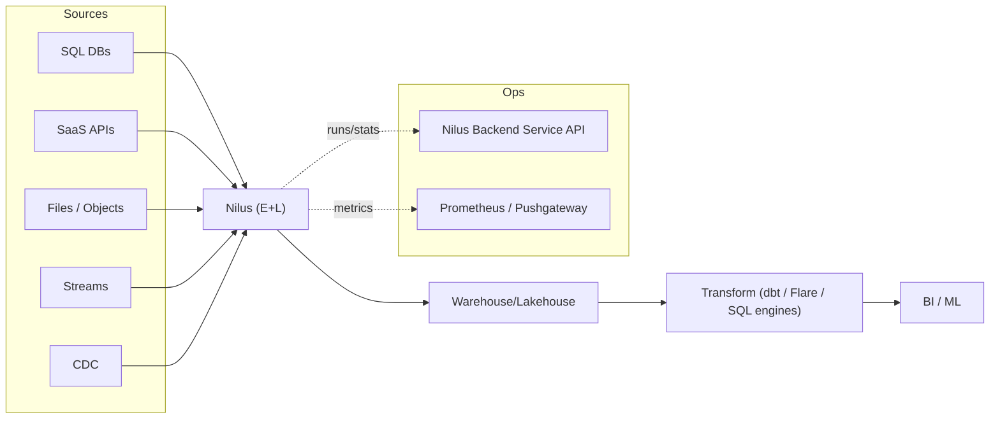
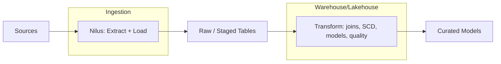
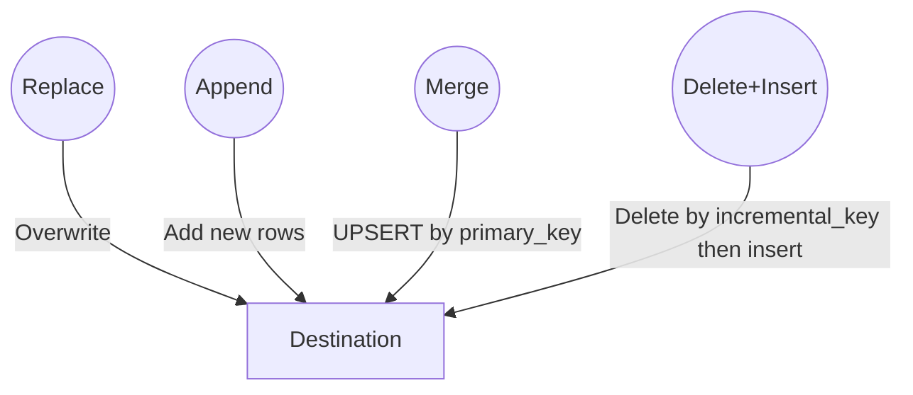
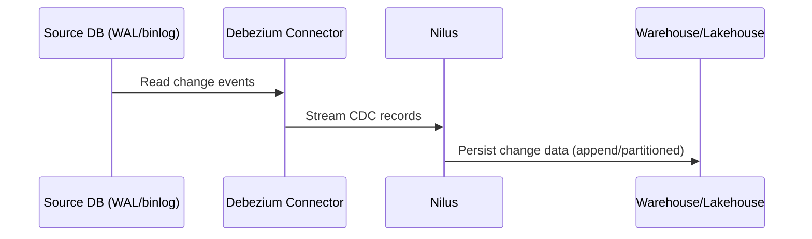
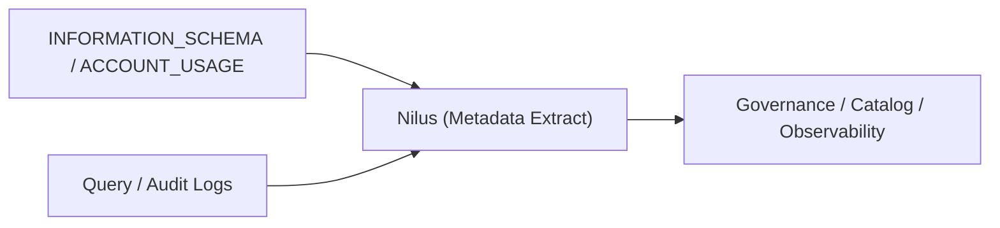
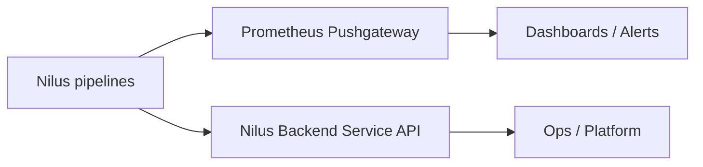

# Introducing Nilus on DataOS: fast, observable EL/ELT for the real world

**Authors:** Darpan Vyas, Rakesh Vishvakarma, Darshan Ajmera <br/>
**Date:** August 11, 2025

If you've worked on data platforms lately, you've felt the squeeze: more sources, tighter SLAs, and higher expectations around governance and cost. The outcome is predictable—fragile ingestion scripts, expensive full refreshes, and long tail "one-off" jobs that become permanent. Nilus was built for this world.

Nilus is a developer-friendly EL/ELT layer that reliably moves data, metadata, and query/audit logs from anywhere to your warehouse or lakehouse—with first-class observability. It's designed by [The Modern Data Company](https://themoderndatacompany.com/index.html) and runs on [DataOS](https://www.themoderndatacompany.com/dataos), a converged data platform that brings software engineering discipline to data products ([DataOS documentation](https://dataos.info/)). This aligns with the [Converged Data Platform](https://www.gartner.com/en/documents/6329547) model described by Gartner.

## The challenge: modern data integration at scale

Real platforms face three fundamental pressures that traditional ETL tools struggle to address:

**Source sprawl and complexity.** Teams need to ingest from SQL databases, SaaS APIs, log files, message streams, and change data capture (CDC)—each with unique authentication, pagination, schemas, and rate limits. They also need metadata for catalogs and query/audit logs for governance, not just row data.

**Cost and performance constraints.** Full refreshes don't scale economically. Incremental loading and CDC are essential to hit SLAs while controlling compute and egress costs. But most teams lack the engineering bandwidth to implement these patterns reliably across dozens of sources.

**Operational complexity.** Pipelines are production software. Teams need metrics, run history, health endpoints, and structured error handling—so operations are boring (in the best possible way). Without standardized telemetry and APIs, incident response and capacity planning suffer.



## The Nilus approach: focus on Extract and Load

Nilus tackles these challenges by focusing on the E and L of ETL—and deliberately pushing the T downstream. This separation isn't academic; it's practical and economically driven.



### Why separate Extract/Load from Transform?

Modern cloud warehouses and lakehouses are optimized for transformation work. Separating E/L from T yields practical benefits that are widely recognized:

- **Scalability and price/performance**: pushdown to the warehouse/lakehouse exploits elastic compute and MPP engines for joins, aggregations, and SCD logic ([Snowflake: ELT vs. ETL](https://www.snowflake.com/guides/elt-vs-etl/)).
- **Agility and governance**: loading raw/near‑raw data first preserves lineage and enables multiple downstream models without re‑extracting, while governance teams can apply policies centrally in the platform's transform layer ([dbt Labs: Why ELT](https://docs.getdbt.com/docs/introduction)).
- **Simplified ingestion**: keeping ingestion focused on connectivity, pagination, typing, and incrementality reduces fragility and shortens time‑to‑data, especially when sources evolve.

Nilus embodies this ELT philosophy: extract and load with speed and reliability; transform with flexibility and scale.

## How Nilus works in practice

Nilus covers the spectrum from simple batch loads to real-time streaming through declarative YAML configurations. Let's walk through the most common patterns:

### 1. Batch loading with incremental windows

For regular data synchronization, Nilus makes incremental loading straightforward. This example syncs a month of sales transactions from Postgres to BigQuery, only touching the records that changed:

```yaml
source:
  address: postgresql://${DB_USERNAME}:${DB_PASSWORD}@${DB_HOST}:5432/${DB_NAME}?sslmode=disable
  options:
    source-table: "public.sales_transactions"
sink:
  address: bigquery://${BQ_PROJECT}?credentials_path=${GOOGLE_APPLICATION_CREDENTIALS}&location=EU
  options:
    dest-table: "raw.sales_transactions"
    incremental-strategy: "delete+insert"
    incremental-key: "transaction_date"
    interval-start: "2023-01-01"
    interval-end: "2023-01-31"
```

The `delete+insert` strategy removes existing January 2023 transactions and replaces them with fresh data—perfect for handling late-arriving transactions, refunds, or data corrections.

### 2. Custom queries with safe parameterization

For complex extraction logic, prefix your table name with `query:` and use parameterized SQL:

```yaml
source:
  address: postgresql://${DB_USERNAME}:${DB_PASSWORD}@${DB_HOST}:5432/${DB_NAME}?sslmode=disable
  options:
    source-table: "query:SELECT u.*, p.plan_type FROM users u JOIN plans p ON u.plan_id = p.id WHERE u.updated_at BETWEEN :interval_start AND :interval_end"
sink:
  address: bigquery://${BQ_PROJECT}?credentials_path=${GOOGLE_APPLICATION_CREDENTIALS}&location=EU
  options:
    dest-table: "raw.user_plans"
    incremental-strategy: "delete+insert"
    incremental-key: "updated_at"
    interval-start: "2023-01-01"
    interval-end: "2023-01-31"
```

Nilus safely substitutes `:interval_start` and `:interval_end` variables while preserving incrementality—no SQL injection risks.

### 3. Real-time change data capture

For near real-time data movement, Nilus integrates [Debezium](https://debezium.io/) to stream database changes as they happen:

```yaml
source:
  address: debezium+postgresql://${CDC_USERNAME}:${CDC_PASSWORD}@${CDC_HOST}:5432/${CDC_DATABASE}
  options:
    table.include.list: "ecom.sales"
    topic.prefix: "cdc_changelog"
    slot.name: "nilus_slot"
    plugin.name: "pgoutput"
sink:
  address: dataos://${LAKEHOUSE_NAME}
  options:
    incremental-strategy: append
    dest-table: dev.sales
```

Every insert, update, and delete in the `ecom.sales` table streams to your lakehouse within seconds—ideal for dashboards, alerting, or downstream systems that need fresh data.

### Incremental strategies that just work

Nilus provides four proven patterns for incremental loading, each optimized for different use cases:



- **Replace**: Full refresh; simple and reliable for smaller tables
- **Append**: Add only new rows; perfect for event logs and immutable data
- **Merge**: UPSERT by primary key; handles updates while preserving history
- **Delete+Insert**: Remove and re-add by date/key window; ideal for backfill and corrections

## Easy to extend

Building a custom source for Nilus requires surprisingly little code. The pattern is straightforward: implement a tiny interface, return a dlt resource, and wire it up with configuration. Teams can ship new connectors in hours, not weeks.

### The CustomSource interface

The base class is minimal—just two methods:

```python
class CustomSource:
    def handles_incrementality(self) -> bool:
        return False

    def dlt_source(self, uri: str, table: str, **kwargs):
        raise NotImplementedError("You must implement the `dlt_source` method.")
```

### Example: Simple RandomUserSource

Here's a complete working example that generates synthetic user data - all in one file:

```python
# nilus_custom_source.py
import dlt
from nilus.src.custom_source import CustomSource

class RandomUserSource(CustomSource):
    def handles_incrementality(self) -> bool:
        return False

    def dlt_source(self, uri: str, table: str, **kwargs):
        # Sample data directly in the method
        dummy_data = [
            {
                "id": 1,
                "name": "Aisha Patel",
                "email": "aisha.patel@example.com",
                "city": "Bengaluru",
                "age": 36
            },
            {
                "id": 2,
                "name": "Rahul Sharma", 
                "email": "rahul.sharma@example.com",
                "city": "Mumbai",
                "age": 32
            },
            {
                "id": 3,
                "name": "Neha Reddy",
                "email": "neha.reddy@example.com", 
                "city": "Chennai",
                "age": 49
            }
        ]

        @dlt.resource()
        def fetch_users():
            for record in dummy_data:
                yield record

        @dlt.source
        def user_source():
            return fetch_users()

        return user_source()
```

### Wiring it up

Use the custom source with a `custom://` URI and repo configuration:

```yaml
repo:
  url: https://bitbucket.org/org/queries
  syncFlags: ['--ref=main']
  baseDir: examples/custom_source

source:
  address: custom://RandomUserSource?secret-name=abc
  options:
    source-table: "sales.customer"

sink:
  address: dataos://${LAKEHOUSE_NAME}
  options:
    dest-table: dev.sales_customer
    incremental-strategy: append
```

### Real-world patterns

Custom sources work well for:
- **Internal APIs** without standard connectors (CRM systems, data warehouses)
- **File formats** or protocols Nilus doesn't support natively
- **Data generation** for testing and development
- **Legacy systems** that need custom authentication or parsing logic

The key insight: implement the minimal data extraction logic, let Nilus handle incrementality, typing, and destination loading. Heavy transforms still happen downstream where they scale best.

## Performance that scales

Extensibility is powerful, but it needs to be backed by solid performance fundamentals. Nilus achieves high-throughput data movement by leveraging proven engines: [dlt (Data Load Tool)](https://dlthub.com/) for batch extraction and [Debezium](https://debezium.io/) for change data capture. Real-world benchmarks show substantial performance advantages.

### Batch extraction: 3-10x faster than alternatives

Testing on a 1M-row PostgreSQL table with mixed data types shows Nilus's multi-worker advantage:

| Tool               | Workers | Extraction time | Throughput (rows/min) | vs. Single-worker Nilus |
|--------------------|---------|-----------------|----------------------|-------------------------|
| Nilus (via dlt)    | 1       | 10.9 min       | ~92K                 | 1.0×                    |
| **Nilus (via dlt)** | **5**   | **3.5 min**    | **~286K**            | **3.1×**                |
| Fivetran           | —       | ~22 min        | ~45K                 | 0.5×                    |
| Airbyte            | —       | ~65-110 min    | ~9-15K               | 0.1-0.2×                |
| Stitch             | —       | ~65-110 min    | ~9-15K               | 0.1-0.2×                |

*Source: [dlt SQL benchmark](https://dlthub.com/blog/sql-benchmark-saas) using ConnectorX and PyArrow backends*

### CDC: Real-time streaming at scale

For change data capture, Nilus integrates Debezium connectors that process millions of database changes efficiently:

| Scenario           | Configuration                        | Workload          | Performance                    |
|--------------------|--------------------------------------|-------------------|--------------------------------|
| PostgreSQL → Sink  | Batch enabled, optimized buffer      | 1M change events  | 2,300 events/sec (7 minutes)  |
| Oracle snapshot    | Tuned threads + fetch size           | Full table scan   | 25% faster (8h → 6h)          |
| MySQL binlog       | Parallel processing enabled          | Continuous stream | <1 sec lag at 10K events/sec  |

*Without batching, the same 1M events took 9.5 hours—a 80x improvement. See [Debezium JDBC sink performance](https://debezium.io/blog/2023/12/20/JDBC-sink-connector-batch-support/) for configuration details.*



## Built for operations and governance

Raw speed is just the beginning—Nilus was designed for production environments where observability and governance aren't optional. High performance means nothing if you can't monitor, debug, and manage pipelines at scale.

**Metrics and monitoring.** Pipelines emit [Prometheus](https://prometheus.io/) metrics and push to Pushgateway, creating instant visibility into data operations. Key metrics include:
- `nilus_extraction_rate_rows_per_second` - Real-time throughput monitoring
- `nilus_pipeline_duration_seconds` - SLA tracking and capacity planning
- `nilus_error_count_total` - Immediate failure detection and alerting
- `nilus_memory_usage_bytes` - Resource optimization and scaling decisions

**APIs for operations.** Nilus Backend Service exposes REST endpoints that transform debugging from guesswork into precise incident response:
- `GET /api/v1/runs/{run_id}` - Complete pipeline execution details with error context
- `GET /api/v1/metrics/pipeline/{pipeline_id}` - Historical performance trends and anomaly detection
- `GET /api/v1/cdc/offsets/{connector}` - Real-time CDC lag monitoring and offset management
- `POST /api/v1/health/check` - Automated health monitoring for orchestration systems

**Metadata and audit trails.** Nilus doesn't just move data—it captures the context that governance teams need for compliance and optimization. This includes extracting table schemas, column lineage, query execution logs, and data access patterns that feed directly into data catalogs and observability platforms.





## Nilus within the DataOS ecosystem

While Nilus excels as a standalone EL/ELT tool, it truly shines within the broader DataOS ecosystem. DataOS provides the foundation Nilus needs to thrive at enterprise scale, transforming individual pipeline capabilities into platform-wide data operations.

**The DataOS Integration Model:**
```
Sources (batch/CDC/streams) → Nilus (E+L) → Warehouse/Lakehouse → Transform (dbt/Flare/SQL) → BI/ML
                                   ↓
                            DataOS Platform Layer
                         (Discovery • Governance • Security)
```

**Concrete DataOS integrations that amplify Nilus:**

- **Unified Discovery**: DataOS automatically catalogs tables loaded by Nilus, creating searchable metadata with business context, data quality scores, and usage analytics across the entire organization.

- **Policy Enforcement**: Row-level security, column masking, and data access policies defined in DataOS apply seamlessly to all Nilus-loaded data, ensuring consistent governance without pipeline-level configuration.

- **Semantic Layer**: Business users access Nilus-ingested data through DataOS's semantic layer, which provides consistent metrics definitions and self-service analytics without exposing raw table complexity.

- **Apache Iceberg Integration**: Nilus writes directly to Iceberg tables in the DataOS lakehouse, enabling time travel, schema evolution, and efficient incremental processing at petabyte scale.

This converged approach eliminates the integration complexity that plagues traditional data stacks—no more stitching together separate tools for ingestion, cataloging, governance, and consumption ([learn more about DataOS](https://www.themoderndatacompany.com/dataos)).

## The competitive landscape

This integrated approach puts Nilus in a unique competitive position. While most solutions force you to choose between managed convenience and open-source control, Nilus provides both through the DataOS platform.

Nilus competes with managed ELT providers (Fivetran, Hevo), open-source frameworks (Airbyte, Singer/Meltano), and bespoke orchestration. Here's how the key capabilities compare:

| Capability | Fivetran/Hevo | Airbyte/Meltano | Nilus on DataOS |
|------------|---------------|-----------------|-----------------|
| **Performance** | ~2x slower | ~6-10x slower | 3-10x faster with multi-worker |
| **CDC Integration** | Limited connectors | Basic CDC support | Native Debezium integration |
| **Extensibility** | Closed ecosystem | Complex connector dev | Simple CustomSource interface |
| **Operations** | Black box monitoring | Basic metrics | Prometheus + REST APIs |
| **Cost Model** | Per-row pricing | Self-managed overhead | Platform efficiency |
| **Governance** | Vendor-specific | DIY integration | Native DataOS policies |

**The Nilus advantage:** Rather than forcing trade-offs between performance, flexibility, and operational maturity, Nilus combines all three through its converged platform approach—one tool for batch, CDC, and streaming ingestion with enterprise-grade observability built in.

The landscape is moving fast. [Cloudflare's JetFlow](https://blog.cloudflare.com/building-jetflow-a-framework-for-flexible-performant-data-pipelines-at-cloudflare/) reports more than a hundred‑fold efficiency improvements and multi‑million rows per second per database connection, cutting a 19‑billion‑row job from roughly 48 hours/300 GB RAM to roughly 5.5 hours/4 GB RAM. That trajectory signals where the space is headed—and why high‑performance ingestion will matter even more for Gen‑AI use cases that demand fresh, rich context across domains.

If you're looking for a Converged Data Platform, or want ingestion that keeps up with your ambitions, Nilus on DataOS is ready.
