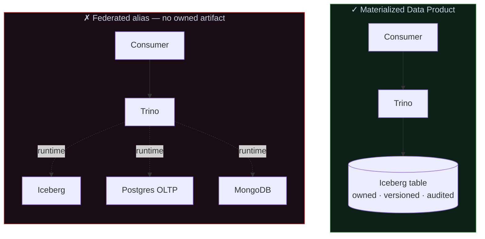
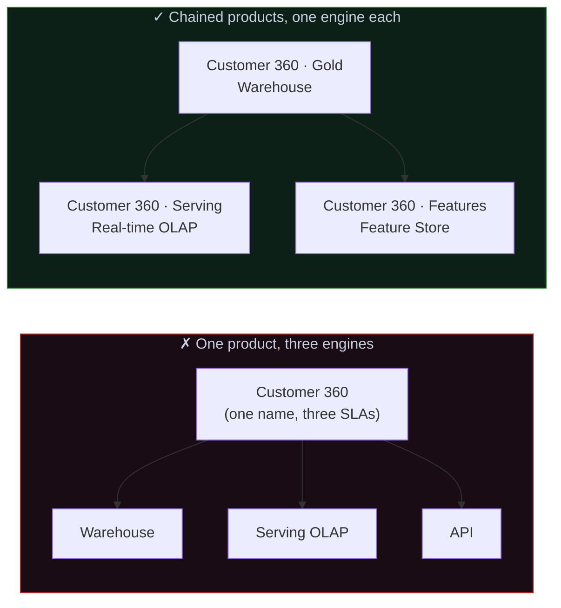

# Data Products

*An internal manifesto on how Data Products must be defined, grounded, and governed. Short, opinionated, and binding — a shared frame for how Data Products should be built, not an encyclopedia of options. Read it end-to-end once; return to §6–§9 when building or reviewing a specific product.*

**Version:** 0.9 (for internal review)
**Last updated:** 21 April 2026
**Owner:** [Name / role]
**Status:** Draft — circulated for stakeholder review ahead of org-wide adoption.

---

## Contents

1. **Our Position** — preamble: why this document exists, what it commits to, and what it does not cover.
2. **Definition** — what a Data Product is, what it isn't, and why its shape is the right shape for AI consumption.
3. **Design Principles** — the seven principles a Data Product is built against, from product-spec to deliberate modeling to versioning discipline.
4. **Grounding a Data Product** — why *ownership* (not federation vs. materialization) is the axis that matters, how consumption patterns drive engine choice, and why one product must have one engine.
5. **Anti-patterns to Refuse** — eight named failure modes the organization commits against, from the data swamp to governance-by-PDF.
6. **What This Position Costs** — the trade-offs this position accepts deliberately, so they are named rather than hidden.
7. **Is This a Data Product? — A Decision Rubric** — the eight-point gate that separates a Data Product from a dataset, a view, or a pipeline output.
8. **Data Product Tiers** — Critical, Core, Local. Differentiated obligations per tier so the standards are adoptable rather than dogmatic.
9. **Roles and Responsibilities** — the Data Product Team, the Data Product Lead, Governance, and how Platform / IT fits. How disputes are resolved.

---

## Our Position

Data is not a byproduct of the systems that generate it. It is an asset, and when it is served to a consumer — a human, a pipeline, an AI model, an application — it is served as a *product*: with an owner, a contract, a consumer in mind, and a lifecycle that is managed deliberately.

This document sets out what that means at this organization. It defines the concept, the design principles that guide it, the architectural choices that follow from them, and the anti-patterns it refuses to repeat. It is meant to be short, opinionated, and binding — a shared frame for how Data Products are built, not an encyclopedia of options.

The position exists because the alternative — data treated as whatever happens to exist in the warehouse — has measurable costs. Pipelines break silently. Models are trained on inputs no one can reconstruct. Three teams define "active customer" three different ways. Dashboards disagree, and the disagreement is investigated instead of the business question. These costs are paid by every organization that lets them accumulate. This document intends to stop paying them.

What follows is not a tooling manifesto. It does not prescribe specific vendors, team structures, or which products get built first. It takes a position on the *shape* of a Data Product, the *foundation* it sits on, and the *discipline* required to keep both credible over time. Tooling and process follow from that — not the other way around.

---

## 1. Definition

A **Data Product** is a self-contained, managed unit of data that's treated like a product — with owners, consumers (human *and* machine), SLAs, and a lifecycle — rather than as a byproduct of some operational system.

### Core properties

- **Purpose-built** — it solves a specific analytical, operational, or AI need, not "data in general"
- **Owned** — a named owner is accountable for its quality, evolution, and deprecation
- **Discoverable & addressable** — findable in a catalog, accessed via a stable interface (table, API, topic, file path) that agents and pipelines can resolve without human help
- **Trustworthy** — published, *machine-readable* guarantees on freshness, accuracy, completeness, and availability that downstream jobs can gate on
- **Self-describing** — schema, semantics, lineage, and usage examples travel with the data, so both people and LLMs can reason about it correctly
- **Interoperable** — standard formats and shared identifiers so products compose cleanly across training, features, and inference
- **Versioned** — schema and semantic changes are managed like API changes, not silent breakages that quietly poison a model

### Why this shape is AI-ready

- AI consumers are machines — they can't eyeball a table, read a Confluence page, or ask a teammate what `status=3` means. Everything a human would infer has to be *explicit and programmatic* in the product itself.
- A semantic contract kills train/serve skew: the same definition of "active customer" or "net revenue" powers offline training, online features, and agent queries.
- Trust signals as data let RAG refreshes, feature pipelines, and autonomous agents decide whether today's data meets the bar — the only way AI runs safely without a human in the loop.
- Grounded retrieval needs curated, defined inputs. Point an LLM at a Data Product, get explainable answers; point it at raw warehouse tables, get confident fabrication.
- Lineage and classification are intrinsic, so "what trained this model, and is any of it PII?" is answerable by reading the asset — not by forensics after an incident.

### What it is not

- A raw table someone dumped into the warehouse
- A one-off extract or a dashboard
- A pipeline (the pipeline is plumbing; the product is the *output* plus its contract)
- A vector index bolted onto undefined source data

### The mental shift

From *"here's the data, go figure it out"* to *"here's a packaged offering with a contract, a support model, and both human and machine consumers in mind."*

That definition stands on its own — it predates data mesh and applies whether you're centralized, federated, or something in between. Mesh made Data Products the atomic unit of an *operating model*; AI makes them the atomic unit of *safe consumption at machine speed*.

---

## 2. Design Principles

**1. Start with a product spec, not a pipeline**
Every Data Product begins with a written spec: who consumes it, what decisions or actions it enables, the questions it must answer, SLAs, and what's explicitly *out of scope*. No spec, no product. This single discipline prevents 80% of the sprawl and rework that plagues data teams — technically and commercially.

**2. Model the domain deliberately**
Data modeling is the core craft, not an afterthought. Entities, grains, relationships, and conformed dimensions have to be designed — not inherited from whatever the source system happened to emit. A good model makes the product intuitive to query, cheap to evolve, and safe to compose with others. A bad model is a tax every consumer pays forever.

**3. Contract-first, implementation-second**
Schema, semantics, and SLAs are declared and published before the pipeline is built. The contract is the product; the pipeline is swappable plumbing. Consumers bind to the logical interface, never to physical storage paths.

**4. Fit-for-purpose scope with one clear owner**
A Data Product answers a bounded set of questions well, not every possible question poorly. One team owns it end-to-end — definition, quality, evolution, deprecation. Shared ownership means no ownership; unbounded scope means no SLA can hold.

**5. Quality is in-band, not after-the-fact**
Validation — tests, audits, assertions — runs as part of the build and gates publication. Bad data is blocked, not alerted on. Trust signals (freshness, completeness, lineage) are emitted as first-class, machine-readable outputs so downstream consumers can gate on them too.

**6. Versioned and backward-compatible by default**
Schema and semantic changes follow an API-style lifecycle: versioned, deprecated, sunset. Consumers — including models in production — are never surprised. This is what makes a Data Product *durable* rather than a moving target.

**7. Measured like a product**
Adoption, usage, cost-to-serve, and business outcomes are tracked. Products that drive decisions get invested in; products nobody uses get retired. Without this feedback loop, you're building artifacts, not products.

---

## 3. Grounding a Data Product

The engine beneath a Data Product is an important decision, but not the *first* decision. Picking it up front is what causes the "federation vs materialization" debate — a debate that usually misses the point. The actual chain is: **ownership comes first, consumption pattern comes second, engine falls out last.** When you work it in that order, most of the argument disappears.

### 3.1 Ownership comes first

A Data Product makes promises to a consumer — a schema, an SLA, a freshness guarantee, a versioning policy. You can only make those promises if you **own a versioned artifact** that the contract binds to. Without that artifact, there is nothing durable beneath the contract — just a pass-through to whatever upstream systems happen to be doing today.

This reframes the usual debate. The axis that matters is not *federation vs materialization* — it's **ownership of a versioned artifact**. A query engine running over a table your team owns, versions, and audits is a perfectly good foundation. A query engine translating across systems you don't control at runtime is not. The test is simple: *is there a versioned, owned artifact the contract is bound to?* If yes, you have a product. If no, you have a query alias dressed up in product language.

**A concrete illustration.** Consider two architectures that both involve Trino:

- **Iceberg → Trino.** The Iceberg table is owned, versioned, and materialized by one team. Trino is just the query engine; the artifact beneath it is durable and under deliberate control. Schema changes go through a release cycle, lineage is intrinsic, time-travel is supported. The contract sits on something real. This is a materialized Data Product.
- **Iceberg + Postgres + Mongo → Trino.** Trino federates across three sources at runtime. No single team owns the composite. Postgres schema drift, Mongo connection saturation, and Iceberg partition changes all leak through to every consumer. There is nothing durable for a contract to bind to — it's a thin alias over moving parts.

Same query engine in both cases. Totally different products. The engine isn't the issue; ownership of a versioned artifact is.

"Materialization" is a loaded word — it sounds like "make a copy" and triggers arguments about storage cost. The frame is wrong. The thing you need is a stable, versioned, owned artifact, and that can take several shapes:

- A physical table in a warehouse or lakehouse (Parquet, Iceberg, Delta)
- An incrementally maintained materialized view with a defined refresh policy
- A versioned snapshot or time-travel table
- A zero-copy clone over immutable files

What they share: someone owns it, it has a version, it has known freshness, and its shape doesn't change beneath the consumer without a release cycle. That's what makes a contract credible.

What you lose without this artifact is not subtle. Reproducibility goes — a model trained on a virtual view cannot be retrained identically tomorrow. Snapshot consistency goes — two consumers at different moments see different results. Schema drift stops being absorbed at ingestion and starts leaking to every consumer at query time. Performance bounds can't be promised, because you don't own the layout. Column-level lineage has to be reconstructed from logs instead of being there by construction. Access policy scatters across every upstream source, and gaps appear.

The operational test: *"what did this dataset look like at 3pm yesterday, and who accessed it?"* — if you can't answer deterministically, you don't have a product.

### 3.2 Consumption pattern comes second

Once ownership is settled, the next question is *how the product will be consumed* — because that, not the technology menu, determines what shape the artifact needs to take. A handful of patterns cover most of the ground:

- **Analytical / BI** — wide scans, aggregations, a few seconds of latency, moderate concurrency. Humans behind dashboards and analysts behind notebooks.
- **Operational / API** — point lookups, millisecond latency, high concurrency, sometimes transactional consistency. Applications calling for a single record or a small set.
- **Real-time analytics / user-facing** — sub-second aggregation over fresh data, very high concurrency. Product features, live dashboards, in-app metrics.
- **AI training** — large batch reads, strict reproducibility, full lineage. Runs periodically, tolerates minutes of latency, cannot tolerate undefined inputs.
- **AI inference / feature serving** — millisecond reads of pre-computed features, very high concurrency, consistent with training definitions.
- **Ad-hoc exploration** — flexibility and breadth over SLA. Analysts poking around, often before a canonical product exists.

The consumption pattern determines freshness, latency, concurrency, and consistency requirements — and those in turn determine what engine can credibly serve the contract.

### 3.3 Engine choice falls out of the first two

With ownership established and the consumption pattern named, the engine decision becomes mechanical rather than philosophical. The families:

**OLTP engines** (Postgres, MySQL, Spanner, CockroachDB). Row-oriented, tuned for point lookups, high write concurrency, transactional consistency. The right home for operational Data Products. The wrong home for analytical scans — putting an OLTP under OLAP load melts production traffic.

**OLAP engines** — too coarse as one category, so split:

- *Cloud DW / lakehouse* (Snowflake, BigQuery, Redshift, Databricks, Fabric). Batch and near-real-time analytics, wide scans, large volumes. The workhorse for analytical products, AI training datasets, BI.
- *Real-time / serving OLAP* (ClickHouse, Druid, Pinot, StarRocks). Sub-second aggregation over fresh data at high concurrency. User-facing analytics, operational dashboards, ML feature serving.
- *Embedded OLAP* (DuckDB, Polars). In-process, single-node. CI tests, local development, small products.

**Federation engines** (Trino/Starburst, Dremio, Denodo, Spark SQL federation). Query-time translation, no owned storage. The right home for exploratory cross-source queries, bootstrap before a canonical model exists, thin SQL layers over already-governed stable sources, and cost-optimized access to cold data. The wrong home as the foundation of a consumer-facing product — because they own no artifact, so nothing durable sits beneath the contract. See the Iceberg-vs-multi-source contrast in §3.1 for why the same engine can be either a good or a bad foundation depending on what sits beneath it.

The decision reduces to matching the consumption pattern to the family: milliseconds and point lookups → OLTP or serving OLAP; seconds and wide scans → cloud DW; sub-second aggregation at high concurrency → serving OLAP; reproducible batch reads for training → lakehouse; ad-hoc exploration → federation. Volume, write pattern, and cost shape the specific pick inside each family.

### 3.4 One Data Product, one engine

A tempting mistake is to serve a single Data Product from multiple engines — the same "customer 360" exposed as a warehouse table *and* a low-latency API *and* a real-time feature. It looks efficient. It's not.

A Data Product has **one contract**: one SLA, one freshness guarantee, one consistency model, one performance envelope. Those guarantees are engine-dependent. Two engines serving the same product mean two different sets of guarantees living under one name — which is not one product, it's two products pretending to be one. When they diverge (and they will), no one knows which was the source of truth at which time, and the contract stops meaning anything.

The right pattern when multiple consumption shapes exist is to build **multiple Data Products, chained**. A gold analytical product lives in the warehouse. A serving product for the API is derived from it, materialized into a serving OLAP engine, with its own owner and its own contract. A feature product for inference is derived similarly, with its own SLA and its own freshness guarantee. Each has one engine, one contract, one owner. The lineage between them is explicit — and when the serving product is stale, the contract says so, instead of pretending otherwise.

This also resolves the common objection *"but Iceberg can be queried by many engines!"* Yes — that's the storage layer. A Data Product chooses **one** engine to expose to consumers through its contract. Other teams may query the same underlying storage to build *their own* products with their own contracts. Those are different products, even if they share bytes on disk.

The principle: **one Data Product, one engine, one contract.** Shared storage is fine. Shared contracts are not.

---

## 4. Anti-patterns to Refuse

A manifesto is as much about what it rules out as what it endorses. The following shapes are committed against — not because each is always wrong in isolation, but because calling them Data Products dilutes the term until it means nothing.

**The data swamp.** A warehouse full of tables no one owns, documents, or can confidently use. Rejected because an uncurated warehouse is not a platform — it's a cost center that erodes trust every quarter it goes untended.

**The dashboard-as-product.** A BI dashboard treated as the deliverable, with no underlying artifact other consumers can use. Rejected because a dashboard is a *view* of a product, not the product itself. Without the artifact beneath, the logic lives in the dashboard and cannot be reused, audited, or evolved.

**The federated alias.** A "Data Product" that is actually a runtime query over sources the producing team does not own — a view with a nicer name. Rejected because nothing durable sits beneath the contract, and the promises it makes are promises someone else has to keep without knowing they made them.

**The shared contract across engines.** One Data Product served from a warehouse, a serving OLAP, and an API — under a single name, as if the guarantees were the same. Rejected because one name and multiple SLAs is two products pretending to be one, and the pretense breaks the first time they diverge.

**The permanent beta.** A product that has been "in alpha" for two years, used in production, with no owner willing to commit to an SLA. Rejected because undefined maturity is a governance gap: consumers assume production, producers assume experiment, and the gap is filled with incident reports.

**The orphaned product.** A product whose original team disbanded or moved on, still running, still consumed, with no one empowered to change or deprecate it. Rejected because ownership is a property of *now*, not of history. An unowned product must be re-owned or retired — never left running on momentum.

**Governance by PDF.** Policies, definitions, and classifications that live in documents no pipeline can read. Rejected because governance that cannot be queried cannot be enforced — and in a world of AI consumers, unenforceable governance is no governance at all.

**The pipeline mistaken for the product.** The transformation job is shipped, scheduled, and monitored — but there is no contract, no consumer in mind, and no ownership of the output. Rejected because the pipeline is plumbing. The product is the *output plus its contract*, and without the second half, infrastructure has been built for nobody.

---

## 5. What This Position Costs

The position in this document is not free. Adopting it has costs — in time, in storage, in discipline — that treating data as exhaust does not. Those costs are named explicitly here, because a position whose costs are hidden is a position that will be abandoned the first time it is inconvenient.

**Slower time to first query.** A Data Product begins with a spec, a contract, and a deliberate model — not a `CREATE TABLE AS SELECT`. For one-off questions, this is overhead. The cost is accepted because *most* data work is not one-off, and the cost of skipping the spec compounds across every future consumer.

**Storage duplication — mostly a myth, but worth naming.** A materialized artifact takes more storage than a virtual view. In a modern data stack, storage is the cheapest component — orders of magnitude cheaper than compute or engineering time — and the reproducibility, consistency, and performance bounds a materialized artifact buys are not comparable in value. The trade-off is named to be honest about it, not because it is close.

**Fewer products, more deliberately built.** A team applying these standards ships fewer Data Products per quarter than a team shipping raw tables. This is a feature, not a bug. A smaller number of trusted products consumed by many is worth more than a large number of untrusted tables consumed cautiously.

**Ongoing maintenance, not one-time build.** Products have lifecycles. They require owners, SLA monitoring, version management, deprecation communication. A Data Product is never "done" the way a one-off extract is. This cost is accepted because the alternative — a warehouse of artifacts in unknown states — is the cost this document exists to stop paying.

**Political cost of saying no.** Applying these standards sometimes means refusing to call something a Data Product when a stakeholder wants the label. It means pushing back on "just expose this table" requests. The friction is real and it falls on producing teams. The cost is accepted because the label means something only if it is withheld when it doesn't fit.

**Up-front modeling cost.** Deliberate data modeling takes longer than reflecting whatever shape the source system produced. The payoff is downstream — in query intuitiveness, evolution cost, and composability — but the cost is borne up front by the producing team. The cost is accepted because a bad model is a tax every consumer pays forever, and up-front design is cheaper than retroactive refactoring.

---

## 6. Is This a Data Product? — A Decision Rubric

The preceding sections define what a Data Product is and what it rests on. This section turns that definition into a gate. A proposal or existing artifact is a Data Product if — and only if — it passes all eight of the following. Anything missing means it is something else: a dataset, a pipeline output, a view, a prototype. Those are all legitimate things. They are not Data Products, and should not be labeled or governed as such.

**Identity and intent**

1. **Named owner.** A single team or individual is accountable for quality, evolution, and deprecation. "The data team" is not an owner. A name is.
2. **Written spec.** The product has a document describing its consumers, the decisions or actions it enables, the questions it answers, and what is explicitly out of scope. If the spec does not exist in writing, the product does not exist.
3. **Identified consumers.** At least one named consumer — human, pipeline, model, or application — exists and has agreed the product meets their need. A hypothetical future consumer does not count.

**Foundation**

4. **Owned artifact.** A versioned, materialized artifact sits beneath the contract. Not a virtual view over sources the producing team does not control. Not a federated alias. An artifact.
5. **One engine.** The product is served through a single engine with a single SLA and a single consistency model. Multiple consumption shapes mean multiple chained products, each with its own contract — not one product with one name and two sets of guarantees.

**Contract**

6. **Published contract.** Schema, semantics, SLA, freshness, versioning policy, and support model are documented and discoverable — not in a PDF no pipeline can read.
7. **Quality gates in place.** Tests, audits, and assertions run as part of the build and block publication of bad data. After-the-fact alerting does not qualify.
8. **Versioning policy.** A stated policy for how breaking changes are handled — deprecation windows, consumer migration, version retirement. "We'll coordinate" is not a policy.

A product that passes all eight is a Data Product. A product that passes five or six is a candidate — something to bring to this bar, not something to ship under the label. A product that passes fewer is a dataset, a view, or a pipeline output, and that is what it should be called.

**How this is used.** When a team proposes something as a Data Product, this rubric is the review checklist. When a team inherits an existing asset and is unsure how to treat it, this rubric is the audit. When a stakeholder disputes the label, this rubric is the arbiter. The point is not gatekeeping — it is clarity. Labels carry expectations; expectations carry obligations. A Data Product's label should carry both honestly.

---

## 7. Data Product Tiers

Not every Data Product warrants the same rigor. A product feeding regulatory reporting and three production ML models must clear a higher bar than a product serving one team's internal dashboard. A single standard applied to both either over-engineers the second or under-protects the first — neither serves the organization. Three tiers are defined below, with differentiated obligations. Every Data Product belongs to exactly one.

### Tier 1 — Critical

Products whose failure has material business, regulatory, or customer consequences. Examples: financial reporting inputs, customer-facing data served in production applications, inputs to models making consequential decisions (credit, fraud, medical, pricing), and any data subject to regulatory audit.

**Obligations:**
- Passes the full §6 rubric without exception.
- SLA is contractual, measured continuously, and reported.
- Quality gates include completeness, accuracy, and reconciliation checks — not just schema validation.
- Breaking changes require a minimum deprecation window and explicit consumer sign-off.
- Reviewed at inception by Platform / IT (architectural consultation on the substrate) and by Governance (policy and classification), and re-reviewed by Governance at least annually.
- Documented lineage end-to-end, including upstream systems.

### Tier 2 — Core

Products consumed by multiple teams or domains, where correctness and stability are important but not regulatory or customer-visible. Examples: shared entity tables (customer, product, order), metrics used across domains, feature datasets used by multiple ML projects.

**Obligations:**
- Passes the full §6 rubric.
- SLA is published and monitored, but measured less intensively than Tier 1.
- Quality gates include schema and completeness; accuracy checks where feasible.
- Breaking changes require a deprecation window but not formal consumer sign-off.
- Architectural consultation with Platform / IT at inception, where the substrate or capacity needs warrant it.
- Documented lineage to named upstream sources.

### Tier 3 — Local

Products consumed by a single team for a bounded purpose. Examples: a team's internal dashboard data, exploratory products still maturing, domain-specific aggregations used by one analytics group.

**Obligations:**
- Passes the §6 rubric, with the caveat that the contract and consumer set can be lighter.
- No published SLA required; best-effort freshness documented.
- Quality gates include schema validation at minimum.
- Breaking changes communicated to known consumers; no formal deprecation window required.
- No external review required, but registered in the catalog.

### Moving between tiers

Tiers are not static. A Tier 3 product that accumulates cross-team consumers graduates to Tier 2. A Tier 2 product adopted by a Tier 1 system either pulls its obligations up or gets forked into a Tier 1 variant with tighter guarantees. The reverse — downgrading a Tier 1 product — is rare and requires explicit governance review, because consumers have built on the stronger guarantees.

### What the tiers are not

Tiers are not a quality ranking. A Tier 3 product is not lower-quality than a Tier 1 product within its scope — it simply has a smaller scope and correspondingly lighter obligations. A Tier 3 product that fails its local consumers is just as broken as a Tier 1 product that fails regulatory reporting; the *blast radius* is what differs, not the standard within each tier.

---

## 8. Roles and Responsibilities

A Data Product is only as owned as the roles around it. Vague accountability is the single most common failure mode — "the data team owns it" is not ownership, it's diffusion. Three roles are defined here. Every Data Product has one instance of each; the individuals filling each role may differ from product to product, but the roles themselves are fixed.

### The Data Product Team

One team builds, runs, supports, and evolves the product end-to-end. Transformations, quality gates, materialization, serving layer, consumer support, on-call for incidents, lifecycle management. The team is the single point of contact for anything related to this product — consumers, stakeholders, and downstream teams engage the Data Product Team, not a collection of functions spread across the organization.

The team is *not* responsible for running the underlying infrastructure — the warehouse, the lakehouse, the serving engines, the orchestrator. It consumes those the way any engineering team consumes infrastructure: requesting capacity, reporting issues, escalating when the substrate is the problem. It is responsible for everything *above* that line, from the contract to the consumer.

### The Data Product Lead

A named individual *inside* the Data Product Team who owns the contract and is the accountable face of the product externally. Sets the SLA, approves or rejects consumer requests for changes, declares deprecation, and makes the final call when the contract is in dispute. When a consumer has a question about what the product does or will do, the Lead is the person they talk to.

The Lead is not a separate role filled by a separate person — it is a hat worn by one team member. Everyone on the team builds, runs, and supports the product; the Lead additionally carries the external accountability. This keeps the team cohesive while preserving the discipline that *one name* sits on the contract.

The Lead is *not* a hierarchical position. They do not manage the team in a line-management sense. They are the accountable interface with the outside world.

### Governance

The function — often a named team, sometimes a virtual committee — accountable for the policies that cross all Data Products: classification (PII, sensitive, restricted), access controls, retention, regulatory compliance, and the rubric and tier definitions themselves. Reviews Tier 1 products at inception and annually. Adjudicates disputes that cross product boundaries or require policy interpretation.

Data Product Teams operate *within* the policies Governance sets — they do not inherit or re-invent those policies per product. Governance is *not* a co-owner of any product and *not* a blocker to be routed around. It is the function that makes cross-product guarantees possible. Without it, every product's access policy and classification is re-invented, and the organization has no defensible position on compliance.

### Where Platform / IT fits

The Data Product Team engages Platform / IT the way any engineering team engages an infrastructure provider. Capacity is requested; incidents affecting the substrate are escalated; upgrades and migrations are coordinated. Platform / IT is a *supplier* to the product, not a *co-owner* of it. The team owns the product; Platform owns the substrate beneath it. The line between them is the same line that separates any service team from its infrastructure provider — and it should be kept crisp for the same reason: shared ownership across that line is what produces the "no one's accountable when it breaks" failure mode this section exists to prevent.

### How disputes are resolved

Most disputes about a Data Product fall into one of three categories, and each has a clear resolution path:

- **Contract disputes** (what the product should do, how it should behave, what the SLA should be) are resolved by the Data Product Lead. The Lead is the single point of authority on the contract.
- **Execution disputes** (whether the product is meeting its contract) are resolved within the Data Product Team. If the root cause is infrastructural, the team escalates to Platform / IT — but the team remains accountable to the consumer throughout.
- **Policy disputes** (classification, access, compliance, tier assignment) are resolved by Governance. This is final.