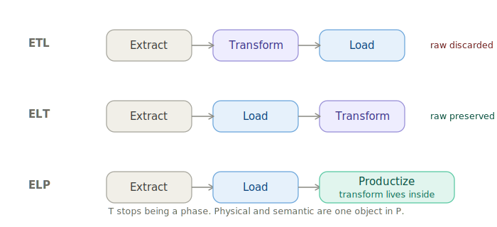
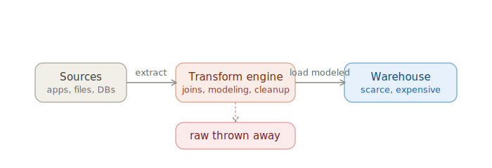
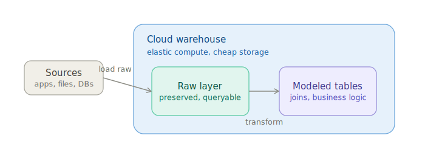
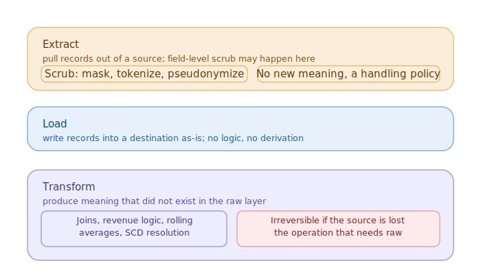
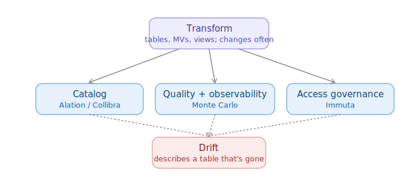
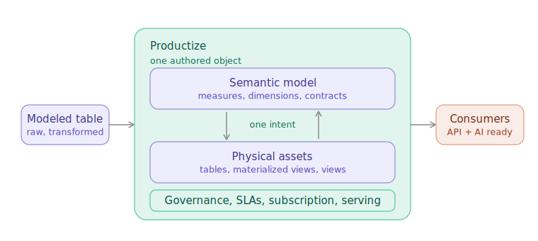
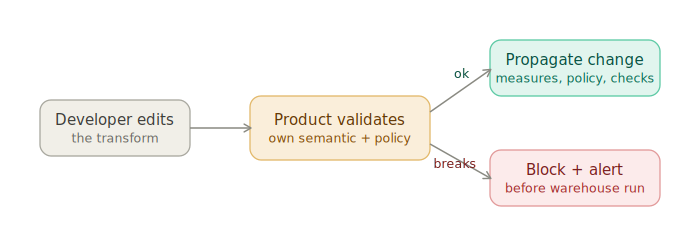

# Evolution of data engineering design patterns

*How the field moved from ETL to ELT, and why the next move is to ELP.*

---

- **Version:** 0.1
- **Last updated:** 10 June 2026
- **Author:** Animesh Kumar

---

## Glossary

- **Extract** — pull records out of a source.
- **Scrub** — mask, tokenize, or pseudonymize sensitive fields; field-level, produces no new meaning.
- **Load** — write records into a destination, unchanged.
- **Transform** — produce meaning that wasn't in the source: joins, business logic, aggregates, derived measures.
- **Productize** — turn transformed data into an owned, contracted, discoverable product fit for human and machine consumption.
- **Raw** — the unmodified copy of source data as it was loaded, before any transform runs. Not the source system itself; the landed copy sitting in the warehouse.

---

Data engineering patterns don't change for fashion. They change when a constraint that justified the old pattern lifts, or when a need outgrows what the pattern can express. ETL gave way to ELT because cloud warehouses removed the cost constraint that made pre-load transformation necessary. ELT is now the correct default, but it solves only the production of transformed data, not its consumption. That gap is what ELP exists to close.

Each pattern here gets the same treatment: what it is, why it arose, and where it breaks. The breaking point matters most, because one pattern's drawback is the next pattern's reason to exist. ETL discards its inputs, which is why ELT arose. ELT produces a table nobody but its author can safely use, and that turns blocking the moment you want AI to consume it, which is why ELP arises.

---

## Pattern 1: ETL

Extract from sources, transform in a separate engine, then load only the finished, modeled result into the warehouse. Transformation happens before the data lands.

ETL was a rational response to its economics. Warehouse storage and compute were expensive and coupled: you paid for them together and couldn't scale one without the other. Under that cost structure, loading raw source data and sorting it out later was waste. You'd pay premium warehouse rates to store and scan tables far larger than the modeled output anyone actually queried. So you transformed first, in a cheaper external engine, and loaded only the clean result.

Because ETL transforms before loading and keeps only the modeled output, the raw is gone the moment the pipeline runs, and two failures follow.

The first is that every transform is bet-the-pipeline. If the logic was wrong you can't re-derive, because the inputs are gone. You re-ingest from source, assuming the source still has the data in the same form, which for event streams and mutable upstreams it often doesn't. The source is under no obligation to wait for you either. Retention policies, GDPR deletion, log rotation, and operational databases that keep only a rolling window all prune history on their own schedule. The day you discover a join bug and go to re-run the fix, the rows you need may no longer exist anywhere.

The second is that ingestion becomes a coupling point. Since the pipeline must produce final modeled output, it has to know every downstream use case in advance, and each new requirement edits the ingestion path. That path is the most fragile thing to keep editing.

ETL is an anti-pattern. Avoid it by default, and treat any pre-load transformation as a red flag that needs explicit justification. The justification space is small and known, and two things commonly get mistaken for ETL or genuinely require pre-load work.

Scrubbing is not ETL. Masking, tokenization, and pseudonymization are field-level operations that produce no new meaning and depend on nothing outside the field itself. They belong before load as a data-handling policy and stay compatible with the next pattern: `Extract → scrub → Load → Transform`. Calling scrub a "transform" is the most common way this debate gets muddled, and the next section pins down why it isn't one.

A few cases genuinely force pre-load transform. Streaming-to-serving has no land step, so you transform in flight by definition. Some regulatory regimes forbid sensitive data landing in the warehouse at all, even scrubbed, which forces a controlled pre-load stage. These are narrow and don't undermine the default. A pipeline doing pre-load transformation that isn't one of these is the red flag firing.

---

## Pattern 2: ELT

Extract from sources, load the raw data into the warehouse first, then transform it in place. The order of the last two steps flips, and the raw layer is preserved.

The constraint that created ETL lifted. Cloud warehouses separated storage from compute and made compute elastic and on-demand. Storage became cheap enough that keeping the full raw copy cost almost nothing, and compute became something you could burst for a transform and release. The economic reason to transform before loading stopped existing, so the order flipped.

With raw preserved, ETL's two failures vanish. Transforms become re-runnable code, so a wrong join is an edit-and-rebuild against the same raw rather than a re-ingestion. And ingestion decouples from use: the load step needs to know nothing about downstream questions, so a new requirement is a new transform, not a change to the fragile ingestion path.

### The operations, defined precisely

ELT is where the three operations finally sit in the right place. The split that does the work is inside Extract, between scrubbing and transformation.

Extract pulls records out of a source. Scrubbing, if required, happens here. It's field-level, reversible by design (you substitute or hide a value, not derive a new fact), and needs no knowledge of any other table. A handling policy attached to extraction, not a transform.

Load writes records into the destination exactly as they are, with no logic, no joins, no derivation. The output of load is the raw layer.

Transform produces meaning that didn't exist in the raw layer: joining orders to customers to products, applying revenue-recognition rules, computing a 90-day rolling average, resolving a slowly changing dimension. The defining property is irreversibility. Run these and discard the raw, and you can't get back. That's why transform belongs after load, on preserved raw, never as a destructive pre-load step. It's also the precise reason scrub-before-load is fine and pre-load transform is the anti-pattern: scrub isn't the irreversible operation, transform is.

### Where ELT stops short

ELT isn't flawed the way ETL is. Its output is correct and its raw is safe. It's insufficient. It solves producing transformed data and does nothing for consuming it. You've transformed correctly and you have a table with the right numbers. Hand it to a team that didn't build it and almost everything that makes data usable is missing: discovery, a trust signal, governed access, a freshness commitment, a channel to report breakage. None of it is in the table.

So everyone stacks tools on top. An entire commercial category exists precisely because transformed tables aren't usable on their own: catalogs like Alation and Collibra for discovery and metadata, quality platforms like Monte Carlo for freshness and anomalies, access governance like Immuta for policy and masking at query time. Each is a real product solving a real gap. But each was built as its own system with its own model of the world, and stacking them above the transform introduces two problems that no amount of integration removes.

The first is impedance mismatch. The catalog's notion of a dataset, the quality tool's notion of a monitored asset, and the governance tool's notion of a protected resource are three different models of the same table, disagreeing on identity, grain, and how lineage and policy are represented. Connecting them is a lossy translation between models that were never meant to align. A masking rule has no clean home in the catalog; a metric definition has no home in the quality tool. Every connector approximates one tool's idea of the table in another's vocabulary, and the approximation is where meaning leaks.

The second is drift, and it's the real killer. Each tool has its own change cadence, and nothing holds them in lock-step with the transform underneath. The transform is the thing that actually changes (someone renames a column, splits a measure, changes a grain), and the correct order is to edit it first, then update everything downstream to match. Across four systems with four owners and four release cycles, nothing enforces that order. One rename plays out like this:

- **Monday:** column renamed in the model.
- **Monday onward:** the quality check passes on the old shape, so the number is wrong but green.
- **Monday onward:** a policy still guards a column by its old name, so it protects nothing.
- **Thursday:** the catalog finally re-crawls and catches up.

For three days the layers describe a table that no longer exists, and they never say so. Drift doesn't fail loudly; it stays invisible until someone trusts a stale definition and ships a wrong decision.

You can fight it, but only with people, and at that point reconciliation stops being a task and becomes a program: Jira boards, tickets, sprints, priorities, a governance function whose job is keeping the tools agreeing with each other. Every transform change spawns downstream work in three other systems, tracked and scheduled and argued over like any other backlog. That raises headcount and slows every change to the speed of the slowest cross-team sync, and it never converges. The system is fragile by construction, because consistency is maintained by human effort against four models that have no reason to agree, rather than guaranteed by one model that can't disagree with itself.

AI raises the bar past anything this stack reaches. To answer a question correctly without a human in the loop, an agent needs context that lives in none of these tools as a queryable definition: what a measure means, what grain it's at, which dimensions are valid, what a "customer" is here versus in the next table, what's trustworthy enough to answer from, and what the consumer is allowed to see. A catalog has a text description a human reads. A quality tool has a freshness check. A governance tool has a policy. None holds the semantic contract an AI needs, and because the pieces live in separate, drifting systems, there's nowhere to assemble one. An AI reading a drifted catalog doesn't hesitate the way a human might. It answers confidently from the stale definition. The half-product problem, merely expensive for human consumers, turns dangerous for AI ones.

That's where ELT stops short. Its output is correct and unusable by anyone, or anything, that didn't build it, and every attempt to make it usable by layering tools above it buys coherence it can't keep.

---

## Pattern 3: ELP

Extract, load raw, then Productize: make the data a coherent product in one step rather than a table you surround with tools afterward. Productize consolidates discovery, trust, governed access, SLAs, lifecycle, and the semantic context underneath them into one owned surface, served through APIs and ready for both application and AI consumption. The acronym lands at E → L → P.

A data product is the unit Productize produces. It's data treated the way a software team treats a service: a named owner accountable for it, a published contract (schema, SLA, freshness, quality as machine-readable guarantees), named consumers both human and machine, and a versioned lifecycle. The property that matters most for what follows is that its semantics travel with it. What a column means, how a measure is defined, what's trustworthy, who may see which rows are part of the product, not notes in a system alongside it. That's the difference between something an AI can consume safely and a table it has to guess at. This is a pattern, not a product; the rest of this section describes one way to implement it.

The drawbacks of ELT aren't fixable by adding more tools, because the problem is the separate tools. Drift is what you get when semantics, quality, and security are their own layers with their own change cadence, and no amount of integration removes it. The only way to kill drift is to remove the separation: author the semantics, the contracts, and the access policy with the data, as one object, so they can't fall out of sync because there's nothing to sync. One model can't disagree with itself. Coherence by construction rather than by coordination is what makes Productize a distinct pattern rather than a procurement checklist.

The deeper move is that P absorbs the transform itself. Transform stops being a separate phase and becomes a responsibility inside the product. This holds for any implementation that authors the physical asset and its semantic model as one object: physical assets (tables, materialized views, views) with a semantic model authored on top of them, the two dealt with together under a single intent. They affect each other. A change to a measure can imply a change to the physical asset beneath it; a change to the physical model reshapes what the semantic model can express.

The two-way link is the point. Physical and semantic aren't stacked layers with a handoff; they're one object, authored and reasoned about as a unit. There's no clean line where transform ends and product begins, because the same authored object decides what the transform means, how it's materialized, who sees which rows, and how it's served. That's also what solves the change-order problem behind drift. When the transform and its semantics are one object, editing the transform is editing the semantic definition. There's no window where the model has changed and the description hasn't, because they're the same edit. The rename can't ship ahead of the catalog, the quality contract can't validate a shape the measure no longer has, and the access policy can't reference a dropped column, because all of them are expressed against the one definition that just changed. Order is enforced by structure, not by a review board.

The three-phase split in ELT was an artifact of tooling, not of the data. Transform's meaning (what a metric is, who it's for, how fresh it must be) was separated from transform's execution only because no single tool authored them together. You built the table in one place and described it across four others. Author them as one object and the separation goes away, and the phase boundary it created disappears with it. "P absorbs T" is a structural consequence, not a rename.

### How the product holds itself together

The drift case was a list of things that go stale independently: descriptions, quality checks, access policies, semantic measures, each in its own system. When all of them are part of the one authored object, a change to the data propagates through them instead of leaving them behind.

Access policy is part of the product, not a downstream tool. Masking and row-level rules are authored against the product's own definition, so they're enforced wherever the product is served and they move with the columns they protect. Rename or drop a protected column and the policy is evaluated against the new definition in the same change. No separate governance system holds a policy that now points at nothing.

Description, terms, tags, and metadata are attributes of the product, not rows in a catalog that has to re-crawl to notice an edit. Change the asset and its metadata is already attached to the thing that changed.

Quality rules run on change, not on a timer. The contract is bound to the product, so it executes when the data changes and when the schema evolves, not on a crawl schedule that lags the edit. A check can't keep validating a shape the measure no longer has, because the check is defined against the same measure.

Semantic measures reflect schema evolution. A measure is defined in terms of the physical asset beneath it, so when that asset evolves compatibly (a column added, a type widened), the measure resolves against the new shape with no separate update step.

Breaking changes are caught before they reach the warehouse, which the layered stack can never do. Because the product knows its own semantic and policy surface, an edit that would break it (dropping a column a measure depends on, changing a grain a contract relies on, removing a field a policy protects) is detected at author time, and the developer is alerted before the transform is planned against the warehouse. The failure surfaces as a blocked change, not as a silently drifted catalog discovered weeks later.

In the layered stack, the transform runs and the rest of the world finds out later. Here the order is inverted. The product validates the change against everything it owns first, propagates it where it's compatible, and refuses it where it isn't. Drift never gets a chance to open, because there's no gap between the data changing and its description, contracts, and policy changing with it.

### The boundary

P doesn't reach upstream. Extract pulls from sources and scrubs sensitive fields. Load writes raw. Raw is preserved. None of that moves into P.

P owns the transform's meaning and execution, the semantic model, governance and access, freshness and uptime commitments, serving, discovery, and the change-and-breakage lifecycle.

The test for whether something belongs in P is whether it requires knowing who the consumer is. Extract and load don't; they're identical regardless of who uses the data. Everything that depends on the consumer (what a metric should mean for them, which rows they may see, what freshness they're promised, how they find and subscribe) is P. Transform sits inside P because you can't define the transform without also defining those things. They're one object.

That's the evolution. ETL transformed before loading to protect a scarce warehouse and discarded its inputs doing it, an anti-pattern once the warehouse stopped being scarce. ELT loaded raw and transformed in place, which is correct but reaches only as far as a table. ELP productizes in one step and absorbs the transform, because once the physical asset and its semantic, governance, and serving layers are authored as one object, there's no separate transform phase left to name, and there's finally a coherent product a human or an AI can consume.

---

The data-product standard referenced here, including ownership, contracts, tiers, and roles, is defined in detail in [Data Products in DataOS: An Internal Guide](https://github.com/tmdc-io/whitepapers/blob/main/guides/April%2024%2C%202026/data-products-standard-and-dataos-implementation.md).
